## Variogramme {#sec-ex-ch07 .recueil}
### Exercice 1 — Variogramme expérimental sur carottes (Cu)

On dispose des teneurs en cuivre suivantes, obtenues sur des carottes de longueur constante de $3\ \text{m}$. Calculez le variogramme expérimental $\hat\gamma(h)$ pour les distances $h = 3$, $6$ et $9\ \text{m}$. Indiquez le nombre de paires $N(h)$.

| Carotte | 1 | 2 | 3 | 4 | 5 | 6 | 7 |
|:--|:--:|:--:|:--:|:--:|:--:|:--:|:--:|
| Teneur Cu (%) | 1,5 | 1,6 | 1,8 | 3,5 | 2,8 | 3,5 | 3,9 |

::: {.callout-note collapse="true"}
## Solution

Le variogramme expérimental se calcule par
$$
\hat\gamma(h) = \frac{1}{2\,N(h)} \sum_{i=1}^{N(h)} \big[Z(\mathbf{x}_i+\mathbf{h}) - Z(\mathbf{x}_i)\big]^2 .
$$

| $h\ (\text{m})$ | $N(h)$ | $\hat\gamma(h)\ (\%^2)$ |
|:--:|:--:|:--:|
| 3 | 6 | 0,34 |
| 6 | 5 | 0,59 |
| 9 | 4 | 1,06 |
:::

### Exercice 2 — Variogramme expérimental dans une direction (épaisseur de veine)

La figure suivante montre l'épaisseur d'une veine minéralisée mesurée en certains points.

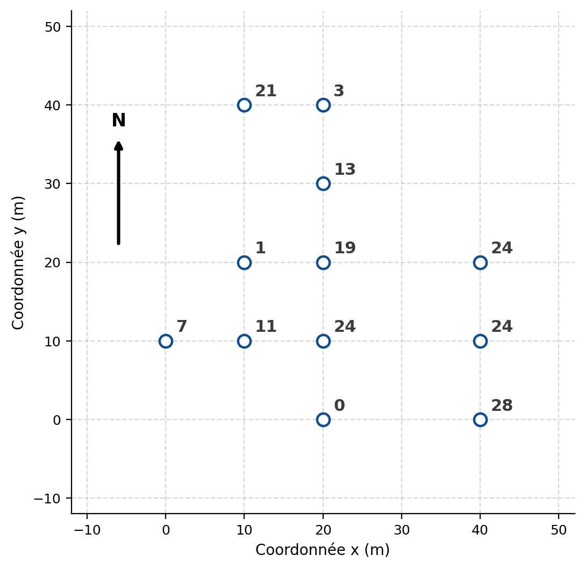{#fig-ex07-2 fig-align="center" width="70%"}

Quelle est la valeur du variogramme expérimental $\hat\gamma(\mathbf{h})$ dans la direction $90^\circ$ (azimut) pour la distance $h = 20\ \text{m}$ (tolérance angulaire nulle et tolérance sur la distance nulle) ? Indiquez clairement toutes les paires considérées dans votre calcul ainsi que les unités du résultat.

::: {.callout-note collapse="true"}
## Solution

La direction d'azimut $90^\circ$ correspond à l'axe est-ouest (direction des $x$). Pour $h = 20\ \text{m}$, on apparie les points distants exactement de $20\ \text{m}$ sur une même ligne :

$$
\hat\gamma(\mathbf{h}) = \frac{1}{2\times 4}\Big[(0-28)^2+(24-24)^2+(19-24)^2+(7-24)^2\Big] = 137{,}25\ \text{m}^2 .
$$

Les paires utilisées sont $(0,28)$, $(24,24)$, $(19,24)$ et $(7,24)$, soit $N(\mathbf{h})=4$.
:::

### Exercice 3 — Ajustement d'un modèle (ciment C3S)

Le variogramme expérimental ci-dessous représente la variation de la teneur du ciment en C3S (mesurée en %) dans le temps, à la sortie d'une cimenterie. Le palier est atteint à $\hat\gamma \approx 10$ pour $\delta t \approx 10\ \text{heures}$, avec une ordonnée à l'origine d'environ $3$.

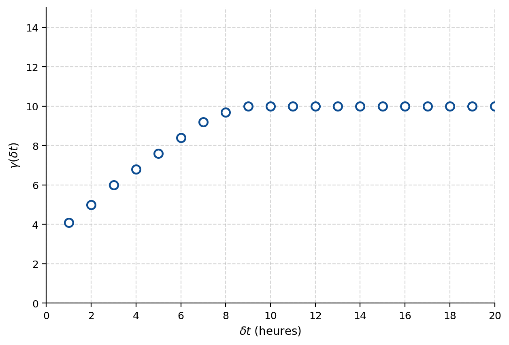{#fig-ex07-3 fig-align="center" width="85%"}

Quel est le modèle de variogramme (type et paramètres) qui permet un ajustement adéquat au variogramme expérimental ? Indiquez clairement les unités des paramètres fournis.

::: {.callout-note collapse="true"}
## Solution

Modèle **sphérique** avec portée $a = 10\ \text{heures}$, pépite $C_0 = 3\ \%^2$ et palier de la composante structurée $C = 7\ \%^2$ (palier total $C_0 + C = 10\ \%^2$).
:::

### Exercice 4 — Variogramme expérimental sur deux forages (Au)

On vous donne deux portions de forage sur lesquelles sont indiquées les teneurs en Au (ppm) pour des carottes de $3\ \text{m}$. Les deux forages sont espacés de $9\ \text{m}$ de centre à centre (le dessin n'est pas à l'échelle).

| Forage 1 (ppm) | Forage 2 (ppm) |
|:--:|:--:|
| 5,2 | 5,2 |
| 2,3 | 4,6 |
| 3,7 | 6,3 |
| 9,1 | 8,1 |
| 4,3 | 2,7 |

Les deux colonnes sont distantes de $9\ \text{m}$ horizontalement ; les carottes successives d'un même forage sont distantes de $3\ \text{m}$ verticalement.

a) Calculez le variogramme expérimental omnidirectionnel à la distance $h = 9\ \text{m}$ exactement, en prenant soin d'indiquer toutes les paires utilisées.

b) Calculez le variogramme expérimental dans la direction horizontale, puis dans la direction verticale.

::: {.callout-note collapse="true"}
## Solution

**a) Omnidirectionnel à $h=9\ \text{m}$.** Les paires distantes de $9\ \text{m}$ sont :

$(5{,}2;\,9{,}1)$, $(2{,}3;\,4{,}3)$, $(5{,}2;\,8{,}1)$, $(4{,}6;\,2{,}7)$, $(5{,}2;\,5{,}2)$, $(2{,}3;\,4{,}6)$, $(3{,}7;\,6{,}3)$, $(9{,}1;\,8{,}1)$, $(4{,}3;\,2{,}7)$.

$N(h)=9$ paires. La somme des différences carrées vaut environ $87{,}42$, d'où
$$
\hat\gamma(9) = \frac{1}{2\times 9}\sum \big[\Delta Z\big]^2 \approx 4{,}86\ \text{ppm}^2 .
$$

**b) Horizontal ($9\ \text{m}$, d'un forage à l'autre, même niveau).** Paires : $(5{,}2;\,5{,}2)$, $(2{,}3;\,4{,}6)$, $(3{,}7;\,6{,}3)$, $(9{,}1;\,8{,}1)$, $(4{,}3;\,2{,}7)$. $N=5$, somme des diff$^2 = 15{,}61$, donc $\hat\gamma = 1{,}561\ \text{ppm}^2$.

**Vertical (au sein d'un forage).**

| $h\ (\text{m})$ | $N(h)$ | $\hat\gamma(h)\ (\text{ppm}^2)$ |
|:--:|:--:|:--:|
| 3 | 6 | 5,485 |
| 6 | 4 | 4,483 |
| 9 | 4 | 8,976 |
| 12 | 4 | 3,904 |
:::

### Exercice 5 — Variogramme expérimental directionnel sur grille (azimut 90°)

Calculez le variogramme expérimental $\hat\gamma(\mathbf{h})$ des données suivantes dans la direction (azimut) $90^\circ$ pour les distances $h = 10\ \text{m}$ et $h = 20\ \text{m}$ (tolérance angulaire $0{,}1^\circ$). La grille a un pas de $10\ \text{m}$ en $x$ et en $y$.

| $y \backslash x$ | 0 | 10 | 20 | 30 | 40 | 50 | 60 | 70 | 80 | 90 | 100 | 110 |
|:--|:--:|:--:|:--:|:--:|:--:|:--:|:--:|:--:|:--:|:--:|:--:|:--:|
| 110 | 3 | 6 | 1 | 12 | 8 | 16 | | | | | | |
| 80 | 14 | 13 | 18 | 15 | 16 | 0 | | | | | | |
| 50 | 17 | 13 | 8 | 11 | 11 | 14 | | | | | | |
| 20 | 0 | 16 | 1 | 3 | 19 | 9 | | | | | | |
| | 19 | 9 | 7 | 4 | 9 | 5 | | | | | | |

> *(Disposition des teneurs reproduite du document source ; la position exacte de chaque ligne suit la figure d'origine.)*

::: {.callout-note collapse="true"}
## Solution

En appariant les points distants de $10\ \text{m}$ puis $20\ \text{m}$ dans la direction est-ouest :

| $h\ (\text{m})$ | $N(h)$ | $\hat\gamma(h)$ |
|:--:|:--:|:--:|
| 10 | 4 | 33,5 |
| 20 | 7 | 23,571 |
:::

### Exercice 6 — Variogramme expérimental 2D multidirectionnel (épaisseur de veine)

Soit les données 2D suivantes montrant l'épaisseur d'une veine minéralisée (en mètres), localisées sur une grille de $0$ à $220\ \text{m}$ en $x$ et en $y$ :

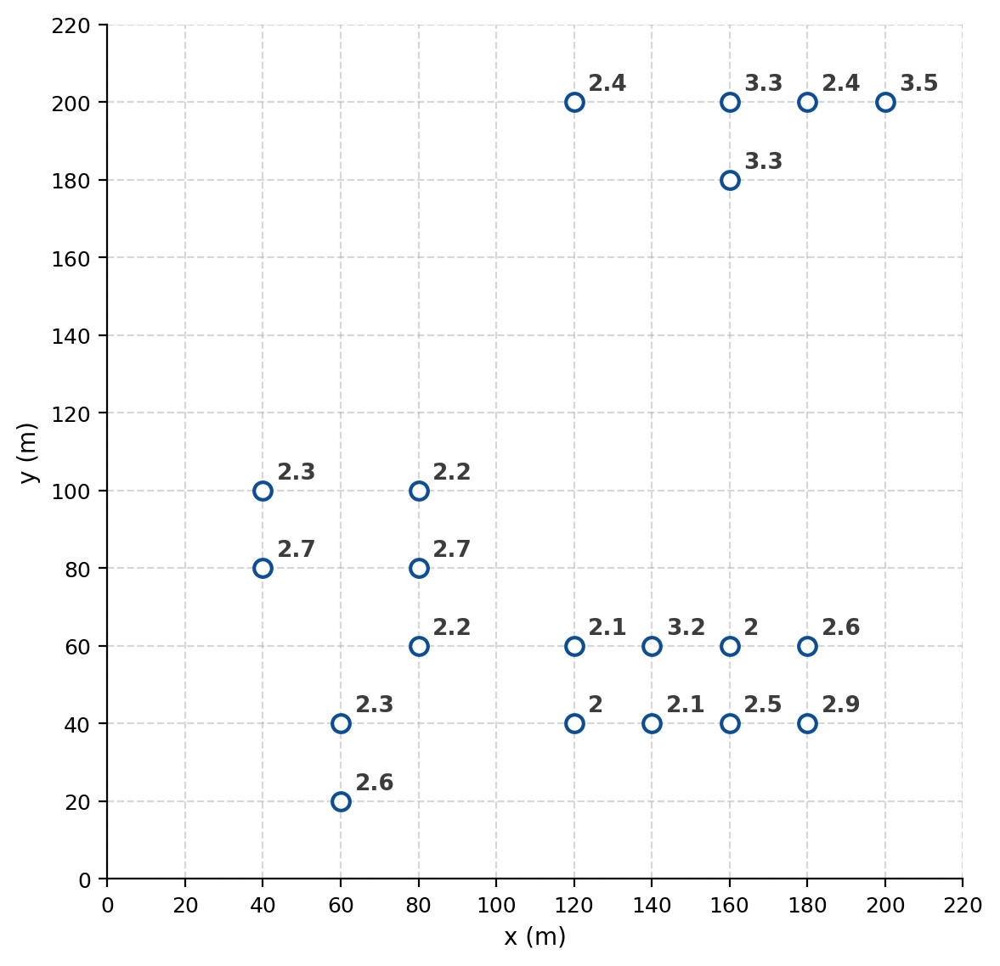{#fig-ex07-6 fig-align="center" width="75%"}

a) Calculez le variogramme expérimental selon les azimuts $0^\circ$, $45^\circ$, $90^\circ$ et $135^\circ$, pour des classes d'égales largeurs de $20\ \text{m}$ allant de $]0,20]$ à $]60,80]\ \text{m}$, avec une très petite tolérance angulaire. Indiquez le nombre de paires et la distance moyenne pour chaque point du variogramme.

b) À partir des résultats de a), calculez le variogramme expérimental selon les mêmes azimuts, pour des classes d'égales largeurs de $40\ \text{m}$ jusqu'à $80\ \text{m}$. Indiquez le nombre de paires et la distance pour chaque point.

::: {.callout-note collapse="true"}
## Solution

**a)** Format de sortie : (distance moyenne, nombre de paires, $\hat\gamma$).

*Azimut $0^\circ$ :*

| $\bar h\ (\text{m})$ | $N$ | $\hat\gamma$ |
|:--:|:--:|:--:|
| 20,00 | 9 | 0,13 |
| 40,00 | 1 | 0 |

*Azimut $45^\circ$ :* $(28{,}28;\ 5;\ 0{,}23)$.

*Azimut $90^\circ$ :*

| $\bar h\ (\text{m})$ | $N$ | $\hat\gamma$ |
|:--:|:--:|:--:|
| 20,00 | 8 | 0,34 |
| 40,00 | 9 | 0,12 |
| 60,00 | 5 | 0,21 |
| 80,00 | 3 | 0,22 |

*Azimut $135^\circ$ :* $(28{,}28;\ 3;\ 0{,}22)$ et $(56{,}57;\ 3;\ 0{,}09)$.

**b)** En regroupant en classes de $40\ \text{m}$ :

*Azimut $0^\circ$ :* $(22{,}00;\ 10;\ 0{,}12)$.

*Azimut $45^\circ$ :* $(28{,}28;\ 5;\ 0{,}23)$.

*Azimut $90^\circ$ :* $(30{,}59;\ 17;\ 0{,}22)$ et $(67{,}50;\ 8;\ 0{,}21)$.

*Azimut $135^\circ$ :* $(28{,}28;\ 3;\ 0{,}22)$ et $(56{,}57;\ 3;\ 0{,}09)$.
:::

### Exercice 7 — Variance, covariance et combinaisons linéaires (modèle sphérique)

On a un variogramme sphérique avec $C_0 = 1$, $C = 10$ et $a = 20$. Soit les points $\mathbf{x}_1 = (0,0)$ et $\mathbf{x}_2 = (10,0)$.

a) Quelle est la variance de $Z(\mathbf{x}_1)$ ? de $Z(\mathbf{x}_2)$ ?

b) Quelle est la covariance entre $Z(\mathbf{x}_1)$ et $Z(\mathbf{x}_2)$ ?

c) On forme $Z_3 = 0{,}8\,Z(\mathbf{x}_1) + 0{,}2\,Z(\mathbf{x}_2)$. Quelle est la variance de $Z_3$ ? Quelle est la covariance de $Z_3$ avec $Z(\mathbf{x}_1)$ ?

d) On forme $Z_4 = 0{,}4\,Z(\mathbf{x}_1) + 0{,}6\,Z(\mathbf{x}_2)$. Quelle est la covariance entre $Z_3$ et $Z_4$ ?

::: {.callout-note collapse="true"}
## Solution

**a)** $\operatorname{Var}\big(Z(\mathbf{x}_1)\big) = \operatorname{Var}\big(Z(\mathbf{x}_2)\big) = C_0 + C = 11$.

**b)** $h = 10$, donc
$$
\gamma(h) = 1 + 10\Big(1{,}5\tfrac{10}{20} - 0{,}5\big(\tfrac{10}{20}\big)^3\Big) = 7{,}875,
$$
d'où $\operatorname{Cov}\big(Z(\mathbf{x}_1),Z(\mathbf{x}_2)\big) = (C_0+C) - \gamma(h) = 11 - 7{,}875 = 3{,}125$.

**c)**
$$
\operatorname{Var}(Z_3) = 0{,}8^2\cdot 11 + 0{,}2^2\cdot 11 + 2\cdot 0{,}8\cdot 0{,}2\cdot 3{,}125 = 8{,}48 .
$$
$$
\operatorname{Cov}\big(Z_3, Z(\mathbf{x}_1)\big) = 0{,}8\cdot 11 + 0{,}2\cdot 3{,}125 = 9{,}425 .
$$

**d)**
$$
\operatorname{Cov}(Z_3, Z_4) = 11\,(0{,}8\cdot 0{,}4 + 0{,}2\cdot 0{,}6) + 3{,}125\,(0{,}8\cdot 0{,}6 + 0{,}2\cdot 0{,}4) = 6{,}59 .
$$
:::

### Exercice 8 — Portée directionnelle d'un modèle anisotrope (Pb)

Un site contaminé au Pb montre un modèle de variogramme comprenant 3 composantes différentes :

| Composante | $C\ (\text{ppm}^2)$ | $a_g\ (\text{m})$, $\theta_g$ (azimut) | $a_p\ (\text{m})$, $\theta_p$ (azimut) |
|:--|:--:|:--:|:--:|
| Effet pépite | 120 | — | — |
| Sphérique 1 | 580 | 1000 ; 87° | 300 ; 177° |
| Sphérique 2 | 1200 | 400 ; 42° | 200 ; 132° |

où $\theta_g$ est la direction de meilleure continuité et $\theta_p$ la direction de moindre continuité.

Selon l'azimut $30^\circ$, à quelle distance séparant deux points peut-on considérer les teneurs en Pb non corrélées ?

::: {.callout-note collapse="true"}
## Solution

On cherche la portée selon la direction $30^\circ$. On calcule la portée directionnelle pour chacune des deux composantes sphériques (anisotropie géométrique) et on retient la valeur maximale.

*Sphérique 1* — angle avec $a_g$ : $57^\circ$,
$$
a_{30} = \frac{1000\times 300}{\sqrt{1000^2\sin^2 57^\circ + 300^2\cos^2 57^\circ}} = 351{,}1\ \text{m}.
$$

*Sphérique 2* — angle avec $a_g$ : $12^\circ$,
$$
a_{30} = \frac{400\times 200}{\sqrt{400^2\sin^2 12^\circ + 200^2\cos^2 12^\circ}} = 376{,}3\ \text{m}.
$$

La portée dans la direction $30^\circ$ est donc $376{,}3\ \text{m}$ : au-delà de cette distance, les teneurs sont considérées non corrélées.
:::

### Exercice 9 — Proposer un modèle à partir d'observations terrain (Cu)

Dans une mine 2D de Cu, un géologue vous communique les faits suivants :

- Il a prélevé plusieurs échantillons de même taille côte à côte et a obtenu, pour ces échantillons voisins, une différence carrée des teneurs égale en moyenne à $2\ \%^2$.
- Selon son expérience, la zone d'influence d'un échantillon est de l'ordre de $70\ \text{m}$ dans la direction est-ouest. Il affirme que cette zone d'influence est approximativement deux fois plus courte dans la direction nord-sud. La direction est-ouest correspond à l'orientation générale des fractures dans le gisement.
- Il a calculé une variance de $10\ \%^2$ pour la teneur en Cu sur l'ensemble des échantillons couvrant une très grande surface par rapport à la zone d'influence d'un échantillon.

Suggérez un modèle de variogramme (type et paramètres) pouvant tenir compte de ces informations.

::: {.callout-note collapse="true"}
## Solution

Variogramme **sphérique** (ou exponentiel) avec **anisotropie géométrique** :

- portée principale est-ouest $a_g = 70\ \text{m}$, portée la plus courte nord-sud $a_p = 35\ \text{m}$ ;
- pépite $C_0 = \tfrac{1}{2}\times 2\ \%^2 = 1\ \%^2$ (la demi-différence carrée des voisins immédiats estime la pépite) ;
- palier de la composante structurée $C = 10 - 1 = 9\ \%^2$ (la variance globale donne le palier total).
:::

### Exercice 10 — Covariance entre deux points (anisotropie géométrique, Zn)

Un gisement de Zn présente un variogramme sphérique (2D) avec effet de pépite de $4\ \%^2$, $C = 20\ \%^2$ et des portées suivant les différentes directions décrites par un modèle d'anisotropie géométrique, avec axes principaux en $x$ et $y$, et $a_x = 10\ \text{m}$, $a_y = 20\ \text{m}$. On désire estimer la teneur au point $\mathbf{x}_0$ situé en $(0,0)$ à partir des teneurs mesurées aux points $\mathbf{x}_1$ à $\mathbf{x}_3$, de coordonnées respectives $(-10,0)$, $(0,20)$ et $(5,22)$, où l'on a observé $Z_1 = 2\,\%$, $Z_2 = 3{,}3\,\%$ et $Z_3 = 3\,\%$.

Quelle est la covariance entre les teneurs aux points $\mathbf{x}_2$ et $\mathbf{x}_3$ ?

> *(Le système de krigeage complet de ces mêmes données est traité à l'exercice correspondant du chapitre 9 ; on ne demande ici que la covariance.)*

::: {.callout-note collapse="true"}
## Solution

Le vecteur $\mathbf{x}_2 \to \mathbf{x}_3 = (5, 2)$. L'azimut associé :
$$
\theta = \arctan\!\Big(\frac{5-0}{22-20}\Big) = 68{,}2^\circ .
$$
Portée directionnelle dans cette direction :
$$
a(\theta) = \frac{20\times 10}{\sqrt{(20\sin 68{,}2^\circ)^2 + (10\cos 68{,}2^\circ)^2}} = 10{,}56\ \text{m}.
$$
Distance entre les deux points :
$$
h = \sqrt{5^2 + 2^2} = 5{,}385\ \text{m}.
$$
D'où
$$
C(\mathbf{h}) = 20\Big[1 - \Big(1{,}5\,\tfrac{5{,}385}{10{,}56} - 0{,}5\,\big(\tfrac{5{,}385}{10{,}56}\big)^3\Big)\Big] = 6{,}03\ \%^2 .
$$
:::

### Exercice 11 — Covariance entre deux points (plan de localisation, Fe)

Soit le plan de localisation suivant, avec un point à estimer $\mathbf{x}_0$ et des points de données $\mathbf{x}_1$ à $\mathbf{x}_4$ :

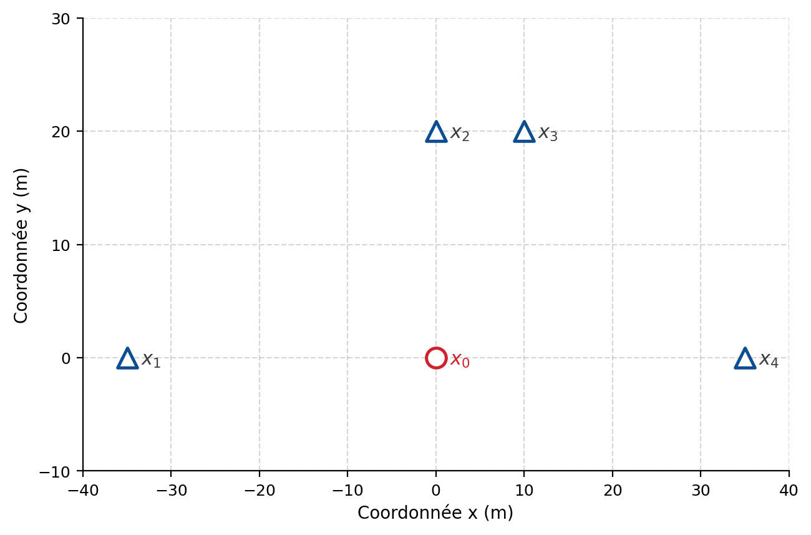{#fig-ex07-11 fig-align="center" width="85%"}

Le variogramme est sphérique anisotrope avec $a_x = 30\ \text{m}$ et $a_y = 50\ \text{m}$, et un effet de pépite de $5\ \%^2$. Le $C$ du sphérique est de $50\ \%^2$ (palier total $55\ \%^2$).

Quelle est la covariance entre les teneurs aux points $\mathbf{x}_0$ et $\mathbf{x}_3$ ?

> *(Le système de krigeage complet de ces mêmes données est traité à l'exercice correspondant du chapitre 9 ; on ne demande ici que la covariance.)*

::: {.callout-note collapse="true"}
## Solution

Distance entre $\mathbf{x}_0$ et $\mathbf{x}_3$ :
$$
h = \sqrt{100 + 400} = 22{,}36\ \text{m}.
$$
Angle avec l'axe des $y$ :
$$
\theta = \arctan\!\Big(\frac{10}{20}\Big) = 26{,}6^\circ .
$$
Portée dans cette direction :
$$
a(\theta) = \frac{50\times 30}{\sqrt{50^2\sin^2 26{,}6^\circ + 30^2\cos^2 26{,}6^\circ}} = 42{,}9\ \text{m}.
$$
Covariance (sphérique) :
$$
C(\mathbf{h}) = 50\Big[1 - 1{,}5\,\tfrac{22{,}36}{42{,}9} + 0{,}5\,\big(\tfrac{22{,}36}{42{,}9}\big)^3\Big] = 14{,}5\ \%^2 .
$$
:::

### Exercice 12 — Décrire un modèle à partir de variogrammes directionnels (azimut 22°)

On a un gisement 2D dont la direction préférentielle de la minéralisation est $22^\circ$ (azimut). On dispose des 4 variogrammes expérimentaux directionnels suivants, calculés selon les azimuts $22^\circ$, $67^\circ$, $112^\circ$ et $167^\circ$. Les paliers atteints valoisinent $800\ \text{ppm}^2$, avec une ordonnée à l'origine d'environ $200\ \text{ppm}^2$ et des portées variant selon la direction.

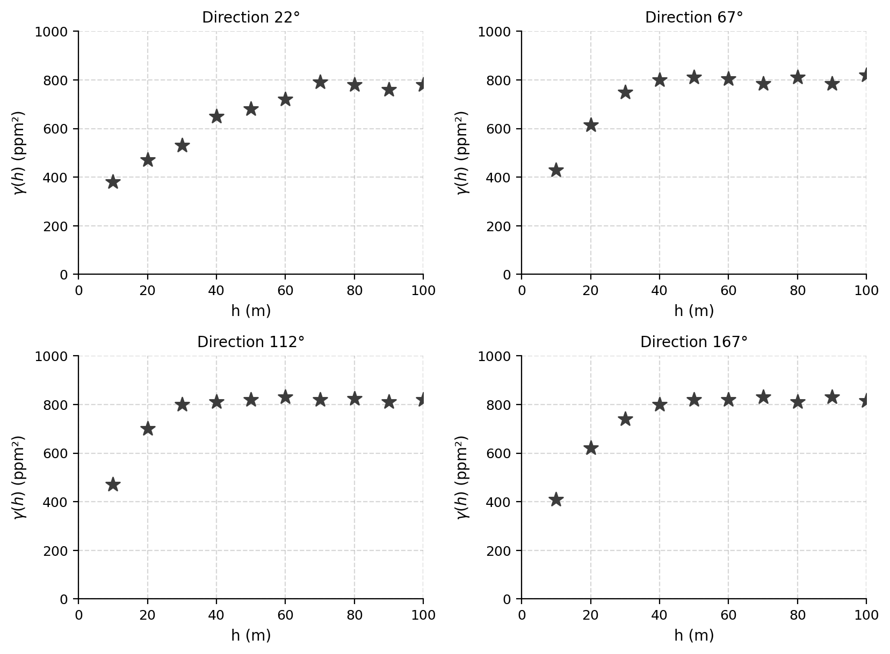{#fig-ex07-12 fig-align="center" width="85%"}

Décrivez le modèle de variogramme (en spécifiant tous les paramètres) permettant un ajustement adéquat de ces variogrammes expérimentaux.

::: {.callout-note collapse="true"}
## Solution

Modèle **sphérique** avec $C_0 = 200\ \text{ppm}^2$ et $C = 600\ \text{ppm}^2$ ; **anisotropie géométrique**, ellipse orientée à $22^\circ$, avec portée principale $a_g = 80\ \text{m}$ et portée mineure $a_p = 30\ \text{m}$.
:::

### Exercice 13 — Décrire un modèle 2D, covariance directionnelle et précision analytique

Dans un gisement 2D, on a obtenu un modèle de variogramme illustré dans 8 directions ($10^\circ$, $32{,}5^\circ$, $55^\circ$, $77{,}5^\circ$, $100^\circ$, $122{,}5^\circ$, $145^\circ$, $167{,}5^\circ$). Le palier est de l'ordre de $12$ et l'ordonnée à l'origine d'environ $2$, avec des portées variant selon la direction.

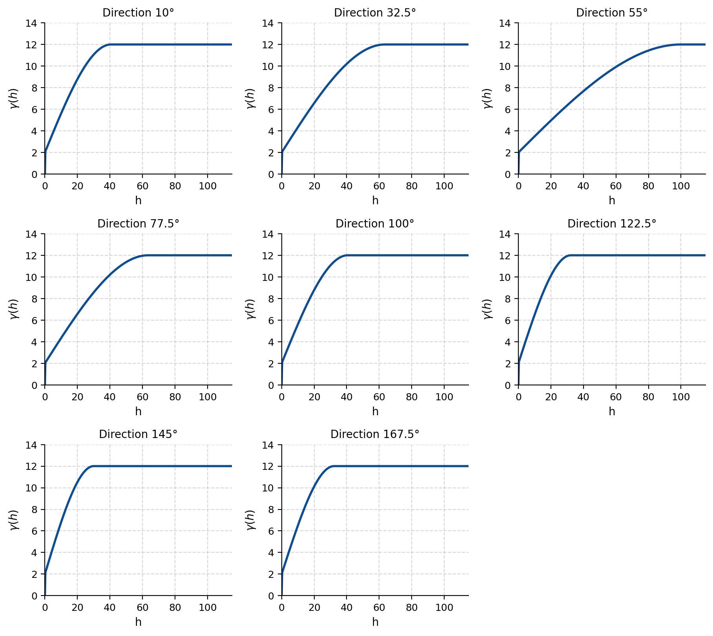{#fig-ex07-13 fig-align="center" width="85%"}

a) Décrivez le modèle de variogramme illustré sur ces figures.

b) Soit deux points espacés de $20\ \text{m}$ et définissant un azimut de $43^\circ$. Quelle est la covariance entre ces deux points ?

c) Les données ayant servi au calcul des variogrammes ont été obtenues à partir d'une procédure analytique assurant une bonne précision. Quelle serait la conséquence sur le variogramme d'utiliser une procédure d'analyse moins précise ?

::: {.callout-note collapse="true"}
## Solution

**a)** Modèle **sphérique** avec $C_0 = 2$, $C = 10$, et des portées décrivant une **anisotropie géométrique** : $a_g = 100$ dans la direction $55^\circ$ et $a_p = 30$ dans la direction $145^\circ$.

**b)** L'angle entre la direction $43^\circ$ et la direction de meilleure continuité ($55^\circ$) est de $12^\circ$. Portée dans cette direction :
$$
a(\theta) = \frac{100\times 30}{\sqrt{100^2\sin^2 12^\circ + 30^2\cos^2 12^\circ}} = 83{,}4\ \text{m}.
$$
Covariance :
$$
C(\mathbf{h}) = 10\Big[1 - \Big(1{,}5\,\tfrac{20}{83{,}4} - 0{,}5\,\big(\tfrac{20}{83{,}4}\big)^3\Big)\Big] = 6{,}48 .
$$

**c)** Le modèle présenterait un **effet de pépite plus important** : une analyse moins précise augmente la variabilité à très courte distance.
:::

### Exercice 14 — Ajustement isotrope puis anisotrope et covariances (Zn)

Soit le variogramme expérimental omnidirectionnel obtenu pour un gisement de Zn sur un niveau donné. Le palier est atteint vers $\hat\gamma \approx 15\ \%^2$.

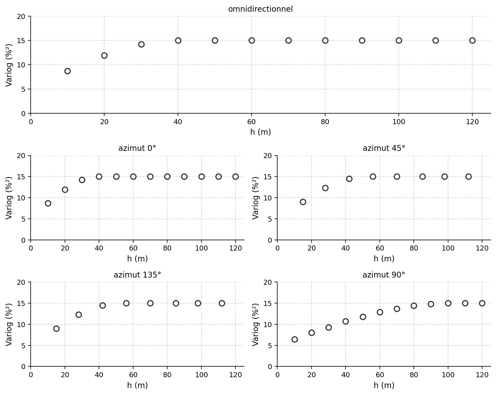{#fig-ex07-14 fig-align="center" width="85%"}

a) Ajustez approximativement un modèle isotrope à ces données.

On calcule ensuite les variogrammes directionnels selon les azimuts $0^\circ$, $45^\circ$, $90^\circ$, $135^\circ$.

b) Ajustez approximativement un modèle avec anisotropie géométrique à ces données.

c) En supposant qu'en a) vous ayez obtenu un modèle sphérique isotrope de portée $40\ \text{m}$, $C_0 = 5\ \%^2$ et $C = 10\ \%^2$, calculez la covariance entre les teneurs en Zn pour les points $(0,0)$ et $(30,20)$.

d) En supposant qu'en b) vous ayez obtenu un modèle sphérique anisotrope avec portées $100\ \text{m}$ selon $x$ et $40\ \text{m}$ selon $y$ ($x$ et $y$ étant les directions principales de l'ellipse), $C_0 = 5\ \%^2$ et $C = 10\ \%^2$, calculez la covariance entre les teneurs en Zn pour les points $(0,0)$ et $(30,20)$.

::: {.callout-note collapse="true"}
## Solution

**a)** Sphérique isotrope avec $a = 40\ \text{m}$, $C_0 = 5\ \%^2$, $C = 10\ \%^2$.

**b)** Sphérique anisotrope avec $a_0 = 40\ \text{m}$ et $a_{90} = 100\ \text{m}$, $C_0 = 5\ \%^2$ et $C = 10\ \%^2$.

**c)** $h = \sqrt{30^2+20^2} = 36{,}06\approx 36\ \text{m}$ :
$$
C(\mathbf{h}) = 10\Big[1 - \Big(1{,}5\,\tfrac{36}{40} - 0{,}5\,\big(\tfrac{36}{40}\big)^3\Big)\Big] = 0{,}14\ \%^2 .
$$

**d)** $h = 36\ \text{m}$, $\theta = \arctan(20/30) = 33{,}7^\circ$, portée directionnelle $a(\theta) = 61{,}8\ \text{m}$ :
$$
C(\mathbf{h}) = 10\Big[1 - \Big(1{,}5\,\tfrac{36}{61{,}8} - 0{,}5\,\big(\tfrac{36}{61{,}8}\big)^3\Big)\Big] = 2{,}25\ \%^2 .
$$
:::

### Exercice 15 — Modèle gaussien anisotrope : variogramme, covariance, corrélation

Soit un modèle gaussien montrant une anisotropie géométrique dont les axes principaux coïncident avec les coordonnées est ($x$) et nord ($y$), avec $a_x = 150$, $a_y = 80$, $C_0 = 0{,}7$ et $C = 7{,}6$. Soit deux observations situées en $\mathbf{x}_1 = (0,0)$ et $\mathbf{x}_2 = (30,10)$.

L'équation du variogramme gaussien utilisée ici est $\gamma(\mathbf{h}) = C_0 + C\big(1 - \exp(-3\,|\mathbf{h}|^2/a^2)\big)$ pour $\mathbf{h} > 0$.

a) Quelle est la valeur théorique du variogramme pour les v.a. correspondant à ces deux points ?

b) Quelle est la valeur théorique de la covariance entre les v.a. correspondant à ces deux points ?

c) Quelle est la valeur théorique de la corrélation entre les v.a. correspondant à ces deux points ?
(Rappel : $\rho_{Z(\mathbf{x}_1),Z(\mathbf{x}_2)} = \operatorname{Cov}\big(Z(\mathbf{x}_1),Z(\mathbf{x}_2)\big)\big/\big[\operatorname{Var}(Z(\mathbf{x}_1))\operatorname{Var}(Z(\mathbf{x}_2))\big]^{1/2}$.)

::: {.callout-note collapse="true"}
## Solution

**a)** Direction : $\theta = \arctan(10/30) = 18{,}4^\circ$. Distance : $h = \sqrt{30^2+10^2} = 31{,}6\ \text{m}$. Portée directionnelle : $a(\theta) = 134{,}1\ \text{m}$.
$$
\gamma(\mathbf{h}) = 0{,}7 + 7{,}6\Big(1 - \exp\big(-3\,(31{,}6/134{,}1)^2\big)\Big) = 1{,}87 .
$$

**b)** $C(\mathbf{h}) = (C_0 + C) - \gamma(\mathbf{h}) = 0{,}7 + 7{,}6 - 1{,}87 = 6{,}43$.

**c)** $\rho = C(\mathbf{h})/(C_0+C) = 6{,}43/8{,}3 = 0{,}77$.
:::

### Exercice 16 — Ajuster un modèle gaussien anisotrope à 8 variogrammes directionnels (élévation)

Ajustez approximativement un modèle 2D avec anisotropie géométrique à l'ensemble des variogrammes expérimentaux suivants, décrivant la continuité spatiale d'une variable topographique (élévation), calculés dans 8 directions ($0^\circ$, $22{,}5^\circ$, $45^\circ$, $67{,}5^\circ$, $90^\circ$, $113^\circ$, $135^\circ$, $158^\circ$ ; régularisation $20$). Donnez l'effet de pépite, les portées principales effectives (min et max) et leur orientation, le palier et le type de modèle. Il importe surtout d'ajuster correctement les débuts des variogrammes ($0$–$120\ \text{m}$) dans chaque direction.

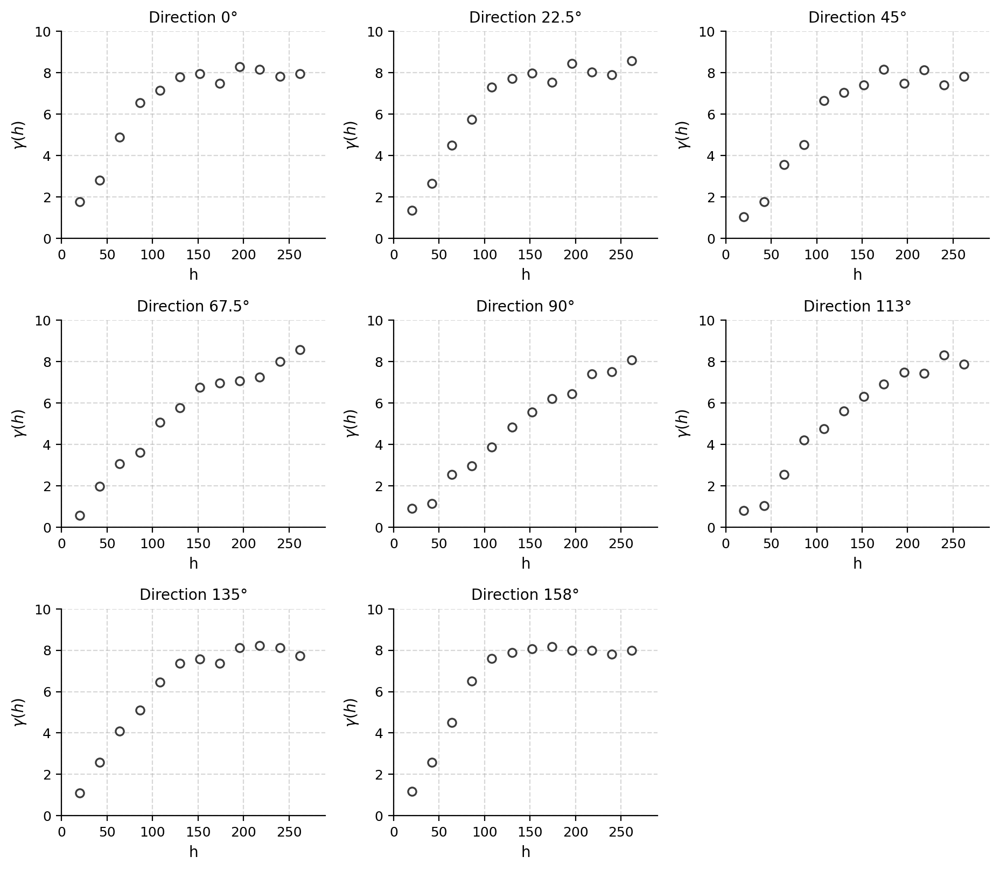{#fig-ex07-16 fig-align="center" width="85%"}

::: {.callout-note collapse="true"}
## Solution

Modèle **gaussien** avec anisotropie géométrique, portées effectives principales d'environ $250\ \text{m}$ selon $x$ (azimut $90^\circ$) et d'environ $120\ \text{m}$ selon $y$ (azimut $0^\circ$), $C_0 = 0{,}7$ et $C = 7{,}3$.
:::

### Exercice 17 — Associer 9 modèles de variogramme à 9 images simulées

Associez à chacun des modèles de variogramme suivants l'image correspondante (chaque image fait $100 \times 100$). Répondez en indiquant d'abord la lettre identifiant le modèle, puis le chiffre identifiant l'image (ex. A-1).

| Modèle | Description |
|:--:|:--|
| A | Pépite pur $C_0 = 10$ |
| B | Pépite + sphérique isotrope $C_0 = 5$, $C = 5$, $a = 20$ |
| C | Sphérique isotrope $a = 20$, $C = 10$ |
| D | Sphérique isotrope $a = 100$, $C = 10$ |
| E | Sphérique anisotrope $a_{120} = 100$, $a_{30} = 20$, $C = 1$ |
| F | Sphérique anisotrope $a_{60} = 100$, $a_{150} = 20$, $C = 10$ |
| G | Sphérique anisotrope $a_{120} = 100$, $a_{30} = 20$, $C = 10$ |
| H | Gaussien isotrope, $a_\text{effectif} = 20$, $C = 10$ |
| I | Gaussien anisotrope, $a_{120} = 100$, $a_{30} = 20$, $C = 10$ (portées effectives) |

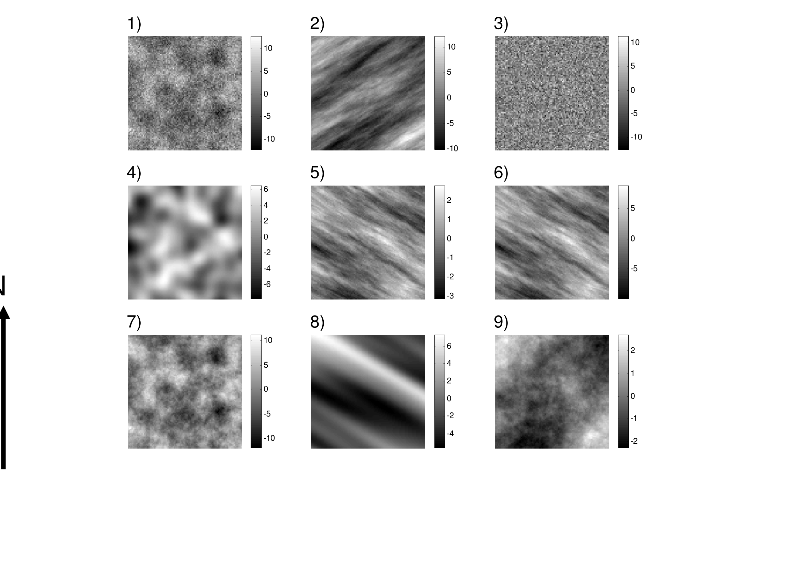{#fig-ex07-17 fig-align="center" width="85%"}

::: {.callout-note collapse="true"}
## Solution

A-3, B-1, C-7, D-9, E-5, F-2, G-6, H-4, I-8.
:::

### Exercice 18 — Effet d'une procédure d'échantillonnage moins précise

Quel serait l'effet sur le variogramme d'une procédure d'échantillonnage (P. Gy) moins précise ?

::: {.callout-note collapse="true"}
## Solution

Lorsque la variance relative d'échantillonnage $s_r^2$ augmente, les analyses peuvent varier davantage à très petite distance : on observe donc une **augmentation de l'effet de pépite** du variogramme.
:::

### Exercice 19 — Admissibilité d'un modèle de covariance

Soit la disposition de points $Z_i$ et le modèle de covariance présenté à la figure suivante (deux points consécutifs sur une même ligne sont espacés de $a/\sqrt{2}$). On forme une nouvelle variable aléatoire $W$ par
$$
W = \sum_{i=1}^{64} (-1)^{\,il_i + ic_i}\, Z_i,
$$
où $il_i$ et $ic_i$ sont respectivement les indices de ligne et de colonne décrivant la position de la $i$-ème donnée. On calcule la variance théorique de $W$ avec ce modèle :
$$
\operatorname{Var}(W) = 2\times 64 - 2\times 56\times 0{,}292 = -1{,}6074 .
$$

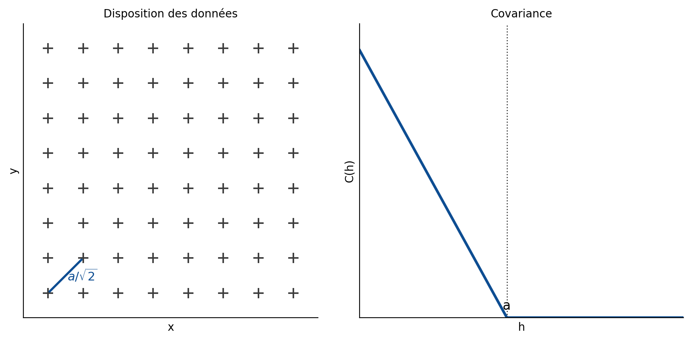{#fig-ex07-19 fig-align="center" width="85%"}

Considérant ce résultat, que peut-on dire du modèle de covariance ?

::: {.callout-note collapse="true"}
## Solution

Comme on vient de trouver une combinaison linéaire dont la variance théorique est négative, on doit conclure que le modèle de covariance utilisé **n'est pas admissible en 2D** (il l'est cependant en 1D). Un modèle admissible doit garantir $\operatorname{Var}(W) \geq 0$ pour toute combinaison linéaire.
:::

### Exercice 20 — Choix d'orientations pour des variogrammes 3D (forages Nb)

On vous présente les orientations des collets des forages pour l'exploration d'un gisement de Nb (graphique azimut–inclinaison). En appliquant une tolérance angulaire définissant un cône de $5^\circ$ autour de chaque orientation choisie, indiquez quatre orientations (azimut et plongée) pour le calcul des variogrammes directionnels, de façon à pouvoir détecter une éventuelle anisotropie 3D, à obtenir suffisamment de paires, tout en formant le plus possible de paires avec des observations d'un même forage.

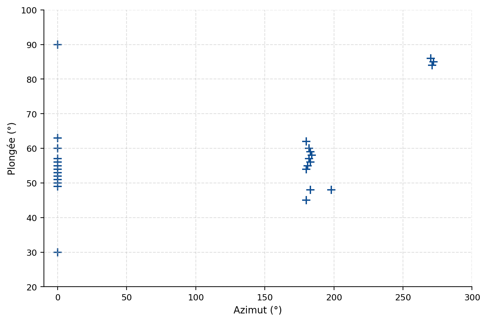{#fig-ex07-20 fig-align="center" width="85%"}

::: {.callout-note collapse="true"}
## Solution

Quatre orientations possibles (azimut–plongée) bien représentées par les forages et couvrant la sphère :

1. vertical (forages quasi verticaux) ;
2. azimut $0^\circ$, plongée $55^\circ$ ;
3. azimut $180^\circ$, plongée $60^\circ$ ;
4. azimut $180^\circ$, plongée $45^\circ$.

Ces directions maximisent le nombre de paires intra-forage tout en échantillonnant des directions différentes de l'espace pour révéler l'anisotropie 3D.
:::

### Exercice 21 — Comparaison de deux levés bathymétriques

Une compagnie A effectue un relevé bathymétrique dans un chenal marin. Une compagnie B effectue un relevé au même endroit, mais selon un patron d'échantillonnage légèrement différent et avec un appareillage différent. Certaines différences sont observées entre les valeurs des deux levés. La compagnie B prétend que son relevé est plus précis que celui de A, car elle utilise une procédure de correction instantanée pour l'effet des vagues, ce que A ne fait pas (A utilise toutefois un GPS différentiel qui, selon elle, fournit la même précision). Les mesures le long des lignes sont prises approximativement aux $3\ \text{m}$, et les lignes de relevé sont espacées approximativement de $10\ \text{m}$.

On vous présente les variogrammes obtenus parallèlement (longitudinalement) et perpendiculairement (transversalement) au chenal pour les deux compagnies (ronds : A ; carrés : B).

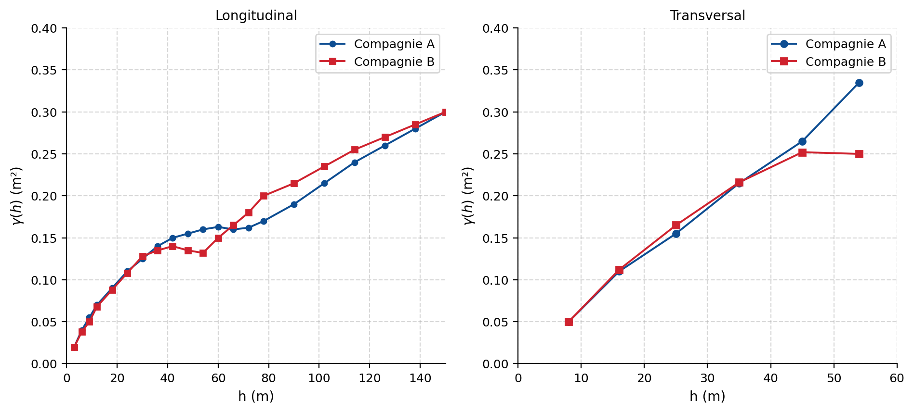{#fig-ex07-21 fig-align="center" width="85%"}

a) Discutez du résultat obtenu. Les variogrammes expérimentaux appuient-ils la prétention de la compagnie B ? Justifiez.

b) Suggérez un modèle 2D de variogramme (avec effet de pépite et palier unique fixé à $0{,}15\ \text{m}^2$) s'ajustant bien à ces données pour des distances allant jusqu'à $70\ \text{m}$ longitudinalement et $25\ \text{m}$ transversalement. Indiquez le type de modèle et les paramètres.

::: {.callout-note collapse="true"}
## Solution

**a)** Non, les variogrammes n'appuient pas la prétention de B, car les variogrammes expérimentaux sont quasi identiques jusqu'à $50\ \text{m}$ longitudinalement (dans le sens du relevé). L'effet des vagues, et donc du mouvement du bateau, devrait être un effet de court terme, car la taille d'une vague dans le chenal est typiquement $< 1$–$2\ \text{m}$. Les petites différences observées à plus grande distance s'expliquent facilement par le fait que les lignes de relevé ne sont pas exactement les mêmes et que la répartition peut différer entre les deux campagnes. À noter que le variogramme montre une demi-variance de $0{,}05\ \text{m}^2$ à $h \approx 5\ \text{m}$, ce qui correspond à un écart-type d'environ $22\ \text{cm}$. Vraisemblablement, les deux compagnies corrigent correctement l'effet des vagues, bien que de façon différente.

**b)** Modèle **sphérique** avec $a_\text{long} = 50\ \text{m}$, $a_\text{trans} = 23\ \text{m}$, $C_0 = 0\ \text{m}^2$ (ou très faible) et $C = 0{,}15\ \text{m}^2$.
:::

### Exercice 22 — Variogramme expérimental, modèle 2D et lissage du krigeage (examen)

Soit la disposition des données d'une mine montrant l'épaisseur d'une veine minéralisée.

a) Calculez, selon un azimut de $90^\circ$ et une tolérance angulaire de $0{,}1^\circ$, la valeur du variogramme expérimental pour la seule classe de distance $]0,20]\ \text{m}$. Précisez le nombre de paires, la valeur $\hat\gamma$ et la distance moyenne correspondante. Les couples appariés sont :

- Couples à $10\ \text{m}$ : $(21,3)$ ; $(1,19)$ ; $(7,11)$ ; $(11,24)$
- Couples à $20\ \text{m}$ : $(19,24)$ ; $(7,24)$ ; $(24,24)$ ; $(0,28)$

b) Pour un banc d'une mine de cuivre, on calcule les variogrammes expérimentaux des teneurs en % de Cu, selon différentes directions, avec une tolérance angulaire de $10^\circ$. Ajustez un seul modèle de variogramme 2D à ces variogrammes expérimentaux (fournissez toutes les informations nécessaires pour représenter adéquatement le modèle théorique).

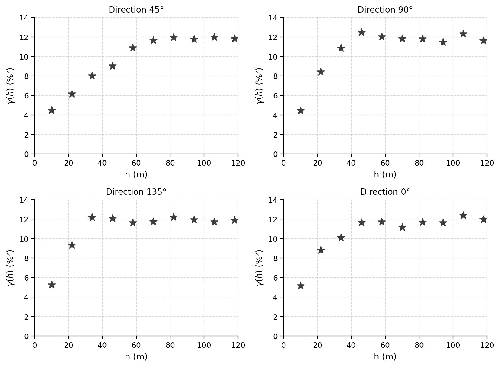{#fig-ex07-22 fig-align="center" width="85%"}

c) On effectue un krigeage ordinaire sur une grille régulière de $10\ \text{m}$, en partant du point $(5\ \text{m}, 5\ \text{m})$, à partir des données de la question a). Le krigeage utilise l'ensemble des données observées pour estimer les valeurs aux points de la grille. Le modèle de variogramme retenu est sphérique avec effet de pépite. On calcule ensuite le variogramme expérimental des valeurs krigées. Le variogramme expérimental obtenu sera-t-il correctement ajusté par le modèle de krigeage utilisé (sphérique avec effet de pépite) ? Justifiez à l'aide de deux arguments principaux.

::: {.callout-note collapse="true"}
## Solution

**a)** Pour la classe $]0,20]\ \text{m}$, on regroupe les $8$ couples (4 à $10\ \text{m}$ et 4 à $20\ \text{m}$). En calculant la demi-moyenne des différences carrées :
$$
\hat\gamma(\mathbf{h}) = \frac{1}{2\times 8}\sum_{\text{8 couples}}\big[\Delta\big]^2 = \frac{1\,931}{16} = 120{,}69\ \text{m}^2 ,
$$
avec $N = 8$ paires et une distance moyenne $\bar h = \dfrac{4\times 10 + 4\times 20}{8} = 15\ \text{m}$.

**b)** Modèle **sphérique** avec **anisotropie géométrique** : la direction de portée principale est $45^\circ$ et celle de portée minimale $135^\circ$, avec $a_g = 80\ \text{m}$ et $a_p = 40\ \text{m}$, $C_0 = 2\ \%^2$ et $C = 10\ \%^2$.

**c)** Non, il ne sera pas bien ajusté, pour deux raisons.

1. L'**effet de pépite sera complètement filtré** : les valeurs krigées sont continues (on ne krige qu'en des points sans donnée), ce qui élimine la discontinuité à l'origine.
2. La **propriété de lissage du krigeage** fait que la variance des valeurs krigées est inférieure à la variance des données. Le palier du variogramme des valeurs krigées sera donc inférieur (ce qui demeure vrai même en l'absence d'effet de pépite).
:::
