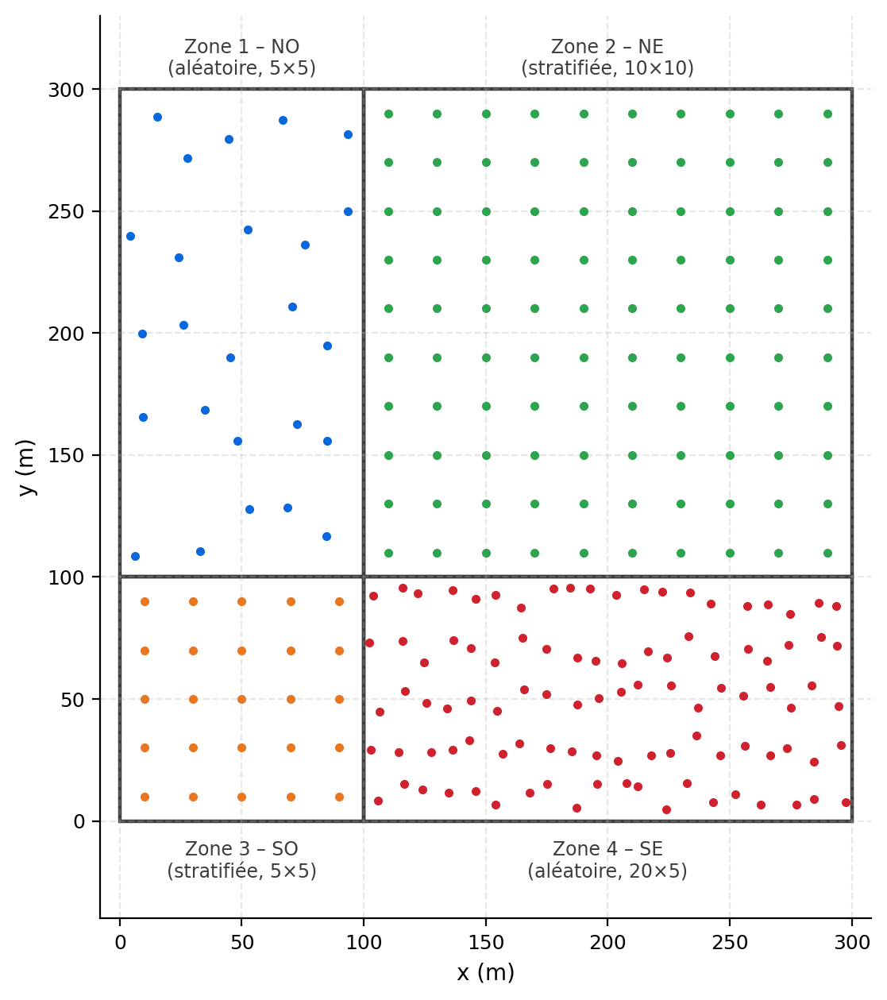

## Variance de blocs, de dispersion et d’estimation {#sec-ex-ch08 .recueil}
> *Les valeurs numériques des corrigés sont obtenues à l'aide des abaques GEOMIN (variance de bloc, de dispersion et d'estimation, modèle sphérique). Lorsqu'une figure ou un abaque n'est pas reproduit ici, l'énoncé et la solution chiffrée sont conservés et la source de l'abaque est signalée.*

### Exercice 1 — Variance de bloc en 1D, 2D et 3D ; variance ponctuelle dans le bloc

On considère un variogramme sphérique (ponctuel) **isotrope** avec un effet de pépite $C_0 = 1\,\text{\%}^2$, un palier de structure $C = 10\,\text{\%}^2$ et une portée $a = 30\,\text{m}$.

a) Quelle est la variance de la teneur de segments de $5\,\text{m}$ ?

b) Quelle est la variance de la teneur d'un bloc $10\,\text{m} \times 5\,\text{m}$ ?

c) Quelle est la variance de la teneur d'un bloc $10\,\text{m} \times 5\,\text{m} \times 5\,\text{m}$ ?

d) Quelle est la variance ponctuelle **dans** un bloc $10\,\text{m} \times 5\,\text{m} \times 5\,\text{m}$ ?

e) Reprenez a) à d) si l'effet de pépite vaut $C_0 = 5\,\text{\%}^2$ au lieu de $1\,\text{\%}^2$.

> *Les valeurs se lisent sur les abaques de variance de bloc, de dispersion et d'estimation donnés à l'annexe D (« Abaques »).*

::: {.callout-note collapse="true"}
## Solution

On utilise les abaques GEOMIN. La variance de bloc s'obtient par $\sigma_V^2 = \bar{C}(V,V)$, et la variance ponctuelle dans le bloc correspond à la variance de dispersion d'un point dans le bloc, $D^2(\,\cdot \mid V) = \sigma^2 - \sigma_V^2$, avec ici un palier total $\sigma^2 = C_0 + C = 11\,\text{\%}^2$.

a) Segment de $5\,\text{m}$ : $\sigma_V^2 = 9{,}26\,\text{\%}^2$.

b) Bloc $10 \times 5$ : $\sigma_V^2 = 8{,}16\,\text{\%}^2$.

c) Bloc $10 \times 5 \times 5$ : $\sigma_V^2 = 7{,}89\,\text{\%}^2$.

d) Variance ponctuelle dans le bloc $10 \times 5 \times 5$ : $D^2(\,\cdot \mid V) = 3{,}11\,\text{\%}^2$.

e) Avec $C_0 = 5\,\text{\%}^2$ : **rien ne change** pour a), b) et c). En effet, l'effet de pépite se retrouve intégralement dans la variance de bloc dès que le support n'est pas ponctuel (la composante pépite n'est pas réduite par le moyennage sur le bloc dans ces lectures d'abaque), tandis que la part structurée demeure identique. Seule la variance **ponctuelle** dans le bloc d) augmente, car le palier total passe de $11$ à $15\,\text{\%}^2$ : elle devient $D^2(\,\cdot \mid V) = 7{,}11\,\text{\%}^2$.
:::

### Exercice 2 — Variance de dispersion (rectangle dans rectangle, bloc dans bloc)

On conserve le variogramme sphérique (ponctuel) avec $C_0 = 1\,\text{\%}^2$, $C = 10\,\text{\%}^2$ et $a = 30\,\text{m}$.

a) Quelle est la variance de dispersion d'un rectangle $10\,\text{m} \times 5\,\text{m}$ dans un rectangle $20\,\text{m} \times 20\,\text{m}$ ?

b) Quelle est la variance de dispersion d'un bloc $5\,\text{m} \times 5\,\text{m} \times 5\,\text{m}$ dans un bloc $30\,\text{m} \times 30\,\text{m} \times 40\,\text{m}$ ?

> *Les valeurs se lisent sur les abaques de variance de bloc, de dispersion et d'estimation donnés à l'annexe D (« Abaques »).*

::: {.callout-note collapse="true"}
## Solution

La variance de dispersion s'obtient par différence de deux variances de bloc :
$$D^2(v \mid V) = \sigma_v^2 - \sigma_V^2 = \bar{C}(v,v) - \bar{C}(V,V).$$

a) $D^2(v \mid V) = 8{,}16 - 5{,}47 = 2{,}69\,\text{\%}^2$, où $8{,}16\,\text{\%}^2$ est la variance de bloc du petit rectangle $10 \times 5$ et $5{,}47\,\text{\%}^2$ celle du grand rectangle $20 \times 20$.

b) $D^2(v \mid V) = 8{,}46 - 2{,}07 = 6{,}39\,\text{\%}^2$, où $8{,}46\,\text{\%}^2$ est la variance de bloc du cube $5 \times 5 \times 5$ et $2{,}07\,\text{\%}^2$ celle du grand bloc $30 \times 30 \times 40$.
:::

### Exercice 3 — Variance de bloc avec anisotropie géométrique

Cette fois, le variogramme sphérique présente une **anisotropie géométrique** avec des portées $a_x = 100\,\text{m}$, $a_y = 50\,\text{m}$ et $a_z = 150\,\text{m}$.

a) Quelle est la variance de la teneur d'un bloc faisant $20\,\text{m} \times 20\,\text{m} \times 30\,\text{m}$ ?

b) Quelle est la variance de la teneur sur un rectangle de $40\,\text{m} \times 50\,\text{m}$ ?

> *Les valeurs se lisent sur les abaques de variance de bloc, de dispersion et d'estimation donnés à l'annexe D (« Abaques »).*

::: {.callout-note collapse="true"}
## Solution

En anisotropie géométrique, on ramène le problème au cas isotrope en divisant chaque dimension du bloc par la portée de son axe ($20/100$, $20/50$, $30/150$, etc.), puis on lit l'abaque sur le support transformé.

a) Bloc $20 \times 20 \times 30$ : $\sigma_V^2 = 7{,}48$ (dans les unités de variance du palier).

b) Rectangle $40 \times 50$ : $\sigma_V^2 = 5{,}18$.
:::

### Exercice 4 — Effet de la forme du bloc : variance de bloc $20 \times 5$ vs $10 \times 10$

Un variogramme sphérique présente $C_0 = 1\,\text{\%}^2$, $C = 10\,\text{\%}^2$ et $a = 30\,\text{m}$. On compare deux rectangles de **même surface** : $v_1 = 20\,\text{m} \times 5\,\text{m}$ et $v_2 = 10\,\text{m} \times 10\,\text{m}$.

Lequel des deux aura la variance de bloc $\sigma_V^2$ la plus élevée ? Énoncez d'abord votre intuition, puis vérifiez-la par le calcul explicite.

::: {.callout-note collapse="true"}
## Solution

**Intuition.** À surface égale, c'est le rectangle dont les côtés (normalisés par les portées) sont les plus « carrés » qui aura la **plus forte** variance de bloc. Un rectangle allongé inclut davantage de variation interne — il échantillonne le champ sur une plus grande portion de l'espace de corrélation dans la direction longue — et la moyenne sur le bloc est donc plus stable : sa variance de bloc est plus faible.

**Calcul.** On obtient :
$$\sigma_V^2 = 7{,}62\,\text{\%}^2 \;\;(\text{bloc } 10 \times 10) \qquad \text{et} \qquad \sigma_V^2 = 6{,}85\,\text{\%}^2 \;\;(\text{bloc } 20 \times 5).$$

Le bloc carré $10 \times 10$ a bien la variance de bloc la plus élevée, ce qui confirme l'intuition.
:::

### Exercice 5 — Effet de la forme sur la variation ponctuelle (dispersion)

Même situation qu'à l'exercice 4 ($C_0 = 1\,\text{\%}^2$, $C = 10\,\text{\%}^2$, $a = 30\,\text{m}$). On veut maintenant savoir dans lequel des deux rectangles ($10 \times 10$ ou $20 \times 5$) on s'attend à observer le **plus de variation de la teneur ponctuelle** à l'intérieur du bloc.

::: {.callout-note collapse="true"}
## Solution

La variation ponctuelle attendue à l'intérieur d'un bloc est la variance de dispersion d'un point dans le bloc, $D^2(\,\cdot \mid V) = \sigma^2 - \sigma_V^2$. C'est donc le bloc ayant la **plus faible** variance de bloc (exercice 4) qui montre la plus grande variation ponctuelle interne — soit le rectangle allongé.

$$D^2(\,\cdot \mid V) = 4{,}15\,\text{\%}^2 \;\;(\text{bloc } 20 \times 5) \qquad \text{et} \qquad D^2(\,\cdot \mid V) = 3{,}38\,\text{\%}^2 \;\;(\text{bloc } 10 \times 10).$$

Le rectangle allongé $20 \times 5$ est donc celui où la teneur ponctuelle varie le plus.
:::

### Exercice 6 — Variance de la teneur quotidienne au concentrateur et pile de pré-homogénéisation

Une minière exploite simultanément **trois zones distinctes**, considérées comme indépendantes. Chaque zone alimente le concentrateur d'une quantité égale de roche. Le volume total acheminé quotidiennement est de $3\,000\,\text{m}^3$, soit environ **trois blocs** de $40\,\text{m} \times 10\,\text{m} \times 10\,\text{m}$ (en $x, y, z$ ; $z$ étant la profondeur). Le variogramme ponctuel 3D du Cu (substance principale) est sphérique, anisotrope, avec $C_0 = 2\,\text{\%}$, $C_1 = 5\,\text{\%}$, $a_\text{horizontal} = 80\,\text{m}$ et $a_\text{vertical} = 20\,\text{m}$. Le même variogramme s'applique à chaque zone.

a) Quelle est la variance, sur une très longue période, de la teneur quotidienne en Cu entrant dans le concentrateur avec l'exploitation actuelle ?

La minière juge cette variance trop élevée, ce qui réduit l'efficacité du concentrateur. Elle évalue l'ajout d'une **pile de pré-homogénéisation** d'une capacité de $75\,000\,\text{m}^3$, approvisionnée de la même façon que le concentrateur l'est actuellement. On peut considérer qu'à la carrière, le volume de la pile représente **trois blocs indépendants** de $50\,\text{m} \times 50\,\text{m} \times 10\,\text{m}$.

b) Que devient, sur une très longue période, la variance de la teneur quotidienne en Cu entrant dans le concentrateur ?

> *Les valeurs se lisent sur les abaques de variance de bloc, de dispersion et d'estimation donnés à l'annexe D (« Abaques »).*

::: {.callout-note collapse="true"}
## Solution

Comme les trois zones sont indépendantes et fournissent chacune une part égale, la teneur quotidienne est la **moyenne** de trois teneurs de bloc indépendantes. La variance de la moyenne de trois variables indépendantes de même variance $\sigma_V^2$ est donc $\sigma_V^2 / 3$.

a) Pour un bloc $40 \times 10 \times 10$, l'abaque donne $\sigma_V^2 = 3{,}125\,\text{\%}^2$. D'où
$$\operatorname{Var}(\bar Z_\text{jour}) = \frac{3{,}125}{3} = 1{,}04\,\text{\%}^2.$$

b) Identique, mais avec un bloc de $50 \times 50 \times 10$ : l'abaque donne $\sigma_V^2 = 2{,}25\,\text{\%}^2$, d'où
$$\operatorname{Var}(\bar Z_\text{jour}) = \frac{2{,}25}{3} = 0{,}75\,\text{\%}^2.$$

La pile de pré-homogénéisation (blocs plus grands) réduit la variance de la teneur quotidienne, ce qui stabilise l'alimentation du concentrateur.
:::

### Exercice 7 — Propriétés de la variance de bloc et de dispersion

a) Soient deux modèles de variogramme **A** et **B** (présentés sur une figure). Pour chacun des éléments décrits dans le tableau 1, indiquez si les valeurs obtenues seront **très semblables (O)** ou **non (N)** lorsqu'on les calcule avec le modèle A puis avec le modèle B.

b) Mêmes consignes pour deux autres modèles **C** et **D** (tableau 2).

Les éléments à évaluer (identiques pour les deux paires de modèles) sont :

| | Élément |
|:---:|:---|
| a) | La variance de la teneur d'un bloc de $10\,\text{m} \times 10\,\text{m}$ |
| b) | La variance de dispersion pour un bloc de $5\,\text{m} \times 5\,\text{m}$ dans un bloc $20\,\text{m} \times 20\,\text{m}$ |
| c) | La variance d'un krigeage ordinaire ponctuel où tous les points, incluant le point à estimer, présentent entre eux des distances $< 10\,\text{m}$ |
| d) | La variance de dispersion des valeurs ponctuelles dans un bloc de $20\,\text{m} \times 20\,\text{m}$ |
| e) | La variance de la teneur d'un bloc de $100\,\text{m} \times 100\,\text{m}$ |
| f) | La variance de dispersion pour un bloc de $5\,\text{m} \times 5\,\text{m}$ dans un bloc $100\,\text{m} \times 100\,\text{m}$ |
| g) | La variance de krigeage ordinaire où tous les points du krigeage, incluant le point à estimer, présentent entre eux des distances $> 40\,\text{m}$ |
| h) | La variance de dispersion des valeurs ponctuelles dans un bloc de $100\,\text{m} \times 100\,\text{m}$ |

{#fig-ex08-modeles-AB-CD fig-align="center" width="85%"}

::: {.callout-note collapse="true"}
## Solution

Question de **raisonnement comparatif** : on juge, sans calcul détaillé, si chaque quantité (variance de bloc, variance de dispersion, variance d'estimation, etc.) est sensible ou non à la différence entre les deux modèles.

Principes directeurs pour répondre :

- La **variance de bloc** $\sigma_V^2$ et la **variance ponctuelle dans le bloc** dépendent surtout du comportement du variogramme **aux courtes distances** (effet de pépite, pente à l'origine, portée). Deux modèles qui diffèrent à courte distance donnent des résultats **différents (N)** pour ces quantités.
- Les quantités gouvernées par le **palier total** (variance ponctuelle globale $\sigma^2$, ou dispersion d'un point dans un très grand volume) sont **semblables (O)** dès que les deux modèles ont le même palier, même si leur structure interne diffère.
- La **variance de dispersion** $D^2(v \mid V) = \sigma_v^2 - \sigma_V^2$, étant une différence, peut filtrer ce qui est commun aux deux modèles : son comportement dépend de la dimension relative des supports $v$ et $V$ par rapport aux portées.

**a) Modèles A et B** (tableau 1) :

| | Élément | Semblable (O) ou Non (N) |
|:---:|:---|:---:|
| a) | Variance de la teneur d'un bloc $10 \times 10$ | N |
| b) | Variance de dispersion d'un bloc $5 \times 5$ dans un bloc $20 \times 20$ | O |
| c) | Variance d'un KO ponctuel, toutes distances $< 10\,\text{m}$ | O |
| d) | Variance de dispersion des valeurs ponctuelles dans un bloc $20 \times 20$ | O |
| e) | Variance de la teneur d'un bloc $100 \times 100$ | N |
| f) | Variance de dispersion d'un bloc $5 \times 5$ dans un bloc $100 \times 100$ | N |
| g) | Variance de KO, toutes distances $> 40\,\text{m}$ | N |
| h) | Variance de dispersion des valeurs ponctuelles dans un bloc $100 \times 100$ | N |

**b) Modèles C et D** (tableau 2) :

| | Élément | Semblable (O) ou Non (N) |
|:---:|:---|:---:|
| a) | Variance de la teneur d'un bloc $10 \times 10$ | N |
| b) | Variance de dispersion d'un bloc $5 \times 5$ dans un bloc $20 \times 20$ | N |
| c) | Variance d'un KO ponctuel, toutes distances $< 10\,\text{m}$ | N |
| d) | Variance de dispersion des valeurs ponctuelles dans un bloc $20 \times 20$ | N |
| e) | Variance de la teneur d'un bloc $100 \times 100$ | O |
| f) | Variance de dispersion d'un bloc $5 \times 5$ dans un bloc $100 \times 100$ | N |
| g) | Variance de KO, toutes distances $> 40\,\text{m}$ | O |
| h) | Variance de dispersion des valeurs ponctuelles dans un bloc $100 \times 100$ | N |

(Correction : $-1$ point par mauvaise réponse dans la grille originale.)
:::

### Exercice 8 — Variance d'estimation et effet de support (30 forages)

> *Note : cet exercice porte sur la **variance d'estimation** ; il se situe à la frontière des chapitres 8 et 9 — voir le lien avec le chapitre 9 (krigeage).*

Une zone d'un gisement 3D d'or est délimitée à partir de **30 forages verticaux** de $120\,\text{m}$ de long chacun. Les forages sont disposés sur une grille régulière, espacés de $50\,\text{m}$ dans les directions $x$ et $y$. Les carottes de $4\,\text{m}$, analysées en continu sur toute la longueur du forage, ont permis d'identifier un modèle de variogramme sphérique avec $C_0 = 25\,\text{ppm}^2$, $C_1 = 75\,\text{ppm}^2$, présentant une anisotropie géométrique avec une portée horizontale $a_h = 100\,\text{m}$ et une portée verticale $a_v = 60\,\text{m}$. On considère le modèle **isotrope** dans le plan horizontal $(x, y)$.

Quelle est la variance d'estimation de la teneur moyenne en or pour l'ensemble de la zone couverte par les 30 forages ?

> *Les valeurs se lisent sur les abaques de variance de bloc, de dispersion et d'estimation donnés à l'annexe D (« Abaques »).*

::: {.callout-note collapse="true"}
## Solution

On a 30 parallélépipèdes de $120\,\text{m}$ de long $\times\,50\,\text{m} \times 50\,\text{m}$, chacun estimé par son forage central. On utilise l'abaque 3D de la variance d'estimation. Chaque forage contient $n = 120 / 4 = 30$ carottes.

**Pour un bloc** (un forage), la variance d'estimation combine la part pépite (réduite par le nombre $n$ de carottes) et la part structurée lue à l'abaque :
$$\sigma_{e_1}^2 = \frac{C_0}{n} + C_1\,E\!\left(\frac{50}{100},\,\frac{120}{60}\right) = \frac{25}{30} + 75 \times 0{,}025 = 2{,}708\,\text{ppm}^2,$$
avec la valeur d'abaque $E(50/100,\,120/60) = 0{,}025$.

**Pour l'ensemble des 30 forages**, comme ils sont disposés régulièrement et estiment des zones de même taille, la variance d'estimation globale est divisée par le nombre de forages :
$$\sigma_e^2 = \frac{\sigma_{e_1}^2}{30} = \frac{2{,}708}{30} = 0{,}0902\,\text{ppm}^2.$$
:::

### Exercice 9 — Variance d'estimation de la teneur moyenne et combinaison d'erreurs élémentaires

> *Note : cet exercice porte sur la **variance d'estimation** ; il se situe à la frontière des chapitres 8 et 9 — voir le lien avec le chapitre 9 (krigeage).*

La figure ci-dessous montre l'emplacement des échantillons dans une portion d'une mine de zinc. On distingue **quatre zones** correspondant à **quatre patrons d'échantillonnage** différents. Pour les zones nord-ouest et sud-est, on peut considérer que l'échantillonnage est **aléatoire stratifié** avec un échantillon par cellule. Les teneurs (% Zn) sont mesurées sur des épaisseurs constantes de $5\,\text{m}$ (épaisseur des bancs) et servent à calculer le variogramme 2D des teneurs en Zn.

Quelle est la variance d'estimation de la teneur moyenne en Zn pour l'ensemble de la zone, si le variogramme est sphérique **isotrope** avec $C_0 = 6\,\text{\%}^2$, $C_1 = 30\,\text{\%}^2$ et $a = 80\,\text{m}$ ? Répondez en combinant les erreurs élémentaires des quatre zones.

Les caractéristiques des quatre zones et de leurs patrons d'échantillonnage sont :

| Zone | Nombre de forages | Taille des blocs | Type de grille | Surface de la zone |
|:---:|:---:|:---:|:---:|:---:|
| 1 – NO | $5 \times 5 = 25$ | $20 \times 40$ | Aléatoire | $100 \times 200 = 20\,000$ |
| 2 – NE | $10 \times 10 = 100$ | $20 \times 20$ | Stratifiée | $200 \times 200 = 40\,000$ |
| 3 – SO | $5 \times 5 = 25$ | $20 \times 20$ | Stratifiée | $100 \times 100 = 10\,000$ |
| 4 – SE | $20 \times 5 = 100$ | $10 \times 20$ | Aléatoire | $200 \times 100 = 20\,000$ |

{#fig-ex08-patrons-zones fig-align="center" width="85%"}

::: {.callout-note collapse="true"}
## Solution

Le principe est celui de la **combinaison d'erreurs élémentaires** : on estime séparément la teneur moyenne de chaque zone $i$ (chacune avec sa propre variance d'estimation élémentaire $\sigma_{e_i}^2$ obtenue par abaque selon son patron d'échantillonnage), puis on combine ces erreurs en pondérant par le **carré de la surface relative** de chaque zone, les zones étant supposées indépendantes :
$$\sigma_e^2 = \frac{1}{S^2}\sum_{i} S_i^2\,\sigma_{e_i}^2,$$
où $S_i$ est la surface de la zone $i$ et $S = \sum_i S_i$ la surface totale.

Pour chaque zone, la variance d'estimation élémentaire $\sigma_{e_i}^2$ se lit à l'abaque approprié au patron correspondant (abaque $E$ pour les grilles aléatoires des zones NO et SE, abaque $F$ pour les grilles stratifiées NE et SO), à partir des rapports dimension/portée ($a = 80\,\text{m}$) et du palier $C_0 + C_1 = 36\,\text{\%}^2$ :

| Zone | Type de grille | Calcul de $\sigma_{e_i}^2$ (palier divisé par le nombre de forages) |
|:---:|:---:|:---|
| 1 – NO | Aléatoire | $6 + 30\,E\!\left(\tfrac{20}{80}, \tfrac{40}{80}\right) = 6 + 30 \times 0{,}145 = 10{,}35$ ; puis $10{,}35 / 25 = 0{,}4940$ |
| 2 – NE | Stratifiée | $6 + 30\,F\!\left(\tfrac{20}{80}, \tfrac{20}{80}\right) = 6 + 30 \times 0{,}17 = 11{,}1$ ; puis $11{,}1 / 100 = 0{,}111$ |
| 3 – SO | Stratifiée | $6 + 30\,F\!\left(\tfrac{20}{80}, \tfrac{20}{80}\right) = 6 + 30 \times 0{,}17 = 11{,}1$ ; puis $11{,}1 / 25 = 0{,}444$ |
| 4 – SE | Aléatoire | $6 + 30\,E\!\left(\tfrac{10}{80}, \tfrac{20}{80}\right) = 6 + 30 \times 0{,}07 = 8{,}1$ ; puis $8{,}1 / 100 = 0{,}081$ |

On agrège enfin par la formule de pondération par le carré des surfaces :
$$\sigma_e^2 = \frac{20\,000^2 (0{,}4940) + 40\,000^2 (0{,}111) + 10\,000^2 (0{,}444) + 20\,000^2 (0{,}081)}{(300 \times 300)^2} = 0{,}0521\,\text{\%}^2.$$
:::
