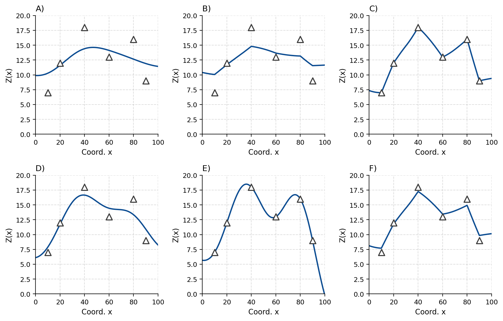
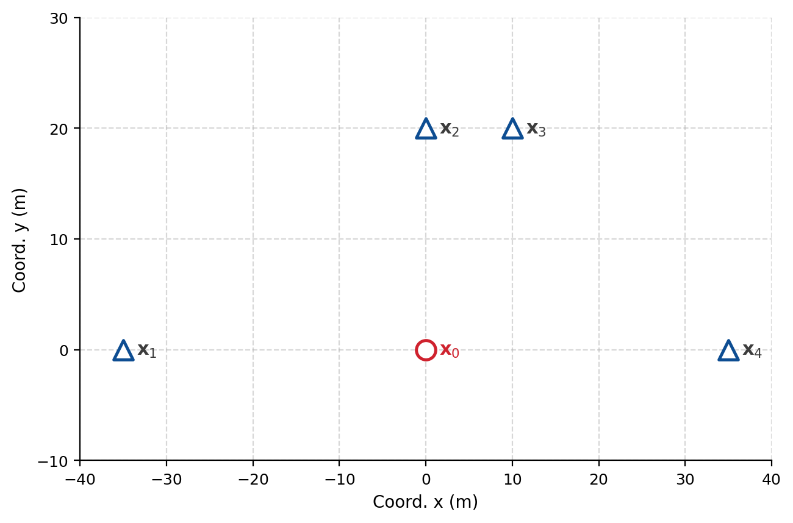
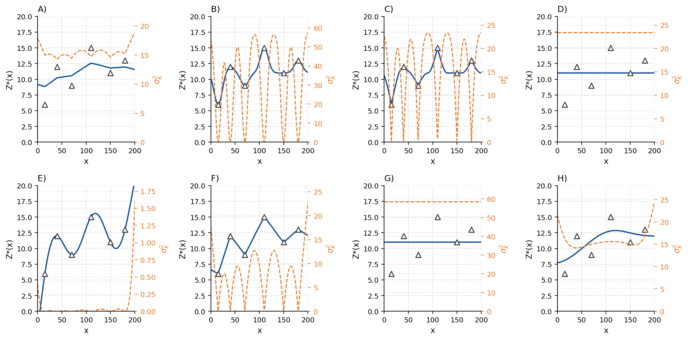
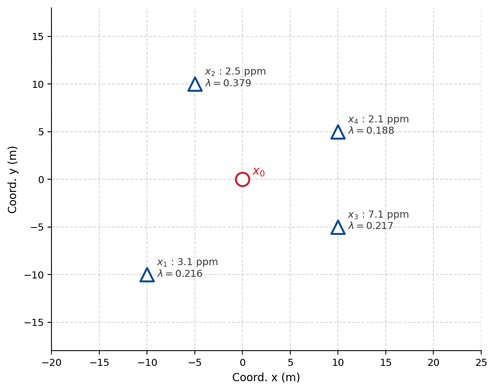
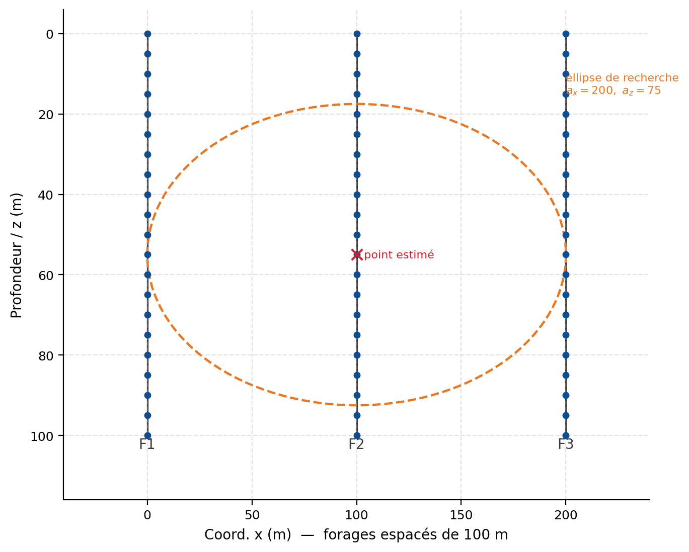

## Krigeage {#sec-ex-ch09 .recueil}
### Exercice 1 — Systèmes de krigeage simple et ordinaire en 1D

Dans un problème 1D, on estime le point $\mathbf{x}_0$ à l'aide des points $\mathbf{x}_1$ et $\mathbf{x}_2$. Le tableau suivant donne les coordonnées de ces points.

| Point | Coordonnée $x$ |
|:---:|:---:|
| $\mathbf{x}_0$ | $0$ |
| $\mathbf{x}_1$ | $-6$ |
| $\mathbf{x}_2$ | $4$ |

Le modèle de covariance est gaussien :
$$
C(h) = 5\,\delta(h) + 10\,\exp\!\left(-\frac{3h^2}{10^2}\right),
$$
où $\delta(h)$ vaut $1$ si $h = 0$ et $0$ sinon.

a) Construisez le système de krigeage simple correspondant.

b) On résout le système et on trouve les poids $\lambda_1 = 0.213$ et $\lambda_2 = 0.406$. Que valent la valeur estimée et la variance de krigeage si la moyenne connue est $m = 3$, avec $Z_1 = 4$ et $Z_2 = 5$ ?

c) Construisez le système de krigeage ordinaire.

d) On trouve comme solution $\lambda_1 = 0.404$, $\lambda_2 = 0.596$ et $\nu = -2.957$. Que valent la valeur estimée et la variance de krigeage si $Z_1 = 4$ et $Z_2 = 5$ ?

::: {.callout-note collapse="true"}
## Solution

On a besoin des covariances. Avec $|\mathbf{x}_1 - \mathbf{x}_2| = 10$, $|\mathbf{x}_1 - \mathbf{x}_0| = 6$ et $|\mathbf{x}_2 - \mathbf{x}_0| = 4$ :
$$
C(\mathbf{x}_1 - \mathbf{x}_2) = 10\,e^{-3\cdot 100/100} = 0.498,\quad
C(\mathbf{x}_1 - \mathbf{x}_0) = 10\,e^{-3\cdot 36/100} = 3.396,\quad
C(\mathbf{x}_2 - \mathbf{x}_0) = 10\,e^{-3\cdot 16/100} = 6.188.
$$
Sur la diagonale, $C(\mathbf{0}) = 5 + 10 = 15$.

a) Système de krigeage simple $\mathbf{C}\,\boldsymbol{\lambda} = \mathbf{c}$ :
$$
\begin{bmatrix} 15 & 0.498 \\ 0.498 & 15 \end{bmatrix}
\begin{bmatrix} \lambda_1 \\ \lambda_2 \end{bmatrix}
=
\begin{bmatrix} 3.396 \\ 6.188 \end{bmatrix}.
$$

b) Estimateur de krigeage simple (la moyenne est connue) :
$$
Z^*(\mathbf{x}_0) = m + \lambda_1 (Z_1 - m) + \lambda_2 (Z_2 - m) = 3 + 0.213(4-3) + 0.406(5-3) = 4.02.
$$
$$
\sigma_{SK}^2 = C(\mathbf{0}) - \lambda_1 C(\mathbf{x}_1 - \mathbf{x}_0) - \lambda_2 C(\mathbf{x}_2 - \mathbf{x}_0) = 15 - 0.213(3.396) - 0.406(6.188) = 11.77.
$$

c) Système de krigeage ordinaire (avec la contrainte $\sum \lambda_i = 1$ et le multiplicateur $\nu$) :
$$
\begin{bmatrix} 15 & 0.498 & 1 \\ 0.498 & 15 & 1 \\ 1 & 1 & 0 \end{bmatrix}
\begin{bmatrix} \lambda_1 \\ \lambda_2 \\ \nu \end{bmatrix}
=
\begin{bmatrix} 3.396 \\ 6.188 \\ 1 \end{bmatrix}.
$$

d) Estimateur de krigeage ordinaire :
$$
Z^*(\mathbf{x}_0) = 0.404(4) + 0.596(5) = 4.60.
$$
$$
\sigma_{OK}^2 = C(\mathbf{0}) - \lambda_1 C(\mathbf{x}_1 - \mathbf{x}_0) - \lambda_2 C(\mathbf{x}_2 - \mathbf{x}_0) - \nu = 15 - 0.404(3.396) - 0.596(6.188) - (-2.957) = 12.90.
$$
Le terme $-\nu = +2.957$ traduit le surcoût de variance dû à l'ignorance de la moyenne.
:::

### Exercice 2 — Particularités du krigeage : singularité, valeurs négatives, voisinage

a) Une erreur de saisie dans une base de données fait que deux données **différentes** se retrouvent avec exactement les **mêmes coordonnées**. Que se passe-t-il lors des krigeages dont le voisinage de recherche inclut ces deux données ? *(Aide : ce n'est pas dans les notes de cours.)*

b) Est-il possible qu'un krigeage retourne une teneur estimée **négative** même si toutes les teneurs mesurées sont (évidemment) positives ? Justifiez.

c) Est-il possible que le krigeage retourne une teneur estimée **supérieure** à la plus grande teneur observée dans les données ? Justifiez.

d) Est-il possible d'avoir une variance de krigeage ordinaire **supérieure** à la variance de la variable aléatoire que l'on cherche à estimer ? Justifiez.

e) Commentez : « on ne peut calculer la variance d'estimation que si l'estimation a été obtenue par krigeage (ordinaire ou simple) ».

f) Commentez : « le choix du voisinage utilisé pour le krigeage peut être davantage important que le choix du modèle de variogramme pour assurer la qualité des estimations du krigeage ».

::: {.callout-note collapse="true"}
## Solution

a) La matrice de krigeage contient alors **deux lignes et deux colonnes identiques** : elle est **singulière** (non inversible) et il n'est pas possible de résoudre le système d'équations.

b) **Oui.** Comme le krigeage peut produire des **poids négatifs**, un poids négatif associé à une valeur positive (les autres poids étant associés à des valeurs nulles ou faibles) peut donner un résultat négatif.

c) **Oui**, pour la même raison. Par exemple, avec deux poids $-0.02$ et $1.02$ : si le poids $-0.02$ est associé à une donnée de valeur $0$, l'estimé dépasse la valeur associée au poids $1.02$.

d) **Oui.** La limite théorique pour le krigeage ordinaire est $2(C_0 + C)$.

e) **Faux.** Dès que l'on connaît le variogramme, on peut calculer la variance d'estimation de **tout estimateur linéaire**, qu'il provienne du krigeage ou non.

f) **Oui.** Les résultats du krigeage sont relativement **robustes** au choix du modèle de variogramme. En revanche, un mauvais choix de voisinage peut mener à des valeurs estimées irréalistes et à des cartes comportant des artéfacts. Il est donc important de choisir le voisinage avec soin.
:::

### Exercice 3 — Peut-on avoir tous les poids nuls ?

Dans un krigeage ponctuel :

a) Est-il possible d'avoir les poids $\lambda_i$, $i = 1,\dots,n$, de **krigeage simple** tous égaux à zéro ? Si oui, dans quelle situation ? Si non, pourquoi ?

b) Est-il possible d'avoir les poids $\lambda_i$, $i = 1,\dots,n$, de **krigeage ordinaire** tous égaux à zéro ? Si oui, dans quelle situation ? Si non, pourquoi ?

::: {.callout-note collapse="true"}
## Solution

a) **Oui**, si tous les points disponibles sont à une distance **supérieure à la portée** du point à estimer (indépendamment de la distance des points entre eux). Toutes les covariances point–point avec $\mathbf{x}_0$ sont alors nulles, et le krigeage simple ramène l'estimateur à la moyenne $m$.

b) **Non.** La contrainte $\sum_i \lambda_i = 1$ l'empêche : les poids ne peuvent pas tous être nuls.
:::

### Exercice 4 — Profils de krigeage et modèles de variogramme

On présente six profils obtenus par krigeage ordinaire avec des modèles différents, en utilisant les observations indiquées par des $\Delta$.

a) Associez à chaque modèle de variogramme le profil de krigeage correspondant (A à F).

| Modèle | Figure |
|:---|:---:|
| Sphérique, $C_0/C = 0$, $a = 50$ | |
| Sphérique, $C_0/C = 0.1$, $a = 50$ | |
| Sphérique, $C_0/C = 1.0$, $a = 50$ | |
| Gaussien, $C_0/C = 0$, $a_\text{effectif} = 50$ | |
| Gaussien, $C_0/C = 0.1$, $a_\text{effectif} = 50$ | |
| Gaussien, $C_0/C = 1.0$, $a_\text{effectif} = 50$ | |

b) À la question précédente, seul le **ratio** $C_0/C$ est fourni au lieu des valeurs séparées de $C_0$ et $C$. Qu'est-ce qui change dans le krigeage si le ratio $C_0/C = 1$ est obtenu avec $C_0 = 10$, $C = 10$ plutôt qu'avec $C_0 = 5$, $C = 5$ ?

{#fig-ex09-4 fig-align="center" width="85%"}

::: {.callout-note collapse="true"}
## Solution

a) Association des modèles aux profils :

| Modèle | Figure |
|:---|:---:|
| Sphérique, $C_0/C = 0$, $a = 50$ | C |
| Sphérique, $C_0/C = 0.1$, $a = 50$ | F |
| Sphérique, $C_0/C = 1.0$, $a = 50$ | B |
| Gaussien, $C_0/C = 0$, $a_\text{effectif} = 50$ | E |
| Gaussien, $C_0/C = 0.1$, $a_\text{effectif} = 50$ | D |
| Gaussien, $C_0/C = 1.0$, $a_\text{effectif} = 50$ | A |

b) Les **estimés demeurent inchangés** (les poids ne dépendent que des covariances **relatives**). En revanche, la **variance de krigeage** serait $2$ fois plus grande avec $C_0 = 10$, $C = 10$ qu'avec $C_0 = 5$, $C = 5$ (le palier total double, donc la variance double aussi).
:::

### Exercice 5 — Système de krigeage ordinaire en 2D (Fe, sphérique isotrope)

> *Note : la covariance de ces données (plan de localisation $\mathbf{x}_0$–$\mathbf{x}_4$) est traitée à l'exercice correspondant du **ch. 7** ; ici on construit le **système de krigeage complet**.*

Le diagramme suivant montre l'emplacement de quatre données ($\mathbf{x}_1$ à $\mathbf{x}_4$) où l'on a mesuré la teneur en Fe. On désire effectuer un krigeage ordinaire au point $\mathbf{x}_0$ situé en $(0, 0)$. Le variogramme est sphérique et **isotrope**, de portée $30\ \text{m}$, d'effet de pépite $C_0 = 5\ \%^2$ et de palier structuré $C = 50\ \%^2$ (palier total $55\ \%^2$).

{#fig-ex09-5 fig-align="center" width="85%"}

a) Fournissez, sous forme matricielle, les équations du krigeage ordinaire du point $\mathbf{x}_0$ avec les points $\mathbf{x}_1$ à $\mathbf{x}_4$. Ne résolvez pas ce système.

b) Quelle serait la covariance entre les teneurs aux points $\mathbf{x}_3$ et $\mathbf{x}_0$ si l'on avait plutôt un modèle sphérique **anisotrope** avec $a_x = 30\ \text{m}$ et $a_y = 50\ \text{m}$ ($C_0$ et $C$ inchangés) ?

c) Si l'on effectuait l'estimation uniquement avec le point $\mathbf{x}_4$, quelle serait la variance de krigeage obtenue ?

::: {.callout-note collapse="true"}
## Solution

a) Le système $\mathbf{K}\,\boldsymbol{\lambda}^+ = \mathbf{k}_0$ s'écrit
$$
\mathbf{K} =
\begin{bmatrix}
55 & 0 & 0 & 0 & 1 \\
0 & 55 & 25.93 & 0 & 1 \\
0 & 25.93 & 55 & 0 & 1 \\
0 & 0 & 0 & 55 & 1 \\
1 & 1 & 1 & 1 & 0
\end{bmatrix},
\qquad
\mathbf{k}_0 =
\begin{bmatrix}
0 \\ 7.41 \\ 4.45 \\ 0 \\ 1
\end{bmatrix},
$$
les inconnues étant $\boldsymbol{\lambda}^+ = (\lambda_1, \lambda_2, \lambda_3, \lambda_4, \nu)^\top$. (Les covariances nulles correspondent à des distances supérieures à la portée de $30\ \text{m}$.)

b) Avec le modèle anisotrope, la distance entre $\mathbf{x}_3$ et $\mathbf{x}_0$ est $\sqrt{100 + 400} = 22.36\ \text{m}$. L'angle de la direction avec l'axe des $y$ est $\arctan(10/20) = 26.6^\circ$. La portée dans cette direction vaut
$$
a = \frac{50 \times 30}{\sqrt{50^2 \sin^2(26.6^\circ) + 30^2 \cos^2(26.6^\circ)}} = 42.9\ \text{m},
$$
d'où
$$
C(h) = 50\left[1 - 1.5\frac{22.36}{42.9} + 0.5\left(\frac{22.36}{42.9}\right)^3\right] = 14.5\ \%^2.
$$

c) Avec le seul point $\mathbf{x}_4$, la covariance $C(\mathbf{x}_4 - \mathbf{x}_0)$ est nulle (distance $>$ portée), donc le poids vaut $1$ et la variance de krigeage ordinaire est
$$
\sigma_{OK}^2 = 2(C_0 + C) = 2 \times 55 = 110\ \%^2.
$$
:::

### Exercice 6 — Impact du modèle de variogramme sur les profils de krigeage 1D

Le tableau suivant présente $8$ modèles de variogramme. La figure associée présente les résultats d'un krigeage 1D effectué à partir des **mêmes** points d'échantillon et de chacun des modèles. Les figures de **gauche** présentent la valeur estimée par krigeage ordinaire en fonction de la coordonnée $x$ ; les figures de **droite** présentent la **variance** de ce krigeage en fonction de $x$.

| Modèle $\#$ | Description |
|:---:|:---|
| 1 | Sphérique, $a = 120$, $C = 50$ |
| 2 | Sphérique, $a = 20$, $C = 20$ |
| 3 | Sphérique, $a = 120$, $C_0 = 10$, $C = 10$ |
| 4 | Gaussien, $a_\text{effectif} = 120$, $C = 50$ |
| 5 | Gaussien, $a_\text{effectif} = 120$, $C_0 = 10$, $C = 40$ |
| 6 | Gaussien, $a_\text{effectif} = 20$, $C = 50$ |
| 7 | Effet de pépite pur, $C_0 = 20$ |
| 8 | Effet de pépite pur, $C_0 = 50$ |

Associez une figure (de A à H) à chacun des modèles du tableau.

{#fig-ex09-6 fig-align="center" width="85%"}

::: {.callout-note collapse="true"}
## Solution

L'association repose sur les comportements caractéristiques :

- un **effet de pépite** élevé donne des estimés peu lissés (sauts aux données) et une variance qui ne retombe pas à zéro entre les données ;
- un modèle **gaussien** (continuité parabolique à l'origine) donne des profils très lisses ;
- une **portée** plus grande étale l'influence des données et abaisse la variance entre celles-ci.

En appariant chaque modèle au couple (profil estimé, profil de variance) compatible avec ces propriétés, on obtient :

| Modèle $\#$ | Description | Figure associée |
|:---:|:---|:---:|
| 1 | Sphérique, $a = 120$, $C = 50$ | F |
| 2 | Sphérique, $a = 20$, $C = 20$ | C |
| 3 | Sphérique, $a = 120$, $C_0 = 10$, $C = 10$ | A |
| 4 | Gaussien, $a_\text{effectif} = 120$, $C = 50$ | E |
| 5 | Gaussien, $a_\text{effectif} = 120$, $C_0 = 10$, $C = 40$ | H |
| 6 | Gaussien, $a_\text{effectif} = 20$, $C = 50$ | B |
| 7 | Effet de pépite pur, $C_0 = 20$ | D |
| 8 | Effet de pépite pur, $C_0 = 50$ | G |

*(L'appariement repose sur la figure des profils (@fig-ex09-4) ; les associations ci-dessus sont celles du corrigé.)*
:::

### Exercice 7 — Variogramme expérimental des valeurs krigées

Vous faites le krigeage d'une variable échantillonnée en quelques points, avec un modèle de variogramme **A**. Le krigeage porte sur une grille très fine couvrant un large domaine. Vous calculez ensuite le **variogramme expérimental des valeurs krigées**.

a) Doit-on s'attendre à ce que ce variogramme expérimental soit nécessairement proche du modèle A ? Justifiez à l'aide des propriétés du krigeage.

b) Est-on réellement justifié de calculer un variogramme sur des données krigées ? Pourquoi ?

::: {.callout-note collapse="true"}
## Solution

a) **Non.** La carte krigée est normalement **plus lisse** que les vraies valeurs. Comme $\operatorname{Var}(Z^*) < \operatorname{Var}(Z)$ et que le palier du variogramme correspond à $\operatorname{Var}(Z)$, on ne peut pas retrouver le modèle A. En particulier :

- les valeurs krigées montrent **peu ou pas d'effet de pépite**, même si les données en présentent un fort (le variogramme des valeurs krigées peut même afficher un comportement **parabolique** à l'origine, alors que les données avaient un comportement linéaire) ;
- la **portée** apparente tend à être **supérieure**, à cause des corrélations de proche en proche introduites par l'interpolation.

b) Théoriquement, $\operatorname{Var}\!\big(Z^*(\mathbf{x})\big)$ varie selon la **localisation** (elle dépend de la position du point estimé par rapport aux données). L'idée même de calculer un variogramme sur des données krigées repose donc sur une hypothèse de stationnarité qui n'est pas satisfaite : c'est en soi une **hérésie** statistique.
:::

### Exercice 8 — Variance d'estimation de la teneur moyenne globale (3 zones)

> *Note : exercice en lien avec la **variance d'estimation** (ch. 8).*

Un gisement tabulaire de Cu, d'épaisseur quasi-constante, comporte $3$ zones ayant des variogrammes différents et ayant été krigées **séparément**. On a obtenu :

| Zone | Forages utilisés | Surface | Variance de krigeage de la zone |
|:---:|:---:|:---:|:---:|
| A | $23$ | $20\,700\ \text{m}^2$ | $0.09\ \%^2$ |
| B | $37$ | $33\,300\ \text{m}^2$ | $0.11\ \%^2$ |
| C | $34$ | $29\,700\ \text{m}^2$ | $0.24\ \%^2$ |

Quelle est la variance d'estimation de la teneur en Cu moyenne pour l'ensemble du gisement ?

::: {.callout-note collapse="true"}
## Solution

Les zones étant krigées indépendamment, on combine les variances en **pondérant par le carré des surfaces** :
$$
\sigma^2_\text{global} = \frac{S_A^2\,\sigma_A^2 + S_B^2\,\sigma_B^2 + S_C^2\,\sigma_C^2}{(S_A + S_B + S_C)^2}.
$$
$$
\sigma^2_\text{global} = \frac{20\,700^2 (0.09) + 33\,300^2 (0.11) + 29\,700^2 (0.24)}{(20\,700 + 33\,300 + 29\,700)^2} = 0.053\ \%^2.
$$
:::

### Exercice 9 — Compléter un système de krigeage ordinaire (Au, anisotropie, azimut 30°)

Un gisement d'or 2D montre un variogramme sphérique avec **anisotropie géométrique**. La direction (azimut) de meilleure continuité spatiale est $30^\circ$. Les paramètres sont $C_0 = 10\ \text{ppm}^2$, $C = 20\ \text{ppm}^2$, $a_{30} = 50\ \text{m}$, $a_{120} = 25\ \text{m}$.

On désire effectuer le krigeage de la teneur au point $(100, 100)$. On retrouve dans le voisinage immédiat les données suivantes :

| Obs. $\#$ | $x$ (m) | $y$ (m) | Teneur (ppm) |
|:---:|:---:|:---:|:---:|
| 1 | $80$ | $90$ | $10$ |
| 2 | $95$ | $105$ | $4$ |
| 3 | $103$ | $104$ | $7$ |
| 4 | $107$ | $92$ | $3$ |

Le système de krigeage ordinaire est construit en plaçant les observations $1$ à $4$ dans l'ordre :
$$
\begin{bmatrix}
30 & A & 2.43 & 0.09 & D \\
B & C & 11.17 & 2.68 & 1 \\
2.43 & 11.17 & 30 & 8.29 & 1 \\
0.09 & 2.68 & 8.29 & 30 & 1 \\
1 & 1 & 1 & 1 & E
\end{bmatrix}
\begin{bmatrix} \lambda_1 \\ \lambda_2 \\ \lambda_3 \\ \lambda_4 \\ \nu \end{bmatrix}
=
\begin{bmatrix} 13.82 \\ 11.94 \\ 16.95 \\ 8.43 \\ 1 \end{bmatrix}.
$$

où $D$ désigne un terme de la colonne de contrainte et $E$ le coin inférieur droit de la matrice.

a) Que valent les entrées $A$ à $E$ ?

b) Quels liens existeraient entre l'estimé et la variance de krigeage du modèle ci-dessus et ceux obtenus avec le modèle suivant : sphérique avec $C_0 = 12\ \text{ppm}^2$, $C = 24\ \text{ppm}^2$, $a_{30} = 50\ \text{m}$, $a_{120} = 25\ \text{m}$ ?

c) On vous informe que la $2^\text{e}$ donnée (et seulement celle-ci) a été obtenue suivant une procédure d'analyse moins précise, qui ajoute une erreur indépendante de variance $3\ \text{ppm}^2$ au résultat. Comment modifieriez-vous le système ?

::: {.callout-note collapse="true"}
## Solution

a) On calcule $C(\mathbf{x}_1 - \mathbf{x}_2)$. L'azimut entre $\mathbf{x}_1$ et $\mathbf{x}_2$ est $\arctan\!\big((95-80)/(105-90)\big) = 45^\circ$. L'angle avec la direction de meilleure continuité est $45 - 30 = 15^\circ$. La portée dans la direction $45^\circ$ vaut
$$
a_{45} = \frac{50 \times 25}{\sqrt{25^2\cos^2(15^\circ) + 50^2\sin^2(15^\circ)}} = 45.62\ \text{m}.
$$
La distance entre les deux points est $\sqrt{15^2 + 15^2} = 21.2\ \text{m}$, d'où
$$
C(h) = 20\left[1 - 1.5\frac{21.2}{45.62} + 0.5\left(\frac{21.2}{45.62}\right)^3\right] = 7.06\ \text{ppm}^2.
$$
Ainsi $A = B = 7.06\ \text{ppm}^2$, $C = 30\ \text{ppm}^2$ (palier total $C_0 + C$ sur la diagonale), le terme de contrainte $D = 1$ et le coin inférieur droit $E = 0$.

b) Le second modèle est **proportionnel** au premier (ratio $1.2$ pour $C_0$ et $C$). On obtient donc **exactement le même estimé**, et la **variance de krigeage est $1.2$ fois** celle du premier modèle.

c) On ajoute la variance de l'erreur d'analyse uniquement sur le terme **diagonal** de la $2^\text{e}$ donnée : $C$ passe de $30$ à $30 + 3 = 33\ \text{ppm}^2$. Le reste du système est inchangé.
:::

### Exercice 10 — Compléter un système de krigeage ordinaire (Au, anisotropie, azimut 40°)

Un gisement d'or 2D montre un variogramme sphérique avec anisotropie géométrique. La direction (azimut) de meilleure continuité est $40^\circ$. Les paramètres sont $C_0 = 2\ \text{ppm}^2$, $C = 30\ \text{ppm}^2$, $a_{40} = 60\ \text{m}$, $a_{130} = 40\ \text{m}$.

On désire effectuer le krigeage de la teneur au point $(100, 100)$. Données du voisinage :

| Obs. $\#$ | $x$ (m) | $y$ (m) | Teneur (ppm) |
|:---:|:---:|:---:|:---:|
| 1 | $100$ | $90$ | $10$ |
| 2 | $91$ | $104$ | $4$ |
| 3 | $110$ | $110$ | $7$ |
| 4 | $107$ | $93$ | $3$ |

Le système de krigeage ordinaire (observations $1$ à $4$ dans l'ordre) :
$$
\begin{bmatrix}
C & A & 13.53 & 23.65 & D \\
B & C & 13.44 & 9.91 & 1 \\
13.53 & 13.44 & C & 8.29 & 1 \\
F & 9.91 & 8.29 & C & 1 \\
1 & 1 & 1 & 1 & E
\end{bmatrix}
\begin{bmatrix} \lambda_1 \\ \lambda_2 \\ \lambda_3 \\ \lambda_4 \\ \nu \end{bmatrix}
=
\begin{bmatrix} 20.89 \\ 19.37 \\ 19.54 \\ 19.11 \\ 1 \end{bmatrix}.
$$

où $D$ désigne un terme de la colonne de contrainte et $E$ le coin inférieur droit de la matrice.

a) Que valent les entrées $A$ à $F$ ?

b) Quels liens existeraient entre l'estimé et la variance de krigeage du modèle ci-dessus et ceux obtenus avec le modèle suivant : sphérique avec $C_0 = 4\ \text{ppm}^2$, $C = 60\ \text{ppm}^2$, $a_{40} = 60\ \text{m}$, $a_{130} = 40\ \text{m}$ ?

c) On vous informe que la $2^\text{e}$ donnée (et seulement celle-ci) a été obtenue suivant une procédure d'analyse moins précise, ajoutant une erreur indépendante de variance $3\ \text{ppm}^2$. Comment modifieriez-vous le système ?

::: {.callout-note collapse="true"}
## Solution

a) On calcule $A = C(\mathbf{x}_1 - \mathbf{x}_2)$. L'azimut entre les observations $1$ et $2$ est $\arctan(-9/14) = -32.73^\circ$. L'angle avec la direction de plus grande portée est $40 + 32.73 = 72.73^\circ$. La portée dans cette direction vaut
$$
a = \frac{60 \times 40}{\sqrt{40^2\cos^2(72.73^\circ) + 60^2\sin^2(72.73^\circ)}} = 41\ \text{m}.
$$
La distance entre les deux points est $\sqrt{9^2 + 14^2} = 16.64\ \text{m}$, d'où
$$
C(h) = 30\left[1 - 1.5\frac{16.64}{41} + 0.5\left(\frac{16.64}{41}\right)^3\right] = 12.74\ \text{ppm}^2.
$$
Par symétrie $B = A = 12.74\ \text{ppm}^2$. Sur la diagonale, $C = 32\ \text{ppm}^2$ (palier total $C_0 + C$). Le terme de contrainte $D = 1$ et le coin inférieur droit $E = 0$. Enfin $F = 23.65\ \text{ppm}^2$ par symétrie avec le terme $(1,4)$.

b) Le second modèle est **proportionnel** au premier (ratio $2$ pour $C_0$ et $C$). L'**estimé est identique** et la **variance de krigeage est doublée**.

c) On ajoute $3\ \text{ppm}^2$ au terme **diagonal** de la $2^\text{e}$ donnée : ce terme passe de $32$ à $35\ \text{ppm}^2$. Le reste du système est inchangé.
:::

### Exercice 11 — Système de krigeage ordinaire matriciel (Zn, anisotropie géométrique)

> *Note : la covariance de ces données (points Zn $\mathbf{x}_1$–$\mathbf{x}_3$) est traitée à l'exercice correspondant du **ch. 7** ; ici on construit le **système de krigeage complet**.*

Un gisement de Zn présente un variogramme sphérique (2D) avec effet de pépite $C_0 = 4\ \%^2$, $C = 20\ \%^2$, et des portées décrites par une anisotropie géométrique d'axes principaux $x$ et $y$, avec $a_x = 10\ \text{m}$ et $a_y = 20\ \text{m}$. On désire estimer la teneur au point $\mathbf{x}_0$ situé en $(0, 0)$ à partir des teneurs mesurées aux points $\mathbf{x}_1$ à $\mathbf{x}_3$, de coordonnées respectives $(-10, 0)$, $(0, 20)$ et $(5, 22)$. Les teneurs observées sont $Z_1 = 2\ \%$, $Z_2 = 3.3\ \%$ et $Z_3 = 3\ \%$.

a) Fournissez, sous forme matricielle, les équations permettant d'obtenir les poids des points $\mathbf{x}_1$ à $\mathbf{x}_3$ garantissant une variance d'estimation (théorique) minimale. Ne résolvez pas ce système.

b) Avec le même objectif qu'en a), si l'on avait observé $10\ \%$ Zn au point $\mathbf{x}_3$ au lieu de $3\ \%$, comment cela affecterait-il les poids obtenus en a) ?

c) Si au lieu de $C_0 = 4\ \%^2$ et $C = 20\ \%^2$ on avait $C_0 = 8\ \%^2$ et $C = 40\ \%^2$, comment cela affecterait-il les poids de krigeage et la variance de krigeage ?

::: {.callout-note collapse="true"}
## Solution

a) On calcule les covariances. Le palier total est $C_0 + C = 24\ \%^2$ (diagonale).

- $C(\mathbf{x}_1, \mathbf{x}_2) = 0$ car $h_x = a_x$ (le long de $x$, la distance atteint la portée).
- $C(\mathbf{x}_1, \mathbf{x}_3) = 0$ car $h_y > a_y$.
- $C(\mathbf{x}_2, \mathbf{x}_3)$ : direction d'azimut $\arctan\!\big((5-0)/(22-20)\big) = 68.2^\circ$. Portée dans cette direction :
$$
a = \frac{20 \times 10}{\sqrt{(20\sin 68.2^\circ)^2 + (10\cos 68.2^\circ)^2}} = 10.56\ \text{m},
$$
distance $h = \sqrt{5^2 + 2^2} = 5.385\ \text{m}$, d'où
$$
C(h) = 20\left[1 - 1.5\frac{5.385}{10.56} + 0.5\left(\frac{5.385}{10.56}\right)^3\right] = 6.03\ \%^2.
$$
- $C(\mathbf{x}_1, \mathbf{x}_0) = 0$ car $h_x = a_x$ ; $C(\mathbf{x}_2, \mathbf{x}_0) = 0$ car $h_y = a_y$ ; $C(\mathbf{x}_3, \mathbf{x}_0) = 0$ car $h_y > a_y$.

Le système de krigeage ordinaire est donc
$$
\begin{bmatrix}
24 & 0 & 0 & 1 \\
0 & 24 & 6.03 & 1 \\
0 & 6.03 & 24 & 1 \\
1 & 1 & 1 & 0
\end{bmatrix}
\begin{bmatrix} \lambda_1 \\ \lambda_2 \\ \lambda_3 \\ \nu \end{bmatrix}
=
\begin{bmatrix} 0 \\ 0 \\ 0 \\ 1 \end{bmatrix}.
$$

b) **Rien ne change** : les poids du krigeage ordinaire ne dépendent **pas des teneurs**, mais seulement de la géométrie et du modèle de covariance.

c) Les poids du krigeage ordinaire **demeurent inchangés** (mêmes portées et même ratio $C_0/C$). En revanche, la **variance de krigeage (et le multiplicateur $\nu$) est multipliée par $2$**.
:::

### Exercice 12 — Construire et résoudre un système de krigeage ordinaire (Au, azimut 0°)

Un gisement d'or 2D présente un variogramme sphérique avec anisotropie géométrique. La direction (azimut) de meilleure continuité spatiale est $0^\circ$. Les paramètres sont $C_0 = 2\ \text{ppm}^2$, $C = 8\ \text{ppm}^2$, $a_0 = 60\ \text{m}$, $a_{90} = 30\ \text{m}$.

On souhaite kriger la teneur au point $(0, 0)$. Données du voisinage :

| Obs. $\#$ | $x$ (m) | $y$ (m) | Teneur (ppm) |
|:---:|:---:|:---:|:---:|
| 1 | $-10$ | $-10$ | $3.1$ |
| 2 | $-5$ | $10$ | $2.5$ |
| 3 | $10$ | $-5$ | $7.1$ |
| 4 | $10$ | $5$ | $2.1$ |

Le système de krigeage ordinaire (observations $1$ à $4$ dans l'ordre) fait apparaître les entrées $A$ à $H$ à compléter.

a) Que valent les entrées $A$ à $H$ ?

b) Le système est résolu et on obtient $\lambda_1 = 0.2164$, $\lambda_2 = 0.3789$, $\lambda_3 = 0.2168$, $\lambda_4 = 0.1879$ et $\nu = -0.2630$. Estimez la teneur au point $(0, 0)$ par krigeage ordinaire.

c) Calculez la variance de krigeage ordinaire.

{#fig-ex09-12 fig-align="center" width="85%"}

::: {.callout-note collapse="true"}
## Solution

a) On trouve $A = B$ (par symétrie), $C = 10\ \text{ppm}^2$ (palier total $C_0 + C$ sur la diagonale), $D = 6.02$, $E = 1$, $F = 0$ (coin inférieur droit), $G = 4.04$ et $H = 1$.

Pour $A = C(\mathbf{x}_1 - \mathbf{x}_2)$ : la distance $\mathbf{x}_1$–$\mathbf{x}_2$ est $\sqrt{(-10 - (-5))^2 + (-10 - 10)^2} = 20.62\ \text{m}$, l'azimut $\arctan(20/5) = 75.96^\circ$, l'angle avec l'axe de meilleure continuité $\theta = 90 - 75.96 = 14.04^\circ$. La portée dans cette direction vaut
$$
a_\theta = \frac{60 \times 30}{\sqrt{30^2\cos^2(14^\circ) + 60^2\sin^2(14^\circ)}} = 55.34\ \text{m},
$$
d'où
$$
C(h_{12}) = 8\left[1 - 1.5\frac{20.62}{55.34} + 0.5\left(\frac{20.62}{55.34}\right)^3\right] = 3.73\ \text{ppm}^2.
$$

b) Estimateur de krigeage ordinaire :
$$
Z^*(\mathbf{x}_0) = 0.2164(3.1) + 0.3789(2.5) + 0.2168(7.1) + 0.1879(2.1) = 3.55\ \text{ppm}.
$$

c) Variance de krigeage ordinaire (les covariances point–point $C(\mathbf{x}_i - \mathbf{x}_0)$ valent ici $3.73$, $5.22$, $4.04$, $4.04$) :
$$
\sigma_{OK}^2 = C(\mathbf{0}) - \sum_{i=1}^4 \lambda_i\, C(\mathbf{x}_i - \mathbf{x}_0) - \nu,
$$
$$
\sigma_{OK}^2 = 10 - \big(0.2164(3.73) + 0.3789(5.22) + 0.2168(4.04) + 0.1879(4.04)\big) - (-0.2630) = 5.84\ \text{ppm}^2.
$$
:::

### Exercice 13 — Effet de pépite pur : proportion maximisant la variance d'estimation

Soit une configuration de $n$ données utilisées pour l'estimation par krigeage ordinaire d'un point $\mathbf{x}_0$ ne coïncidant pas avec une donnée. Le variogramme est sphérique de palier $(C_0 + C) = 1$.

a) Quelle proportion $C_0/(C_0 + C)$ fournit la **variance d'estimation théorique la plus élevée** ?

b) En utilisant cette proportion, quelle est la variance de **krigeage ordinaire** ?

c) En utilisant cette proportion, quelle est la variance de **krigeage simple** ?

d) Si le palier $(C_0 + C) = 50$, comment sont modifiées vos réponses en b) et c) ?

::: {.callout-note collapse="true"}
## Solution

a) **$100\,\%$** (effet de pépite pur, $C_0/(C_0 + C) = 1$).

b) Toutes les covariances point–point sont nulles (effet de pépite pur). En construisant le système de krigeage ordinaire, on voit que **tous les poids valent $1/n$**, donc $\nu = -\sigma^2/n$. La variance de krigeage ordinaire maximale est alors
$$
\sigma_{OK}^2 = \sigma^2\left(1 + \frac{1}{n}\right),
$$
soit ici $1 + 1/n$ (avec $\sigma^2 = C_0 + C = 1$).

c) En krigeage simple, tous les poids sont **nuls** et la variance de krigeage simple vaut simplement $\sigma^2$, soit $1$ ici.

d) Les deux variances sont simplement **multipliées par $50$**.
:::

### Exercice 14 — Effet d'un facteur multiplicatif sur les covariances et validation croisée

a) Si l'on multiplie toutes les valeurs de covariance par un facteur $t$ dans l'exercice 1, que deviennent les valeurs estimées et les variances de krigeage, pour le krigeage simple et le krigeage ordinaire ?

b) Vous effectuez une validation croisée et trouvez que la variance des erreurs normalisées vaut $1.1$. Vous multipliez $C_0$ et $C$ de votre modèle de covariance par $1.1$ et refaites la validation croisée. Quelle sera alors la variance des erreurs normalisées ?

::: {.callout-note collapse="true"}
## Solution

a) **Krigeage simple.** Tous les termes de covariance sont multipliés par $t$ des deux côtés de chaque équation : $t$ s'annule, les poids sont **inchangés** et l'estimé aussi. Pour la variance, $\operatorname{Var}(Z)$ et le vecteur de droite sont tous deux multipliés par $t$ : la **variance de krigeage est multipliée par $t$**.

**Krigeage ordinaire.** En posant $\nu' = t\,\nu$, le système se réécrit avec un facteur $t$ partout (sauf la contrainte de somme). En divisant par $t$, on retrouve les **mêmes poids** et $\nu' = t\,\nu$. L'estimé est inchangé ; la **variance de krigeage ordinaire est aussi multipliée par $t$**.

b) Par définition, la variance expérimentale des erreurs normalisées est
$$
\hat{\sigma}^2_\text{normalisée} = \frac{1}{n}\sum_i \frac{(Z_i - Z_i^*)^2}{\sigma^2_{K,i}}.
$$
Initialement, elle vaut $1.1$. En multipliant $C_0$ et $C$ par $1.1$, les estimés ne changent pas (voir a) : le numérateur est inchangé, mais **chaque variance de krigeage est multipliée par $1.1$**. Donc
$$
\hat{\sigma}^2_\text{normalisée, nouveau} = \frac{1}{1.1}\,\hat{\sigma}^2_\text{normalisée, ancien} = \frac{1.1}{1.1} = 1.
$$
C'est précisément l'objectif de cette correction : ramener la variance des erreurs normalisées à $1$.
:::

### Exercice 15 — Le krigeage est un interpolateur exact

Démontrez que le krigeage (simple ou ordinaire) est un **interpolateur exact** : si l'on estime la valeur en un point $\mathbf{x}_0$ coïncidant avec un point de donnée $\mathbf{x}_i$, alors $Z^*(\mathbf{x}_0) = Z(\mathbf{x}_i)$.

*Aide : comparez la matrice de krigeage au vecteur de droite.*

::: {.callout-note collapse="true"}
## Solution

Si $\mathbf{x}_0 = \mathbf{x}_i$, alors dans le système de krigeage la **$i$-ème colonne** de la matrice de krigeage est **identique** au vecteur de droite du système (puisque $C(\mathbf{x}_j - \mathbf{x}_0) = C(\mathbf{x}_j - \mathbf{x}_i)$ pour tout $j$).

Posons $\lambda_i = 1$ et $\lambda_j = 0$ pour $j \neq i$ : toutes les équations sont alors **satisfaites**. Comme il y a $n$ équations et $n$ inconnues (krigeage simple) et que la matrice $\mathbf{K}$ est **inversible**, cette solution est **unique**. On conclut que
$$
Z^*(\mathbf{x}_0) = Z(\mathbf{x}_i).
$$
(Le même raisonnement vaut en krigeage ordinaire, avec la ligne et la colonne de contrainte additionnelles.)
:::

### Exercice 16 — Système de krigeage ordinaire pour estimer la moyenne $m$

Construisez le système de krigeage ordinaire pour l'estimation de la **moyenne** $m$, c'est-à-dire que l'on forme $m^* = \sum_i \lambda_i Z_i$. Quel système doit-on résoudre pour obtenir les $\lambda_i$ optimaux ?

*Aide : quelle est la variance d'estimation dans ce cas ? Quel système minimise cette variance ? Rappelez-vous que $m$ est un **paramètre** du modèle (pas une variable aléatoire) : sa variance vaut $0$ et sa covariance avec toute autre v.a. vaut $0$.*

::: {.callout-note collapse="true"}
## Solution

La variance d'estimation est
$$
\operatorname{Var}(e) = \operatorname{Var}(m - m^*) = \operatorname{Var}(m^*),
$$
car $m$ est un paramètre déterministe (variance et covariances nulles). En exprimant cette variance en fonction des poids $\lambda_i$, en complétant le lagrangien (contrainte de non-biais $\sum_i \lambda_i = 1$) et en annulant les dérivées partielles par rapport à chaque $\lambda_i$ et à $\nu$, on obtient le système :
$$
\left\{
\begin{aligned}
&\sum_{j=1}^n \lambda_j\,\operatorname{Cov}[Z_i, Z_j] + \nu = 0, && i = 1, \dots, n, \\[4pt]
&\sum_{j=1}^n \lambda_j = 1.
\end{aligned}
\right.
$$
Le second membre des $n$ premières équations est **nul** : c'est ce qui distingue ce système de celui de l'estimation d'un point (où le second membre contient les covariances point–point $C(\mathbf{x}_i - \mathbf{x}_0)$). Cela reflète le fait que la moyenne $m$ n'a aucune covariance avec les données.
:::

### Exercice 17 — Choix du voisinage et validation croisée en 3D

La figure illustre trois forages verticaux espacés de $100\ \text{m}$. Les centres des composites sont situés tous les $5\ \text{m}$, soit $21$ par forage. Le variogramme est sphérique, avec anisotropie géométrique et portées principales $a_x = 200\ \text{m}$ et $a_z = 75\ \text{m}$. On effectue le krigeage pour estimer les valeurs ponctuelles sur une grille régulière de points à $2\ \text{m}$ d'intervalle.

Différentes stratégies de délimitation du voisinage sont proposées pour le krigeage de chaque point. Le nombre de données indiqué est un **maximum** : si davantage de données sont disponibles, seules les plus proches conformes à la stratégie de recherche sont conservées.

a) Pour chaque stratégie, indiquez si elle est adéquate (O) ou non (N). Une stratégie est adéquate lorsqu'elle **ne provoque pas de discontinuité** dans les résultats du krigeage.

b) Pourquoi n'est-il pas recommandé d'utiliser la stratégie de validation croisée *leave-one-out* pour des forages en 3D ?

{#fig-ex09-17 fig-align="center" width="85%"}

::: {.callout-note collapse="true"}
## Solution

a) Une stratégie est adéquate si l'ensemble des données retenues **varie de façon continue** lorsque le point estimé se déplace. Les stratégies qui imposent un **nombre maximal de données** trop faible, ou un voisinage de recherche dont la frontière fait entrer ou sortir brusquement des données, provoquent des **discontinuités** (sauts) dans la carte krigée : elles sont à éviter. Les stratégies à voisinage suffisamment large et à transition douce sont adéquates. *(Réponse O/N détaillée par ligne du tableau, à apparier avec la figure (@fig-ex09-17).)*

b) La validation croisée *leave-one-out* n'est pas recommandée pour des forages en 3D car les échantillons d'un **même forage** sont spatialement très proches et donc **fortement corrélés**. Retirer un seul échantillon revient à l'estimer à partir de ses voisins immédiats du même forage, ce qui **surestime artificiellement** les performances du modèle. On privilégie plutôt une validation croisée **par blocs ou par forages entiers**, afin de tester la capacité du modèle à prédire dans des zones spatialement indépendantes.
:::
