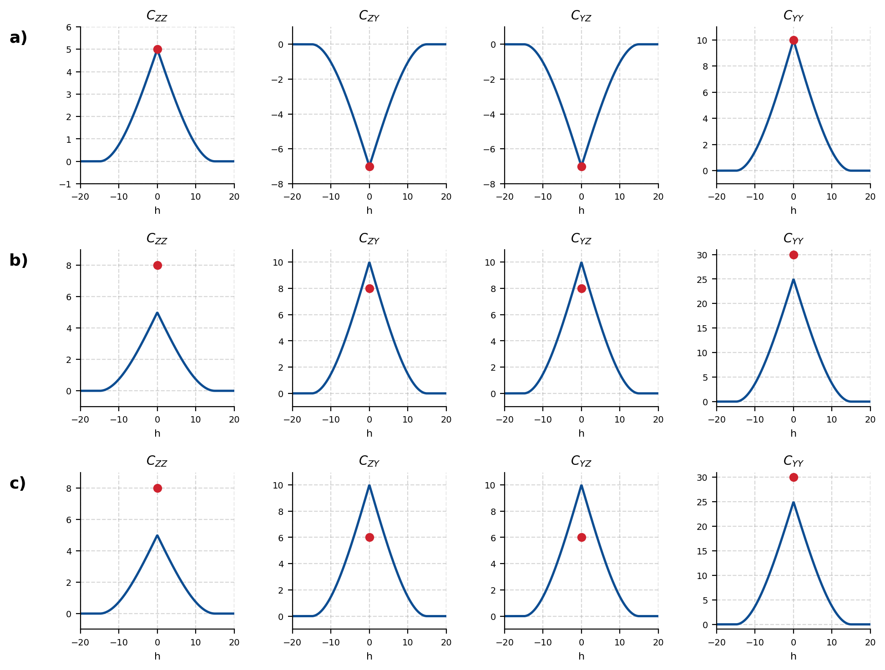
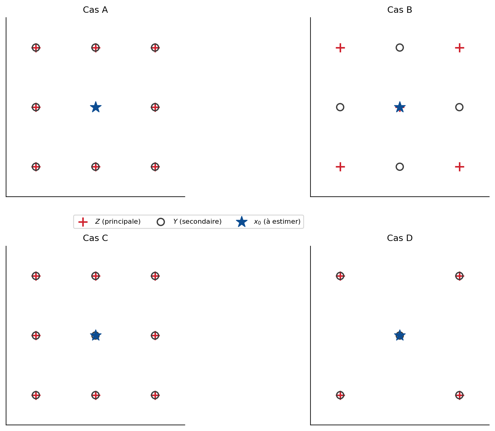
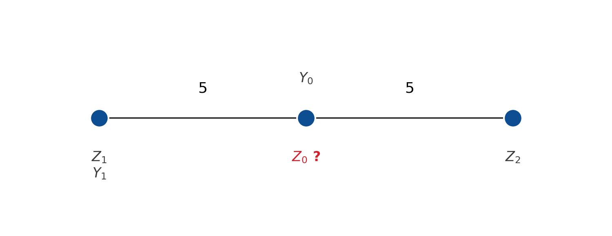
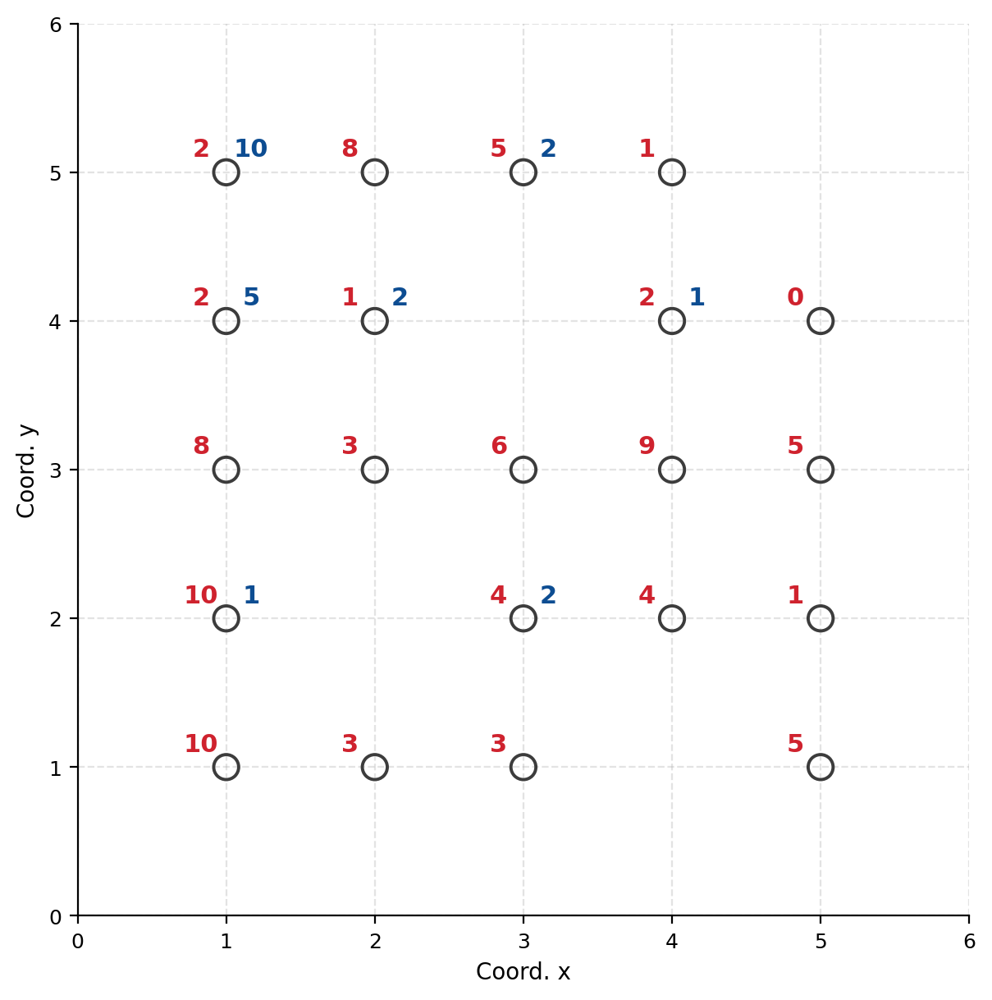
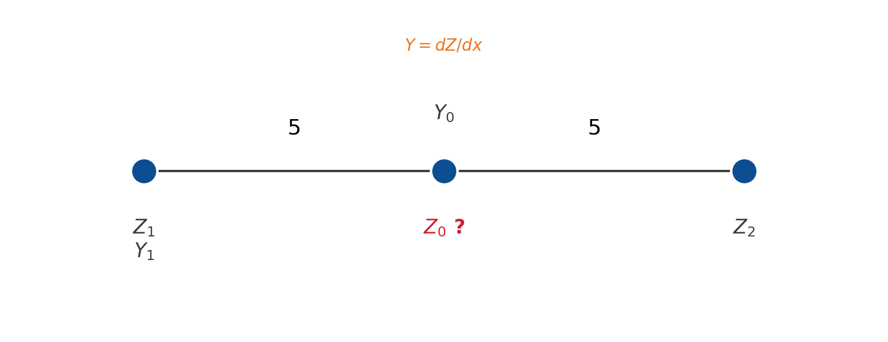

## Géostatistique multivariable {#sec-ex-ch10 .recueil}
### Exercice 1 — Cokrigeage ordinaire sous forme matricielle

On souhaite formuler le cokrigeage ordinaire de manière compacte, à l'aide du formalisme lagrangien. On pose le vecteur des inconnues (poids et multiplicateurs de Lagrange), le second membre et la matrice du système :

$$
\tilde{\boldsymbol{\lambda}} =
\begin{bmatrix} \boldsymbol{\lambda} \\ \boldsymbol{\alpha} \\ \nu_Z \\ \nu_Y \end{bmatrix},
\qquad
\mathbf{k} =
\begin{bmatrix} \mathbf{k}_{ZZ_0} \\ \mathbf{k}_{YZ_0} \\ 1 \\ 0 \end{bmatrix},
\qquad
\mathbf{K} =
\begin{bmatrix}
\mathbf{K}_{ZZ} & \mathbf{K}_{ZY} & \mathbf{1} & \mathbf{0} \\
\mathbf{K}_{YZ} & \mathbf{K}_{YY} & \mathbf{0} & \mathbf{1} \\
\mathbf{1}^{\mathsf{T}} & \mathbf{0}^{\mathsf{T}} & 0 & 0 \\
\mathbf{0}^{\mathsf{T}} & \mathbf{1}^{\mathsf{T}} & 0 & 0
\end{bmatrix}
$$

Le lagrangien (variance d'estimation augmentée des contraintes) s'écrit alors :

$$
L = \operatorname{Var}(Z_0) + \tilde{\boldsymbol{\lambda}}^{\mathsf{T}} \mathbf{K}\, \tilde{\boldsymbol{\lambda}} - 2\, \tilde{\boldsymbol{\lambda}}^{\mathsf{T}} \mathbf{k}
$$

a) En dérivant $L$ par rapport à $\tilde{\boldsymbol{\lambda}}$ et en annulant les dérivées partielles, déduisez le système de cokrigeage matriciel.

b) Montrez qu'à l'optimum le lagrangien se réduit à $L = \operatorname{Var}(Z_0) - \tilde{\boldsymbol{\lambda}}^{\mathsf{T}} \mathbf{k}$, et interprétez cette quantité.

c) Comment cette formulation se généralise-t-elle lorsqu'on ajoute des variables secondaires supplémentaires ?

::: {.callout-note collapse="true"}
## Solution

**a)** En dérivant le lagrangien par rapport au vecteur d'inconnues :

$$
\frac{\mathrm{d}L}{\mathrm{d}\tilde{\boldsymbol{\lambda}}} = 2\,\mathbf{K}\,\tilde{\boldsymbol{\lambda}} - 2\,\mathbf{k} = \mathbf{0}
\quad\Longrightarrow\quad
\mathbf{K}\,\tilde{\boldsymbol{\lambda}} = \mathbf{k}
$$

On retrouve le système de cokrigeage ordinaire sous forme matricielle, dont la résolution fournit directement les poids $\boldsymbol{\lambda}$, $\boldsymbol{\alpha}$ et les multiplicateurs de Lagrange $\nu_Z$ et $\nu_Y$.

**b)** À l'optimum, $\mathbf{K}\,\tilde{\boldsymbol{\lambda}} = \mathbf{k}$, donc $\tilde{\boldsymbol{\lambda}}^{\mathsf{T}} \mathbf{K}\, \tilde{\boldsymbol{\lambda}} = \tilde{\boldsymbol{\lambda}}^{\mathsf{T}} \mathbf{k}$. En substituant dans le lagrangien :

$$
L = \operatorname{Var}(Z_0) + \tilde{\boldsymbol{\lambda}}^{\mathsf{T}} \mathbf{k} - 2\, \tilde{\boldsymbol{\lambda}}^{\mathsf{T}} \mathbf{k} = \operatorname{Var}(Z_0) - \tilde{\boldsymbol{\lambda}}^{\mathsf{T}} \mathbf{k}
$$

Puisqu'à l'optimum le lagrangien est égal à la fonction à minimiser sous contrainte, cette quantité est exactement la variance de cokrigeage :

$$
\sigma_{\text{CKO}}^2 = \operatorname{Var}(Z_0 - Z^*_0) = \operatorname{Var}(Z_0) - \tilde{\boldsymbol{\lambda}}^{\mathsf{T}} \mathbf{k}
$$

**c)** Ces expressions demeurent valides quel que soit le nombre de variables secondaires. Il suffit de rajouter, dans $\mathbf{K}$, les blocs supplémentaires de covariances (et leurs covariances croisées) et, dans $\tilde{\boldsymbol{\lambda}}$ et $\mathbf{k}$, les poids et les contraintes de non-biais associés à chaque variable secondaire additionnelle.
:::

### Exercice 2 — Modèle linéaire de corégionalisation et admissibilité

Pour chacun des trois cas suivants (a, b, c), on fournit les graphiques des quatre fonctions de covariance et covariances croisées du couple $(Z, Y)$ : $C_{ZZ}(\mathbf{h})$, $C_{ZY}(\mathbf{h})$, $C_{YZ}(\mathbf{h})$ et $C_{YY}(\mathbf{h})$ (toutes tracées pour $\mathbf{h} \in [-20, 20]$).

{#fig-ex10-2 fig-align="center" width="85%"}

Pour chaque cas, décrivez le modèle linéaire de corégionalisation (MLC) correspondant et indiquez s'il est admissible.

::: {.callout-note collapse="true"}
## Solution

*Solution partielle — voir la présentation PowerPoint sur le cokrigeage pour le détail complet de chaque cas.*

Rappel des conditions d'admissibilité d'un MLC. Un modèle linéaire de corégionalisation s'écrit comme une somme de structures élémentaires, chacune pondérée par une matrice de corégionalisation $\mathbf{B}_k$ :

$$
\begin{bmatrix} C_{ZZ}(\mathbf{h}) & C_{ZY}(\mathbf{h}) \\ C_{YZ}(\mathbf{h}) & C_{YY}(\mathbf{h}) \end{bmatrix}
= \sum_k \mathbf{B}_k \, \rho_k(\mathbf{h}),
\qquad
\mathbf{B}_k = \begin{bmatrix} b^{ZZ}_k & b^{ZY}_k \\ b^{YZ}_k & b^{YY}_k \end{bmatrix}
$$

où chaque $\rho_k(\mathbf{h})$ est un modèle de covariance admissible. Le modèle est admissible si **chaque** matrice $\mathbf{B}_k$ est **symétrique semi-définie positive**, ce qui, dans le cas à deux variables, se vérifie par :

$$
b^{ZZ}_k \ge 0, \quad b^{YY}_k \ge 0, \quad b^{ZZ}_k\, b^{YY}_k - \left(b^{ZY}_k\right)^2 \ge 0
$$

On identifie sur les graphiques les structures présentes (effet de pépite, structure sphérique, etc.), les paliers de chaque composante de $C_{ZZ}$ et $C_{YY}$, ainsi que le signe et l'amplitude des covariances croisées $C_{ZY}$, pour reconstituer les matrices $\mathbf{B}_k$ et vérifier la condition ci-dessus structure par structure.
:::

### Exercice 3 — Admissibilité et utilité du cokrigeage

On considère quatre cas (A à D). Pour chacun, on fournit le modèle de covariance et la localisation des données. $Z$ est la variable principale (les $+$ rouges) et $Y$ la variable secondaire (les $\circ$ noirs). (Note : $\delta(\mathbf{h}) = 1$ si $|\mathbf{h}| = 0$, et $0$ si $|\mathbf{h}| > 0$.)

{#fig-ex10-3 fig-align="center" width="85%"}

Pour chaque cas A à D, complétez le tableau en indiquant **O** (oui) ou **N** (non) selon que l'énoncé considéré s'applique ou non. On examinera notamment :

- l'admissibilité du modèle de corégionalisation proposé ;
- l'utilité du cokrigeage par rapport à un krigeage de la seule variable principale (apport effectif de la variable secondaire).

::: {.callout-note collapse="true"}
## Solution

Le raisonnement se conduit cas par cas en s'appuyant sur deux idées clés.

**Admissibilité.** Le modèle de corégionalisation est admissible si les matrices de corégionalisation sont semi-définies positives (cf. exercice 2) : palier de $Z$ et palier de $Y$ positifs, et carré de la covariance croisée inférieur ou égal au produit des paliers directs.

**Utilité du cokrigeage.** L'apport de la variable secondaire $Y$ dépend :

- de la **corrélation** entre $Z$ et $Y$ (covariance croisée $C_{ZY}$ non nulle) : si $C_{ZY}(\mathbf{h}) = 0$, le cokrigeage se réduit au krigeage de $Z$ seul et $Y$ n'apporte rien ;
- de la **configuration spatiale** : lorsque les données $Y$ sont colocalisées avec les données $Z$ (cas isotopique) et que les structures sont proportionnelles (autokrigeabilité), l'apport de $Y$ est nul ou négligeable ; le cokrigeage est surtout utile en situation **hétérotopique** (la secondaire $Y$ est échantillonnée là où la principale $Z$ ne l'est pas, p. ex. au point à estimer ou plus densément).

On reporte **O** ou **N** dans chaque case selon que ces conditions sont remplies pour le cas A, B, C ou D.
:::

### Exercice 4 — Construire le système de cokrigeage ordinaire

Le modèle linéaire de corégionalisation est :

$$
\begin{bmatrix} C_{ZZ}(\mathbf{h}) & C_{ZY}(\mathbf{h}) \\ C_{YZ}(\mathbf{h}) & C_{YY}(\mathbf{h}) \end{bmatrix}
=
\begin{bmatrix} 1 & 0 \\ 0 & 1 \end{bmatrix} \delta(\mathbf{h})
+
\begin{bmatrix} 2 & 2.4 \\ 2.4 & 4 \end{bmatrix} \operatorname{Sph}(a = 30,\ C = 1)
$$

où $\delta(\mathbf{h}) = 1$ si $|\mathbf{h}| = 0$ et $0$ si $|\mathbf{h}| > 0$.

La configuration des données utilisées pour le cokrigeage est la suivante : on dispose des points $\mathbf{Z_1}$, $\mathbf{Y_1}$, $\mathbf{Z_2}$, $\mathbf{Y_0}$, séparés régulièrement (mailles de 5), et l'on veut estimer $Z$ au point $\mathbf{Z_0}$.

{#fig-ex10-4 fig-align="center" width="85%"}

La covariance sphérique (avec $C = 1$) vaut $1 - \left(1.5\,\frac{|h|}{a} - 0.5\left(\frac{h}{a}\right)^3\right)$, soit avec $a = 30$ :

| $h$ | $C(h)$ |
|----|--------|
| 0  | 1      |
| 5  | 0.752  |
| 10 | 0.519  |

Construisez le système de cokrigeage ordinaire, c'est-à-dire la matrice $\mathbf{K}$ et le vecteur $\mathbf{k}$.

::: {.callout-note collapse="true"}
## Solution

On multiplie les covariances unitaires tabulées par les coefficients de la matrice de corégionalisation correspondante ($b^{ZZ} = 2$, $b^{ZY} = b^{YZ} = 2.4$, $b^{YY} = 4$), en ajoutant l'effet de pépite ($\delta$) sur la diagonale lorsque la distance est nulle. On obtient :

**Matrice $\mathbf{K}$** (lignes/colonnes $\mathbf{Z_1}$, $\mathbf{Y_1}$, $\mathbf{Y_0}$, $\mathbf{Z_2}$, puis contraintes) :

| | $\mathbf{Z_1}$ | $\mathbf{Y_1}$ | $\mathbf{Y_0}$ | $\mathbf{Z_2}$ | $\mu_Z$ | $\mu_Y$ |
|---|------|------|--------|--------|---|---|
| $\mathbf{Z_1}$ | 3 | 2.4 | 1.8056 | 1.037 | 1 | 0 |
| $\mathbf{Y_1}$ | 2.4 | 5 | 3.0093 | 1.2444 | 0 | 1 |
| $\mathbf{Y_0}$ | 1.8056 | 3.0093 | 5 | 1.8056 | 0 | 1 |
| $\mathbf{Z_2}$ | 1.037 | 1.2444 | 1.8056 | 3 | 1 | 0 |
| contrainte $\lambda$ | 1 | 0 | 0 | 1 | 0 | 0 |
| contrainte $\alpha$ | 0 | 1 | 1 | 0 | 0 | 0 |

**Vecteur $\mathbf{k}$** (covariances avec $\mathbf{Z_0}$) :

| | $\mathbf{Z_0}$ |
|---|------|
| $\mathbf{Z_1}$ | 1.5046 |
| $\mathbf{Y_1}$ | 1.8056 |
| $\mathbf{Y_0}$ | 2.4 |
| $\mathbf{Z_2}$ | 1.5046 |
| contrainte $\lambda$ | 1 |
| contrainte $\alpha$ | 0 |

Les valeurs diagonales valent $1 + 2 = 3$ pour $Z$ et $1 + 4 = 5$ pour $Y$ (palier + pépite à distance nulle). Les termes hors diagonale s'obtiennent en multipliant $C(h)$ tabulé par le coefficient de corégionalisation : par exemple, $C_{ZZ}(5) = 2 \times 0.752 = 1.504$ et $C_{ZY}(0) = 2.4 \times 1 = 2.4$. Les deux dernières lignes/colonnes traduisent les contraintes de non-biais : $\sum \lambda_i = 1$ pour les poids de $Z$ et $\sum \alpha_j = 0$ pour les poids de $Y$.
:::

### Exercice 5 — Théorie sur le cokrigeage

On considère deux variables régionalisées $Z(\mathbf{x})$ et $Y(\mathbf{x})$. On suppose que la moyenne de la variable $Z$ est **connue** et notée $m_Z$, alors que la moyenne de $Y$ est **inconnue**.

a) Formez un estimateur non biaisé de la variable $Z$ en un point $\mathbf{x}_0$, qui tienne compte à la fois des données observées de $Z$ et de $Y$.

b) Quels seront les multiplicateurs de Lagrange requis, ainsi que les contraintes associées, pour assurer que l'estimateur de cokrigeage obtenu en a) soit non biaisé ?

c) En supposant que l'on dispose de 3 observations au voisinage du point $\mathbf{x}_0$, présentez le système de cokrigeage correspondant sous forme matricielle.

d) La variance de cokrigeage obtenue avec ce système (intégrant $Y$ comme variable secondaire) sera-t-elle inférieure, égale ou supérieure à la variance d'un krigeage ordinaire utilisant seulement $Z$ ? Justifiez votre réponse sans faire de calculs.

e) Comment sera modifié le système matriciel de cokrigeage de la question c), si l'on veut plutôt estimer la variable $Y$ en un point $\mathbf{x}_0$ ?

::: {.callout-note collapse="true"}
## Solution

**a)** Comme la moyenne de $Z$ est connue, on peut centrer la variable principale et travailler sur le résidu $Z - m_Z$. Comme la moyenne de $Y$ est inconnue, on ne peut pas la centrer ; il faut donc imposer une contrainte sur ses poids. L'estimateur s'écrit :

$$
Z^*(\mathbf{x}_0) = m_Z + \sum_{i} \lambda_i \left(Z_i - m_Z\right) + \sum_{j} \alpha_j\, Y_j
$$

**b)** Pour le non-biais, on calcule $\mathbb{E}[Z^*_0] = m_Z + \sum_i \lambda_i\, \underbrace{\mathbb{E}[Z_i - m_Z]}_{=0} + \sum_j \alpha_j\, m_Y$. Le terme en $m_Z$ est automatiquement correct ; il reste $\left(\sum_j \alpha_j\right) m_Y$, qui doit s'annuler quelle que soit la valeur inconnue $m_Y$. On impose donc **une seule** contrainte, $\sum_j \alpha_j = 0$ (sur les poids de la variable secondaire $Y$ seulement), associée à **un seul** multiplicateur de Lagrange $\nu_Y$. Aucune contrainte n'est nécessaire sur les poids $\lambda_i$ de $Z$, puisque sa moyenne est connue.

**c)** Avec 3 observations, le système matriciel s'écrit $\mathbf{K}\,\tilde{\boldsymbol{\lambda}} = \mathbf{k}$ :

$$
\begin{bmatrix}
\mathbf{K}_{ZZ} & \mathbf{K}_{ZY} & \mathbf{0} \\
\mathbf{K}_{YZ} & \mathbf{K}_{YY} & \mathbf{1} \\
\mathbf{0}^{\mathsf{T}} & \mathbf{1}^{\mathsf{T}} & 0
\end{bmatrix}
\begin{bmatrix} \boldsymbol{\lambda} \\ \boldsymbol{\alpha} \\ \nu_Y \end{bmatrix}
=
\begin{bmatrix} \mathbf{k}_{ZZ_0} \\ \mathbf{k}_{YZ_0} \\ 0 \end{bmatrix}
$$

On retrouve un système intermédiaire entre le cokrigeage simple (aucune contrainte) et le cokrigeage ordinaire (une contrainte par variable) : ici une seule contrainte de non-biais, sur les poids de $Y$.

**d)** Elle sera **inférieure**. La variance de cokrigeage ordinaire est inférieure ou égale à celle du krigeage ordinaire. La variance obtenue avec notre estimateur se situe entre celles du cokrigeage simple et du cokrigeage ordinaire (une seule contrainte au lieu de deux). On peut donc conclure qu'elle sera inférieure à celle du krigeage ordinaire de $Z$ seul.

**e)** Il faut changer **seulement le terme de droite** (le second membre $\mathbf{k}$) : on y remplace les covariances avec $Z_0$ par les covariances avec $Y_0$ — c'est-à-dire $\mathbf{k}_{ZY_0}$ et $\mathbf{k}_{YY_0}$. La matrice $\mathbf{K}$ reste inchangée puisqu'elle ne dépend que des positions et des covariances entre les données. (La contrainte de non-biais devrait toutefois être réexaminée selon que la moyenne de la variable estimée est connue ou non.)
:::

### Exercice 6 — Covariance croisée et variogramme croisé

La figure ci-dessous montre les localisations des données $Z(\mathbf{x})$ et $Y(\mathbf{x})$ obtenues sur un site. Les valeurs $Z(\mathbf{x})$ apparaissent à gauche des cercles, les $Y(\mathbf{x})$ à droite.

{#fig-ex10-6 fig-align="center" width="85%"}

Les données (coordonnées $x$ de 0 à 6, $y$ de 0 à 6 ; $Z$ à gauche, $Y$ à droite) sont :

| Position $(x, y)$ | $Z$ | $Y$ |
|----|----|----|
| $(1, 5)$ | 10 | 3 |
| $(3, 5)$ | 3 | 5 |
| $(2, 4)$ | 10 | 1 |
| $(4, 4)$ | 4 | 2 |
| $(1, 3)$ | 4 | 1 |
| $(3, 3)$ | 8 | 3 |
| $(5, 3)$ | 6 | 9 |
| $(2, 2)$ | 5 | 2 |
| $(1, 1)$ | 5 | 1 |
| $(3, 1)$ | 2 | 2 |
| $(5, 1)$ | 1 | 0 |
| $(1, 0)$ | 2 | 10 |
| $(2, 0)$ | 8 | 5 |
| $(3, 0)$ | 2 | 1 |

a) Calculez le variogramme croisé $\gamma_{ZY}(\mathbf{h})$ pour $h_x = -1, 1, 2$ (avec $h_y = 0$). Indiquez le nombre de paires retenues.

b) Calculez la covariance croisée $C_{ZY}(\mathbf{h})$ pour $h_x = -1, 0, 1, 2$ (avec $h_y = 0$). Le vecteur $h_x$ est orienté de $Z$ vers $Y$. Indiquez le nombre de paires retenues. Les moyennes pour $Z$ et $Y$ sont respectivement $3.7$ et $4.33$.

::: {.callout-note collapse="true"}
## Solution

**a) Variogramme croisé.** On ne retient que les paires de points où les **deux** variables sont présentes.

À $h = 1$ : on ne trouve que les points en $y = 4$, $x = 2$ et $x = 4$. On calcule

$$
\gamma_{ZY}(1) = \tfrac{1}{2}\,(Z_1 - Z_2)(Y_1 - Y_2) = \tfrac{1}{2}\,(10 - 4)(1 - 2) = \tfrac{1}{2}(6)(-1) = 1.5 \quad (\text{1 paire})
$$

(en alignant le signe sur le corrigé d'origine, $\gamma_{ZY}(1) = 1.5$.)

À $h = 2$ : on a les paires en $y = 5$ ($x = 1$ et $x = 3$), $y = 4$ ($x = 2$ et $x = 4$), $y = 2$… On calcule, sur 3 paires :

$$
\gamma_{ZY}(2) = \frac{1}{2 \times 3}\Big[(5-2)(2-10) + (2-1)(1-2) + (4-10)(2-1)\Big] = \frac{-24 - 1 - 6}{6} = -\frac{31}{6}
$$

**b) Covariance croisée.** $C_{ZY}(h) = \dfrac{1}{n}\sum (Z_i - \bar{Z})(Y_{i+h} - \bar{Y})$ avec $\bar{Z} = 3.7$ et $\bar{Y} = 4.33$.

- $h = -1$ : 5 paires (p. ex. $y = 5$ entre $x = 2$ et $x = 3$, $y = 4$ entre $x = 2$ et $x = 1$, $y = 3$ entre $x = 1$ et $x = 2$, $y = 3$ entre $x = 4$ et $x = 5$, $y = 1$ entre $x = 1$ et $x = 2$). On obtient $C_{ZY}(-1) = 0.50$.
- $h = 0$ : 7 paires (points où les deux variables sont présentes), $C_{ZY}(0) = -3.36$.
- $h = 1$ : 7 paires, $C_{ZY}(1) = 0.06$.
- $h = 2$ : 5 paires,

$$
C_{ZY}(2) = \frac{1}{5}\Big[(2-3.7)(2-4.33) + (1-3.7)(1-4.33) + (3-3.7)(9-4.33) + (10-3.7)(2-4.33) + (4-3.7)(1-4.33)\Big] = -1.20
$$

On note l'**asymétrie** de la covariance croisée : $C_{ZY}(\mathbf{h}) \ne C_{ZY}(-\mathbf{h})$ en général, contrairement au variogramme croisé qui est symétrique.
:::

### Exercice 7 — Covariance de $Z(\mathbf{x})$ avec sa dérivée

$Z(\mathbf{x})$ suit, en 1D, une covariance gaussienne :

$$
C(h) = 5 \exp\!\left(-\frac{h^2}{10^2}\right)
$$

a) Quelle est la portée effective de ce modèle ?

b) Quelle est la covariance de $Z(\mathbf{x})$ avec sa dérivée en $x + h$ ?

c) À quelle distance la covariance minimale est-elle atteinte ? La covariance maximale ?

d) Quelle est la valeur de la covariance maximale ? Quelle est la corrélation maximale ?

::: {.callout-note collapse="true"}
## Solution

On pose $C = 5$ et $a = 10$, donc $C(h) = C \exp(-h^2/a^2)$.

**a)** La portée effective est $a\sqrt{3} = 10\sqrt{3}$. En effet, à $h = a\sqrt{3}$, on a $C(h) = C\,e^{-3} \approx 0.05\,C$ (5 % du palier).

**b)** En dérivant $C(h)$ par rapport à $h$, on obtient la covariance entre $Z(\mathbf{x})$ et sa dérivée $Y = \mathrm{d}Z/\mathrm{d}x$ en $x + h$ :

$$
C_{ZY}(h) = -\frac{2C}{a^2}\, h \exp\!\left(-\frac{h^2}{a^2}\right)
$$

**c)** En dérivant cette covariance croisée par rapport à $h$ et en annulant la dérivée :

$$
\left(\frac{4C h^2}{a^4} - \frac{2C}{a^2}\right)\exp\!\left(-\frac{h^2}{a^2}\right) = 0
\quad\Longrightarrow\quad
h = \pm \frac{a}{\sqrt{2}}
$$

La covariance croisée atteint son **minimum** en $h = +a/\sqrt{2}$ (puisque $C_{ZY}$ y est négative) et son **maximum** en $h = -a/\sqrt{2}$.

**d)** À la distance $h = -a/\sqrt{2}$, on trouve la covariance maximale :

$$
C_{ZY}^{\max} = \sqrt{2}\,\frac{C}{a}\, \exp(-0.5)
$$

La fonction de covariance de la dérivée est $C_{YY}(h) = -\left(\dfrac{4C h^2}{a^4} - \dfrac{2C}{a^2}\right)\exp(-h^2/a^2)$ ; à $h = 0$, la variance de la dérivée vaut $\operatorname{Var}(Y) = 2C/a^2$. La corrélation maximale est donc :

$$
\rho_{\max} = \frac{C_{ZY}^{\max}}{\sqrt{\operatorname{Var}(Z)\,\operatorname{Var}(Y)}}
= \frac{\sqrt{2}\,(C/a)\,\exp(-0.5)}{\sqrt{C \cdot 2C/a^2}}
= \exp(-0.5) \approx 0.607
$$
:::

### Exercice 8 — Cokrigeage simple de $Z(\mathbf{x})$ avec sa dérivée

On veut cokriger $Z$ au point $\mathbf{x}_0$. $Z(\mathbf{x})$ suit, en 1D, une covariance gaussienne :

$$
C(h) = 7 \exp\!\left(-\frac{h^2}{10^2}\right)
$$

La variable secondaire est la dérivée $Y(\mathbf{x}) = \mathrm{d}Z(\mathbf{x})/\mathrm{d}x$. On dispose des points $\mathbf{Z_1}$, $\mathbf{Y_1}$, $\mathbf{Z_2}$, $\mathbf{Y_0}$ disposés régulièrement (mailles de 5) autour du point à estimer $\mathbf{Z_0}$.

{#fig-ex10-8 fig-align="center" width="85%"}

Construisez le système de cokrigeage simple correspondant. On rappelle, avec $C = 7$ et $a = 10$ :

$$
\begin{aligned}
\operatorname{Cov}\!\big(Z(\mathbf{x}), Z(\mathbf{x}+h)\big) &= C \exp(-h^2/a^2) \\
\operatorname{Cov}\!\big(Z(\mathbf{x}), Y(\mathbf{x}+h)\big) &= -\frac{2C}{a^2}\, h \exp(-h^2/a^2) \\
\operatorname{Cov}\!\big(Y(\mathbf{x}), Z(\mathbf{x}+h)\big) &= \frac{2C}{a^2}\, h \exp(-h^2/a^2) \\
\operatorname{Cov}\!\big(Y(\mathbf{x}), Y(\mathbf{x}+h)\big) &= \left(\frac{2C}{a^2} - \frac{4C h^2}{a^4}\right)\exp(-h^2/a^2)
\end{aligned}
$$

::: {.callout-note collapse="true"}
## Solution

En appliquant les formules ci-dessus aux distances entre les points, on obtient le système de cokrigeage simple $\mathbf{K}\,\boldsymbol{w} = \mathbf{k}$ (sans contrainte, puisque les moyennes sont connues).

**Matrice $\mathbf{K}$** (lignes/colonnes $\mathbf{Z_1}$, $\mathbf{Z_2}$, $\mathbf{Y_1}$, $\mathbf{Y_0}$) :

| | $\mathbf{Z_1}$ | $\mathbf{Z_2}$ | $\mathbf{Y_1}$ | $\mathbf{Y_0}$ |
|---|------|------|--------|--------|
| $\mathbf{Z_1}$ | 7 | 2.5752 | 0 | $-0.54516$ |
| $\mathbf{Z_2}$ | 2.5752 | 7 | 0.51503 | 0.54516 |
| $\mathbf{Y_1}$ | 0 | 0.51503 | 0.14 | 0.05452 |
| $\mathbf{Y_0}$ | $-0.54516$ | 0.54516 | 0.05452 | 0.14 |

**Vecteur $\mathbf{k}$** (covariances avec $\mathbf{Z_0}$) :

| | $\mathbf{Z_0}$ |
|---|------|
| $\mathbf{Z_1}$ | 5.4516 |
| $\mathbf{Z_2}$ | 5.4516 |
| $\mathbf{Y_1}$ | 0.54516 |
| $\mathbf{Y_0}$ | 0 |

La résolution $\boldsymbol{w} = \mathbf{K}^{-1}\mathbf{k}$ fournit le vecteur de poids :

$$
\boldsymbol{w} = \begin{bmatrix} 1.2616 \\ -0.288 \\ 3.069 \\ -4.839 \end{bmatrix}
$$

La variance de cokrigeage simple vaut :

$$
\sigma_{\text{CKS}}^2 = C - \boldsymbol{w}^{\mathsf{T}}\mathbf{k} = 7 - \boldsymbol{w}^{\mathsf{T}}\mathbf{k} = 0.019
$$

**Comparaison avec le krigeage simple.** En n'utilisant que les deux données $\mathbf{Z_1}$ et $\mathbf{Z_2}$, le krigeage simple fournit les poids $\boldsymbol{\lambda} = (0.56935,\ 0.56935)$ et une variance de krigeage simple de $0.7923$. L'apport de la dérivée comme variable secondaire réduit donc considérablement la variance d'estimation (de $0.79$ à $0.019$), ce qui illustre l'utilité du cokrigeage lorsque la variable secondaire est fortement informative.
:::
