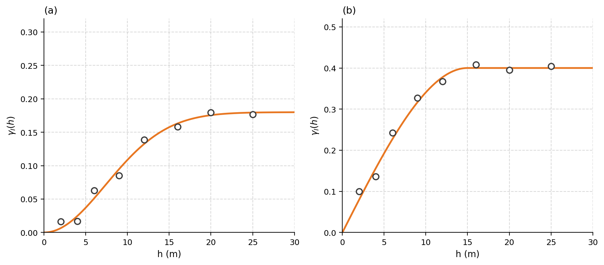
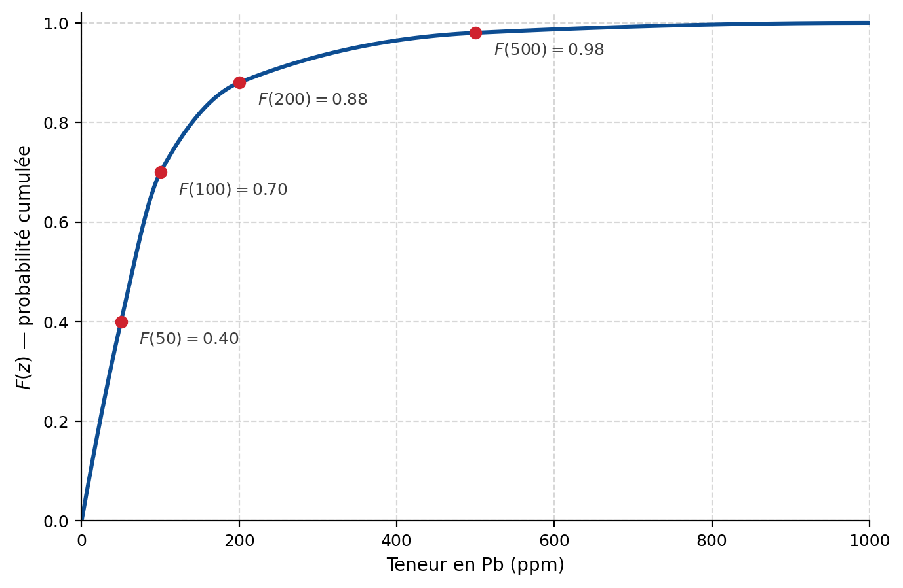

## Krigeage d’indicatrices {#sec-ex-ch11 .recueil}
### Exercice 1 — Palier attendu d'une indicatrice

Quel est le palier attendu de la variable indicatrice $I(\mathbf{x}; z_c)$ pour un seuil $z_c$ correspondant au 70e percentile de la distribution?

::: {.callout-note collapse="true"}
## Solution

L'indicatrice est une variable de Bernoulli de paramètre $p = \mathbb{P}\!\left(Z(\mathbf{x}) \le z_c\right)$. Au 70e percentile, $p = 0{,}70$. Son palier (sa variance) vaut donc, par définition,

$$
\operatorname{Var}\!\left(I(\mathbf{x}; z_c)\right) = p\,(1-p) = 0{,}70 \times 0{,}30 = 0{,}21 .
$$
:::

---

### Exercice 2 — Ajustement de variogrammes d'indicatrices

Les figures suivantes montrent des variogrammes ajustés à des indicatrices sur le plomb (en ppm).

{#fig-ex11-vario_indic_erreurs fig-align="center" width="85%"}

a) Quelles erreurs flagrantes ont été commises dans l'ajustement de ces variogrammes?

b) Quelles sont les unités des variogrammes d'indicatrices illustrés?

::: {.callout-note collapse="true"}
## Solution

**a)** Deux erreurs flagrantes sont à relever :

- Il est **impossible d'avoir un modèle gaussien** pour le variogramme d'une variable indicatrice : la régularité parabolique du modèle gaussien à l'origine est incompatible avec la nature discontinue (à deux états) d'une indicatrice.
- Il est **impossible d'avoir un palier qui dépasse $0{,}25$**, qui est le maximum théorique de $p(1-p)$, atteint lorsque $p = 0{,}5$. Un palier supérieur à $0{,}25$ n'a pas de sens pour une indicatrice.

**b)** Aucune unité : les indicatrices $I(\mathbf{x}; z_c)$ sont des variables sans dimension (valeurs $0$ ou $1$), donc leurs variogrammes $\hat\gamma$ et paliers sont également sans unité.
:::

---

### Exercice 3 — Reconstruction d'une CDF locale par krigeage d'indicatrices

En un point $\mathbf{x}_0$, on a estimé par krigeage d'indicatrices ordinaire (KIO) la fonction de répartition conditionnelle suivante pour le plomb contenu dans le sol :

| Seuil $z_c$ (ppm) | $I^*(\mathbf{x}_0; z_c)$ (par KIO) | Valeur représentative de la classe (ppm) |
|:---:|:---:|:---:|
| 50 | 0,20 | 25 |
| 100 | 0,50 | 75 |
| 200 | 0,65 | 150 |
| 500 | 0,90 | 350 |
| $\infty$ | 1,00 | 900 |

a) Quelle est l'espérance conditionnelle de la concentration de plomb au point $\mathbf{x}_0$?

b) Quelle est la variance conditionnelle?

c) Quelle est la valeur estimée du 85e percentile au point $\mathbf{x}_0$?

d) Quelle est la probabilité que la teneur en Pb au point $\mathbf{x}_0$ soit supérieure à 400 ppm?

::: {.callout-note collapse="true"}
## Solution

Les probabilités de chaque classe s'obtiennent par différence des valeurs cumulées : $0{,}20$ ; $0{,}30$ ; $0{,}15$ ; $0{,}25$ ; $0{,}10$.

**a)** Espérance conditionnelle (moyenne pondérée des valeurs représentatives) :

$$
\mathbb{E}[Z \mid \cdots] = 0{,}20\times 25 + 0{,}30\times 75 + 0{,}15\times 150 + 0{,}25\times 350 + 0{,}10\times 900 = 227{,}5 \text{ ppm}.
$$

**b)** Variance conditionnelle :

$$
\operatorname{Var}[Z \mid \cdots] = \mathbb{E}[Z^2 \mid \cdots] - \big(\mathbb{E}[Z \mid \cdots]\big)^2 = 116\,812{,}5 - 227{,}5^2 = 65\,056
$$

soit un écart-type conditionnel d'environ $255$ ppm.

**c)** Le 85e percentile se situe entre les seuils 200 ppm ($F = 0{,}65$) et 500 ppm ($F = 0{,}90$). Par interpolation linéaire :

$$
200 + \frac{0{,}85 - 0{,}65}{0{,}90 - 0{,}65}\,(500 - 200) = 440 \text{ ppm}.
$$

**d)** La valeur 400 ppm se situe entre 200 et 500 ppm. La CDF y vaut, par interpolation,

$$
F(400) = 0{,}65 + (0{,}90 - 0{,}65)\frac{400 - 200}{500 - 200} \approx 0{,}817,
$$

d'où

$$
\mathbb{P}\!\left(Z(\mathbf{x}_0) > 400\right) = 1 - F(400) \approx 1 - 0{,}817 = 0{,}183 .
$$
:::

---

### Exercice 4 — KI ordinaire et simple à quatre seuils

Toujours pour le cas de la contamination au plomb, on dispose de la fonction de répartition globale (non localisée, obtenue avec tous les échantillons) :

{#fig-ex11-cdf_globale_pb fig-align="center" width="85%"}

On krige un point $\mathbf{x}_0$ à l'aide de 3 points situés dans le voisinage. Les variogrammes des indicatrices étant **proportionnels**, on obtient les **mêmes poids** de krigeage simple et de krigeage ordinaire des indicatrices aux différents seuils 50, 100, 200 et 500 ppm.

| Point | Pb observé (ppm) | Poids KIS | Poids KIO |
|:---:|:---:|:---:|:---:|
| $\mathbf{x}_1$ | 120 | 0,40 | 0,50 |
| $\mathbf{x}_2$ | 80 | 0,20 | 0,23 |
| $\mathbf{x}_3$ | 310 | 0,30 | 0,27 |

Les valeurs de la fonction de répartition globale aux quatre seuils sont $F(50)=0{,}4$, $F(100)=0{,}7$, $F(200)=0{,}88$ et $F(500)=0{,}98$.

a) Effectuez le KI ordinaire et le KI simple aux seuils 50, 100, 200 et 500 ppm.

b) Qu'est-ce qui aurait été différent si les variogrammes des indicatrices aux différents seuils n'avaient pas été proportionnels?

::: {.callout-note collapse="true"}
## Solution

**a)** On code d'abord les indicatrices $I(\mathbf{x}_i; z_c) = \mathbf{1}\{Z(\mathbf{x}_i) \le z_c\}$ :

| Point | $Z(\mathbf{x})$ | $z_c = 50$ | $z_c = 100$ | $z_c = 200$ | $z_c = 500$ |
|:---:|:---:|:---:|:---:|:---:|:---:|
| $\mathbf{x}_1$ | 120 | 0 | 0 | 1 | 1 |
| $\mathbf{x}_2$ | 80 | 0 | 1 | 1 | 1 |
| $\mathbf{x}_3$ | 310 | 0 | 0 | 0 | 1 |

**KI ordinaire** $p^*(z_c) = \sum_i \lambda_i^{OK}\, I(\mathbf{x}_i; z_c)$ (la somme des poids vaut 1) :

| | $z_c = 50$ | $z_c = 100$ | $z_c = 200$ | $z_c = 500$ |
|:---|:---:|:---:|:---:|:---:|
| $p^*_{\text{KIO}}$ | 0 | 0,23 | 0,73 | 1 |

**KI simple** $p^*(z_c) = F(z_c) + \sum_i \lambda_i^{SK}\big(I(\mathbf{x}_i; z_c) - F(z_c)\big)$, où le poids de la moyenne globale est $1 - \sum_i \lambda_i^{SK} = 0{,}1$ :

| | $z_c = 50$ | $z_c = 100$ | $z_c = 200$ | $z_c = 500$ |
|:---|:---:|:---:|:---:|:---:|
| $F(z_c)$ | 0,40 | 0,70 | 0,88 | 0,98 |
| $p^*_{\text{KIS}}$ | $0{,}1\times 0{,}4 = 0{,}04$ | $0{,}2 + 0{,}1\times 0{,}7 = 0{,}27$ | $0{,}6 + 0{,}1\times 0{,}88 = 0{,}69$ | $0{,}9 + 0{,}1\times 0{,}98 = 0{,}99$ |

**b)** Si les variogrammes d'indicatrices aux différents seuils n'avaient **pas** été proportionnels, **les poids de krigeage auraient changé d'un seuil à l'autre** : il aurait fallu résoudre un système de krigeage distinct pour chaque seuil.
:::

---

### Exercice 5 — Le KI est-il un interpolateur exact?

Est-ce que l'espérance conditionnelle calculée par krigeage d'indicatrices est un interpolateur exact à un point échantillon lorsqu'on utilise un nombre fixe et limité de seuils (comme aux exercices précédents)?

::: {.callout-note collapse="true"}
## Solution

**Non.** Au point échantillon, le krigeage attribue un poids de 1 à la donnée concernée : on obtient alors une probabilité de 1 d'appartenir à la **classe** où se situe la valeur observée. L'espérance conditionnelle est donc estimée par la **valeur représentative de la classe**, et non par la valeur observée elle-même. Ce n'est que si la classe devenait infiniment étroite (nombre de seuils tendant vers l'infini) que les deux valeurs coïncideraient.
:::

---

### Exercice 6 — Traitement d'une contrainte d'inégalité (donnée floue)

Reprenez le contexte de l'exercice 4 (contamination au plomb). Indiquez ce que l'on doit faire aux différents seuils si, au point $\mathbf{x}_3$, la seule information disponible est que $\text{Pb}(\mathbf{x}_3) > 310$ ppm.

::: {.callout-note collapse="true"}
## Solution

L'indicatrice de $\mathbf{x}_3$ reste **parfaitement définie** à tous les seuils sauf à un. Comme on sait seulement que $Z(\mathbf{x}_3) > 310$ ppm :

- aux seuils $z_c = 50, 100, 200$ ppm, on a $I(\mathbf{x}_3; z_c) = 0$ (la valeur dépasse à coup sûr ces seuils) ;
- au seuil $z_c = 500$ ppm, l'indicatrice $I(\mathbf{x}_3; 500)$ est **indéterminée** : on ne sait pas si $Z(\mathbf{x}_3)$ est inférieure ou supérieure à 500 ppm.

Ainsi, **seule $I(\mathbf{x}_3; 500)$ est affectée** : elle est indéfinie et ne peut être utilisée à ce seuil. Le point $\mathbf{x}_3$ est donc retiré du krigeage **uniquement au seuil 500 ppm** (on krige alors avec les autres points), tandis qu'il contribue normalement aux autres seuils. C'est précisément l'avantage du krigeage d'indicatrices : il permet d'intégrer une **donnée floue** (contrainte d'inégalité) seuil par seuil.

> **Renvoi.** L'exercice suivant (CP3-Q3) reprend cette même idée — un forage stoppé avant d'atteindre la cible — sous la forme d'une **application chiffrée complète** à quatre puits et cinq seuils.
:::

---

### Exercice 7 — Krigeage ordinaire d'indicatrices avec contrainte d'inégalité (4 puits)

Quatre puits d'exploration ont été forés. Les trois premiers ont recoupé le sommet de la minéralisation à des profondeurs de **305 m**, **333 m** et **309 m** (les profondeurs étant mesurées positivement vers le bas). Le quatrième forage a dû être **arrêté à 318 m**, avant d'atteindre le sommet de la minéralisation, et aucune autre information n'est disponible à ce stade.

Le variogramme de la profondeur est sphérique. Le variogramme du $\log(\text{profondeur})$ lui est proportionnel, de même que les variogrammes des différentes indicatrices, ce qui implique que **les poids de krigeage restent invariants** d'un seuil à l'autre. Lorsque l'on effectue le krigeage ordinaire de la profondeur au point $\mathbf{x}_0$ en utilisant les points $\mathbf{x}_1$ à $\mathbf{x}_4$ d'une part, et $\mathbf{x}_1$ à $\mathbf{x}_3$ d'autre part, on obtient les poids suivants :

| Point | Poids de KO utilisant $\mathbf{x}_1$ à $\mathbf{x}_4$ (4 points) | Poids de KO utilisant $\mathbf{x}_1$ à $\mathbf{x}_3$ (3 points) |
|:---:|:---:|:---:|
| $\mathbf{x}_1$ | 0,20 | 0,25 |
| $\mathbf{x}_2$ | 0,15 | 0,20 |
| $\mathbf{x}_3$ | 0,30 | 0,55 |
| $\mathbf{x}_4$ | 0,35 | — |

> *(Paramètres du variogramme sphérique $C_0$, $C$ et $a$ non récupérés : ils figuraient dans un objet-équation Word non extrait par l'extraction table-aware. Comme les variogrammes sont proportionnels, les poids de krigeage ci-dessus sont invariants d'un seuil à l'autre et suffisent à résoudre l'exercice ; les valeurs précises de $C_0$, $C$, $a$ ne sont pas requises.)*

Utilisez **toutes** les informations disponibles (incluant le forage stoppé en $\mathbf{x}_4$) pour prédire, par krigeage ordinaire d'indicatrices, l'**espérance conditionnelle** de la profondeur du sommet de la minéralisation au point $\mathbf{x}_0$, ainsi que la **variance conditionnelle** associée. Considérez les seuils **300, 310, 320, 330 et 340 m** et utilisez les milieux des classes comme valeurs représentatives.

::: {.callout-note collapse="true"}
## Solution

**Codage des indicatrices.** On code $I(\mathbf{x}_i; z_c) = \mathbf{1}\{Z(\mathbf{x}_i) \le z_c\}$ pour chaque puits, en exploitant la nature de la donnée :

- $\mathbf{x}_1 = 305$, $\mathbf{x}_2 = 333$, $\mathbf{x}_3 = 309$ : indicatrices parfaitement définies aux cinq seuils ;
- $\mathbf{x}_4 > 318$ (forage stoppé) : c'est une **contrainte d'inégalité**. L'indicatrice est connue aux seuils **inférieurs ou égaux à 318 m** ($I(\mathbf{x}_4; 300) = I(\mathbf{x}_4; 310) = 0$, car la profondeur du sommet dépasse à coup sûr ces valeurs), mais **indéterminée** aux seuils 320, 330 et 340 m (on ignore si $Z(\mathbf{x}_4)$ s'y trouve en dessous ou au dessus).

On obtient le tableau de codage suivant (où « — » marque une indicatrice indéterminée) :

| Indicatrice | 300 | 310 | 320 | 330 | 340 |
|:---|:---:|:---:|:---:|:---:|:---:|
| $I(\mathbf{x}_1; z_c)$, $z_1 = 305$ | 0 | 1 | 1 | 1 | 1 |
| $I(\mathbf{x}_2; z_c)$, $z_2 = 333$ | 0 | 0 | 0 | 0 | 1 |
| $I(\mathbf{x}_3; z_c)$, $z_3 = 309$ | 0 | 1 | 1 | 1 | 1 |
| $I(\mathbf{x}_4; z_c)$, $z_4 > 318$ | 0 | 0 | — | — | — |
| $F^*(\mathbf{x}_0; z_c)$ | 0 | 0,50 | 0,80 | 0,80 | 1 |

La dernière ligne $F^*(\mathbf{x}_0; z_c) = \sum_i \lambda_i\, I(\mathbf{x}_i; z_c)$ est la CDF locale estimée (après vérification des relations d'ordre), obtenue avec le jeu de poids approprié à chaque seuil.

**Choix du jeu de poids selon le seuil.** Grâce à la proportionnalité des variogrammes, les poids sont les mêmes pour tous les seuils :

- aux seuils **300 et 310 m**, les quatre puits portent une indicatrice définie : on utilise le jeu de poids à **4 points** $(\mathbf{x}_1\text{–}\mathbf{x}_4)$ ;
- aux seuils **320, 330 et 340 m**, $\mathbf{x}_4$ est inutilisable : on utilise le jeu de poids à **3 points** $(\mathbf{x}_1\text{–}\mathbf{x}_3)$.

**Estimation de la CDF locale.** À chaque seuil, $p^*(z_c) = \sum_i \lambda_i\, I(\mathbf{x}_i; z_c)$ avec le jeu de poids approprié. On vérifie/corrige les **relations d'ordre** (CDF croissante, comprise dans $[0,1]$).

**Valeurs représentatives.** Les milieux des classes définies par les seuils 300–310–320–330–340 sont **305, 315, 325 et 335 m**.

**Espérance conditionnelle** — moyenne des milieux de classe pondérée par les probabilités de classe $p_k = p^*(z_{c,k}) - p^*(z_{c,k-1})$ :

$$
\mathbb{E}[Z \mid \cdots] = \sum_k p_k \,\bar z_k .
$$

**Variance conditionnelle :**

$$
\operatorname{Var}[Z \mid \cdots] = \sum_k p_k \,\bar z_k^{\,2} - \big(\mathbb{E}[Z \mid \cdots]\big)^2 .
$$

L'intérêt de l'exercice est de montrer que **le forage stoppé n'est pas perdu** : il informe pleinement les seuils bas (300, 310 m), même s'il doit être écarté aux seuils élevés.
:::

---

### Exercice 8 — Indicatrice complémentaire et cokrigeage

Soit une indicatrice $I_A$ prenant la valeur 1 quand le faciès A est observé et 0 si le faciès B est observé (ce sont les deux seuls faciès présents). On note $I_B = 1 - I_A$ l'indicatrice complémentaire.

a) Quelle relation existe-t-il entre le variogramme de l'indicatrice $I_A$ et celui de l'indicatrice complémentaire $I_B$?

b) Que vaut le variogramme croisé de $I_A$ et $I_B$?

c) En supposant la symétrie en $\mathbf{h}$ et la présence, pour $I_A$, d'un effet de pépite $b_1$ et d'une composante sphérique de portée $a$ et d'amplitude $b_2$, décrivez le modèle linéaire de corégionalisation (MLC) de ces deux indicatrices. Est-il admissible?

d) Est-ce un modèle à covariances proportionnelles? Concluez sur l'utilité du cokrigeage de $I_A$ et $I_B$.

::: {.callout-note collapse="true"}
## Solution

**a)** Comme $I_B = 1 - I_A$ :

$$
\gamma_{I_B,I_B}(\mathbf{h}) = \tfrac12\,\mathbb{E}\!\left[\big(I_B(\mathbf{x}) - I_B(\mathbf{x}+\mathbf{h})\big)^2\right]
= \tfrac12\,\mathbb{E}\!\left[\big(I_A(\mathbf{x}+\mathbf{h}) - I_A(\mathbf{x})\big)^2\right]
= \gamma_{I_A,I_A}(\mathbf{h}).
$$

Les deux indicatrices ont donc **le même variogramme** pour tout $\mathbf{h}$.

**b)** Variogramme croisé :

$$
\gamma_{I_A,I_B}(\mathbf{h}) = \tfrac12\,\mathbb{E}\!\left[\big(I_A(\mathbf{x}) - I_A(\mathbf{x}+\mathbf{h})\big)\big(I_B(\mathbf{x}) - I_B(\mathbf{x}+\mathbf{h})\big)\right]
= -\,\gamma_{I_A,I_A}(\mathbf{h}).
$$

Le variogramme croisé est l'**opposé** du variogramme direct.

**c)** En posant $\gamma_{I_A,I_A}(\mathbf{h}) = b_1 + b_2\,\mathrm{Sph}_a(\mathbf{h})$, le MLC s'écrit sous forme matricielle :

$$
\boldsymbol{\Gamma}(\mathbf{h}) =
\begin{pmatrix} b_1 & -b_1 \\ -b_1 & b_1 \end{pmatrix}
+
\begin{pmatrix} b_2 & -b_2 \\ -b_2 & b_2 \end{pmatrix}\mathrm{Sph}_a(\mathbf{h}).
$$

Chacune des deux matrices de coefficients a un **déterminant nul** ($b_1^2 - b_1^2 = 0$ et $b_2^2 - b_2^2 = 0$) et est semi-définie positive ; le modèle est donc **admissible**.

**d)** Oui, c'est un modèle à **covariances proportionnelles** : on peut le réécrire

$$
\boldsymbol{\Gamma}(\mathbf{h}) = \begin{pmatrix} 1 & -1 \\ -1 & 1 \end{pmatrix}\big(b_1 + b_2\,\mathrm{Sph}_a(\mathbf{h})\big).
$$

Le **cokrigeage est donc inutile** : avec des covariances proportionnelles, le cokrigeage de $I_A$ et $I_B$ se ramène au krigeage de chacune. D'ailleurs, les matrices de cokrigeage seraient toutes singulières (puisque $I_B = 1 - I_A$ est redondante).
:::

---

### Exercice 9 — Cas à $p > 2$ faciès

Quand il y a $p > 2$ faciès, que peut-on dire de :

a) $\displaystyle\sum_{i=1}^{p} I_i(\mathbf{x})$ ?

b) $\displaystyle\operatorname{Var}\!\left(\sum_{i=1}^{p} I_i(\mathbf{x})\right) = \sum_{i=1}^{p}\operatorname{Var}\big(I_i(\mathbf{x})\big) + \sum_{i=1}^{p}\sum_{\substack{j=1\\ j\ne i}}^{p}\operatorname{Cov}\big(I_i(\mathbf{x}), I_j(\mathbf{x})\big)$ ?

c) Qu'est-ce que cela implique sur les matrices de coefficients du modèle linéaire de corégionalisation à $p$ variables?

::: {.callout-note collapse="true"}
## Solution

**a)** En tout point, un seul faciès est présent, donc une seule indicatrice vaut 1 et les autres 0 :

$$
\sum_{i=1}^{p} I_i(\mathbf{x}) = 1 \quad \text{en tout point.}
$$

**b)** Puisque la somme est **constante** (égale à 1), sa variance est nulle :

$$
\operatorname{Var}\!\left(\sum_{i=1}^{p} I_i(\mathbf{x})\right) = 0 .
$$

**c)** Cette contrainte impose que **chaque matrice de coefficients** du modèle linéaire de corégionalisation à $p$ variables soit **singulière** (déterminant nul) : les sommes par lignes (et par colonnes) des coefficients de corégionalisation s'annulent, ce qui reflète la dépendance linéaire $\sum_i I_i = 1$ entre les $p$ indicatrices.
:::
