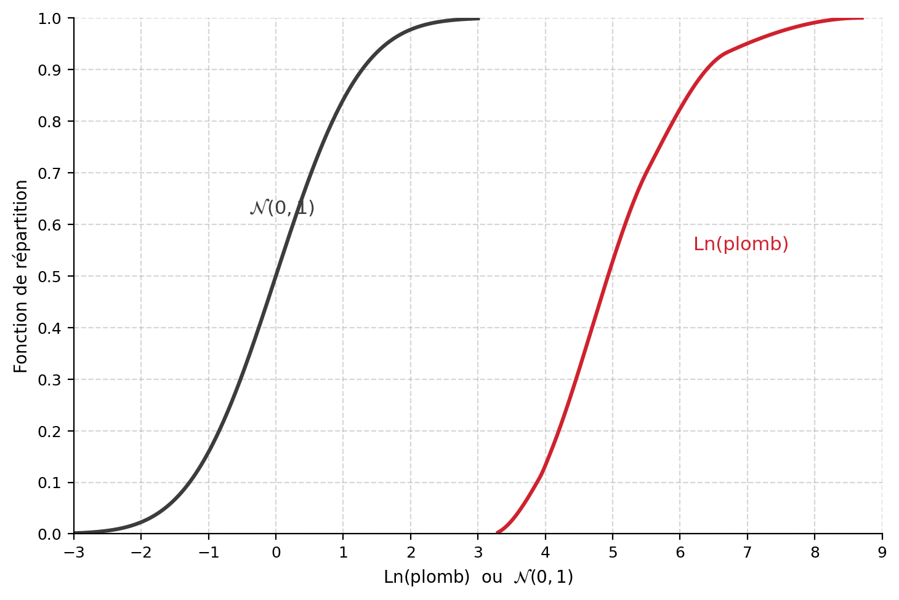
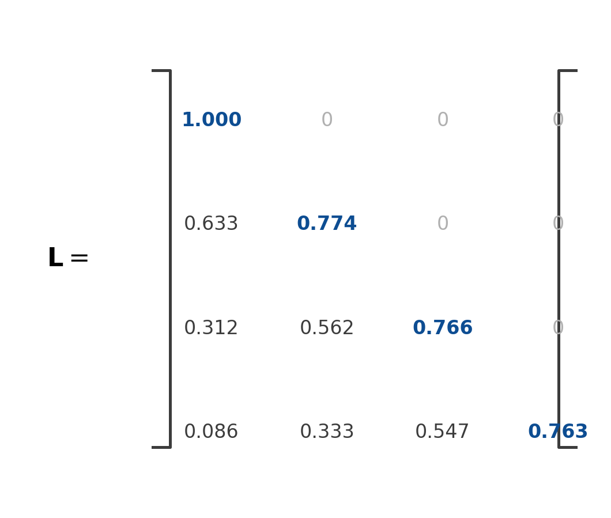

## Simulations géostatistiques de variable continue {#sec-ex-ch12 .recueil}
### Exercice 1 — Transformation gaussienne (données de Dallas, plomb)

Lorsque la distribution n'est pas normale, on peut transformer la variable $Z(\mathbf{x})$ vers $Y(\mathbf{x})$ qui suit une distribution normale, au moyen de l'anamorphose $Z=\varphi(Y)$. Toutefois la transformation n'assure pas que $Y(\mathbf{x})$ soit multigaussien (p. ex. données de Dallas). Si le champ n'est pas gaussien, le variogramme de $Z(\mathbf{x})$ ne sera pas reproduit exactement, de même que toutes les covariances et covariances croisées des indicatrices. La transformation gaussienne se fait habituellement sous forme graphique.

La figure ci-dessous présente, pour les données ponctuelles de plomb de Dallas, les fonctions de répartition de $\ln(\text{plomb})$ et d'une $\mathcal{N}(0,1)$, qui servent de table de correspondance pour l'anamorphose.

{#fig-ex12-anamorphose_dallas fig-align="center" width="80%"}

a) On a observé $\text{Pb}=250$ ppm. Quelle valeur $\mathcal{N}(0,1)$ doit-on associer à cette valeur de Pb pour la simulation ? Idem pour $\text{Pb}=50$ ppm.

b) On a simulé la valeur normale $1{,}5$. Quelle valeur de Pb doit-on associer à cette valeur simulée ? Idem pour $\mathcal{N}(0,1)=-1$.

c) Pour représenter la teneur en plomb d'un bloc de $30\text{ m}\times 30\text{ m}$, on simule $25$ valeurs normales corrélées sur autant de points d'une grille centrée dans le bloc. Doit-on :

   i. faire la moyenne des valeurs normales et appliquer la transformation inverse à cette moyenne pour obtenir $\ln(Z_v)$ puis évaluer l'exponentielle, ou
   ii. transformer chaque valeur normale en $\ln(\text{plomb})$ et faire la moyenne des $25$ valeurs avant de prendre l'exponentielle, ou
   iii. transformer chaque valeur ponctuelle vers $\ln(\text{plomb})$, évaluer l'exponentielle pour chaque valeur séparément et faire la moyenne des $25$ valeurs de plomb obtenues ?

   Pourquoi ?

d) On obtient les valeurs normales simulées $(-2,\ -1{,}5,\ -1)$. Calculez les valeurs de plomb correspondantes et l'écart-type de ces valeurs de plomb. Faites la même chose avec les valeurs normales $(1,\ 1{,}5,\ 2)$. Que peut-on conclure ?

::: {.callout-note collapse="true"}
## Solution

**a)** Par lecture graphique de la transformation : $\text{Pb}=250 \Rightarrow y=0{,}54$ ; $\text{Pb}=50 \Rightarrow y=-1{,}24$.

**b)** $y=1{,}5 \Rightarrow \text{Pb}=810$ ; $y=-1 \Rightarrow \text{Pb}=59$.

**c)** La réponse est **(iii)**. Physiquement, la teneur d'un bloc est la moyenne des teneurs ponctuelles dans le bloc. Comme les transformations impliquées sont non linéaires, il faut appliquer les transformations aux teneurs ponctuelles (ainsi le log d'une moyenne de valeurs n'est pas la moyenne des log des valeurs ; ici on veut bien la moyenne arithmétique des teneurs ponctuelles, donc on transforme chaque valeur normale vers le plomb avant de moyenner).

**d)** Les valeurs normales $(-2,\ -1{,}5,\ -1)$ donnent les teneurs $(27,\ 40{,}5,\ 59)$, dont l'écart-type (division par $n-1$) vaut $16{,}1$, alors que $(1,\ 1{,}5,\ 2)$ donnent $(486,\ 810,\ 2459)$, dont l'écart-type vaut $1076$. On voit donc que l'écart-type dépend des teneurs, contrairement à l'écart-type de krigeage $\sigma_{SK}$ et similairement à l'écart-type conditionnel calculé par krigeage d'indicatrices.
:::

### Exercice 2 — Recuit simulé

À l'itération « $n$ » de l'algorithme du recuit simulé, on a $O_n=100$. Le paramètre de température vaut $T=10$. Le critère de Metropolis accepte une perturbation candidate qui augmente la fonction objectif avec la probabilité $\mathbb{P}=\exp\!\left(-\Delta O/T\right)$ (et l'accepte toujours si elle la diminue). Déterminez si l'on doit accepter la perturbation candidate dans chacun des cas suivants, où $\text{rand}$ est un nombre aléatoire tiré d'une loi $\mathcal{U}(0,1)$ :

a) $O_{\text{candidat}}=95$ et $\text{rand}=0{,}67$ ;

b) $O_{\text{candidat}}=105$ et $\text{rand}=0{,}67$ ;

c) $O_{\text{candidat}}=105$ et $\text{rand}=0{,}43$ ;

d) $O_{\text{candidat}}=105$, $\text{rand}=0{,}43$ mais $T$ vaut $5$ plutôt que $10$.

e) En comparant c) et d), comment se comporte l'algorithme au fur et à mesure que l'on décroît le paramètre de température $T$ ?

::: {.callout-note collapse="true"}
## Solution

**a)** $O$ décroît ($95<100$) : on accepte toujours la modification.

**b)** $\Delta O = 105-100 = 5$. On accepte avec probabilité $\exp(-5/10)=0{,}606$. Comme $\text{rand}=0{,}67>0{,}606$, on **refuse** la modification.

**c)** Même probabilité d'acceptation $0{,}606$. Comme $\text{rand}=0{,}43<0{,}606$, on **accepte** la modification proposée.

**d)** On accepte avec probabilité $\exp(-5/5)=\exp(-1)=0{,}368$. Comme $\text{rand}=0{,}43>0{,}368$, on **refuse** la modification.

**e)** Il devient de plus en plus difficile d'accepter une modification qui augmente la fonction objectif $O$ au fur et à mesure que l'on diminue $T$.
:::

### Exercice 3 — Contraintes minières

Lorsque l'on exploite des blocs dans une mine ou lorsque l'on décontamine un site, on n'opère pour ainsi dire jamais librement sur chaque bloc séparément : l'ordre dans lequel apparaissent les teneurs est habituellement très important. Pour accéder à un bloc, on doit miner les blocs qui le précèdent (selon la direction du minage indiquée). Si un bloc est miné, on peut ou non le traiter.

Le coût de minage est $0{,}5$ et le coût de traitement est $2{,}6$. On considère les quatre scénarios de teneurs de blocs suivants (la colonne A est minée en premier, puis B, puis C) :

| Bloc | Scénario a) | Scénario b) | Scénario c) | Scénario d) |
|:----:|:-----------:|:-----------:|:-----------:|:-----------:|
| A    | 4           | 2           | 2           | 3           |
| B    | 2           | 4           | 3           | 4           |
| C    | 3           | 3           | 4           | 2           |

a) Calculez le tonnage de minerai, la teneur moyenne du minerai, le tonnage de stérile qui doit être miné et le profit de chaque scénario **sous la contrainte minière**, et comparez avec les mêmes quantités en **sélection libre**.

b) Dans les scénarios a) à d), le tonnage de minerai est égal ou supérieur à celui obtenu par sélection libre. Illustrez un scénario de teneurs de blocs où le tonnage de minerai est inférieur (conservez les mêmes coûts).

c) Dans les scénarios a) à d), la teneur du minerai est égale ou inférieure à celle obtenue par sélection libre. Illustrez un scénario de coûts et de teneurs de blocs où la teneur du minerai est supérieure à celle obtenue par sélection libre.

d) Est-il possible d'avoir un profit sous contrainte minière qui soit supérieur à celui obtenu par sélection libre ?

::: {.callout-note collapse="true"}
## Solution

**a)** *Sélection libre* (référence) : on mine seulement le bloc de teneur $4$ : tonnage de minerai $=1$, teneur moyenne $=4$, profit $=4-2{,}6-0{,}5=0{,}9$.

- **Scénario a)** : identique à la sélection libre.
- **Scénario b)** : on mine A et B, mais seul B est traité. Tonnage de minerai $1$, teneur moyenne $4$, profit $4-2\times 0{,}5-2{,}6=0{,}4$, tonnage de stérile $1$.
- **Scénario c)** : on mine A, B et C ; on traite B et C. Tonnage de minerai $2$, teneur moyenne $3{,}5$, profit $(4+3)-3\times 0{,}5-2\times 2{,}6=0{,}3$, tonnage de stérile $1$. Noter que l'on doit traiter B même si sa valeur nette est $3-0{,}5-2{,}6=-0{,}1$ : si on ne le traite pas, on aura un profit de $4-3\times 0{,}5-2{,}6=-0{,}1$.
- **Scénario d)** : on mine et on traite A et B. Tonnage de minerai $2$, teneur moyenne $3{,}5$, profit $(4+3)-2\times 0{,}5-2\times 2{,}6=0{,}8$, tonnage de stérile $0$.

**b)** Avec A, B, C $= 2,\ 3,\ 3{,}5$ : on ne mine alors aucun bloc (aucune séquence ne devient rentable sous contrainte), alors que la sélection libre minerait le bloc de teneur $3{,}5$.

**c)** Avec A, B, C $= 4,\ 2,\ 3{,}2$ : la sélection libre prend $4$ et $3{,}2$, dont la teneur moyenne est $3{,}6$, alors que la sélection sous contrainte ne prend que $4$ (teneur du minerai $=4>3{,}6$).

**d)** Non, c'est impossible. C'est la seule fonction qui a un comportement entièrement prévisible en lien avec les contraintes minières : plus celles-ci sont sévères, plus il y a perte de profits.
:::

### Exercice 4 — Simulation séquentielle gaussienne

La figure ci-dessous montre les fonctions de répartition d'une $\mathcal{N}(0,1)$ et du $\ln(\text{Pb})$ obtenu à partir d'échantillons d'un champ de contamination au plomb. Elle sert de table d'anamorphose $Z=\varphi(Y)$.

{#fig-ex12-anamorphose_sgs fig-align="center" width="80%"}

a) On a observé trois données aux localisations $\mathbf{x}_1$, $\mathbf{x}_2$, $\mathbf{x}_3$, avec les teneurs en Pb indiquées. Complétez le tableau ci-dessous en convertissant chaque teneur en sa valeur gaussienne $Y$ par lecture de la transformation.

| Donnée | $\mathbf{x}_1$ | $\mathbf{x}_2$ | $\mathbf{x}_3$ |
|:------:|:--------------:|:--------------:|:--------------:|
| Pb (ppm)         |  …  |  …  |  …  |
| $Y=\varphi^{-1}(Z)$ |  ?  |  ?  |  ?  |

La variable gaussienne $Y(\mathbf{x})$ associée aux teneurs de Pb présente un variogramme sphérique isotrope de portée $400$ m, avec $C_0=0$ et $C=1$.

b) Quelles sont les unités de $C_0$ et de $C$ ?

On effectue le krigeage simple de $Y$ au point $\mathbf{x}_0$ et l'on obtient le système de krigeage donnant les poids $\boldsymbol{\lambda}$.

c) Quelles seront la valeur krigée $Y^*(\mathbf{x}_0)$ et la variance de krigeage simple $\sigma_{SK}^2$ en ce point $\mathbf{x}_0$ ? *(Si vous n'avez pas répondu à la question a), posez respectivement les valeurs normales $0{,}25$, $-0{,}75$, $0{,}5$ pour les données $1$, $2$ et $3$.)*

d) On tire d'une distribution $\mathcal{U}(0,1)$ la valeur $0{,}7$. Quelle est la valeur gaussienne simulée à ce point ?

e) Quelle est la concentration de plomb que l'on simule à ce point ? *(Posez la valeur gaussienne simulée à $1{,}4$ si vous n'avez pas pu répondre à d).)*

::: {.callout-note collapse="true"}
## Solution

**b)** $C_0$ et $C$ sont les composantes du variogramme de la variable gaussienne $Y$, dont la variance est unitaire : ils n'ont **aucune unité**.

**c)** La valeur krigée est $Y^*(\mathbf{x}_0)=\sum_i \lambda_i\, Y_i$ (les poids $\lambda_i$ sont fournis par la résolution du système de krigeage simple), et la variance de krigeage simple est $\sigma_{SK}^2 = C(0) - \sum_i \lambda_i\, C(\mathbf{x}_0-\mathbf{x}_i)$.

**d)** On simule la valeur gaussienne par $Y^{(s)}(\mathbf{x}_0)=Y^*(\mathbf{x}_0)+\sigma_{SK}\,\Phi^{-1}(0{,}7)$. Par lecture de la table de la loi normale, $\Phi^{-1}(0{,}7)\approx 0{,}5244$.

**e)** On convertit la valeur gaussienne simulée vers le plomb par anamorphose inverse $Z=\varphi(Y)$. Par lecture graphique, avec une valeur gaussienne simulée d'environ $1{,}4$, on lit $\ln(\text{Pb})\approx 6$, soit une concentration de plomb de $e^{6}\approx 403{,}42$ ppm.
:::

### Exercice 5 — Propriétés des simulations (non conditionnelles vs conditionnelles)

Pour chacune des questions a) à f), écrivez **uniquement**, sous forme mathématique, la propriété en jeu (à la manière d'un exemple : « la moyenne des valeurs simulées vaut $m$ »).

Pour a) à d), on a un champ en 2D de taille $G$ pour lequel on génère un très grand nombre $S$ de **simulations non conditionnelles** $Z^{(s)}(\mathbf{x})$ sur une grille serrée de points. Les simulations sont effectuées avec moyenne théorique $m$ et variance théorique $\sigma^2$.

a) On se place à un point donné $\mathbf{x}_0$ et on examine les valeurs obtenues pour les différentes réalisations. Quelles sont la moyenne et la variance des valeurs simulées à ce point ?

b) Pour la $1^{\text{re}}$ réalisation, on calcule la variance expérimentale sur l'ensemble du domaine. On répète l'exercice pour la $2^{\text{e}}$ réalisation, la $3^{\text{e}}$ et ainsi de suite. Que vaut la moyenne (calculée sur l'ensemble des réalisations) des variances expérimentales obtenues pour chaque réalisation ?

c) Pour chaque réalisation, on regroupe les valeurs en blocs de taille $V$ (c.-à-d. on calcule la moyenne des valeurs à l'intérieur du bloc). Pour un bloc donné, quelles seront la moyenne et la variance des teneurs de ce bloc sur l'ensemble des réalisations ?

d) Pour la $1^{\text{re}}$ réalisation, on calcule la variance expérimentale des teneurs des blocs de taille $V$ sur l'ensemble du domaine de taille $G$. On répète l'exercice pour chaque réalisation. Que vaut la moyenne des variances expérimentales ainsi obtenues ?

Pour e) et f), on considère cette fois un très grand nombre de **simulations conditionnelles** sur une grille de points très serrée, toujours sur un champ en 2D de taille $G$.

e) On se place à un point donné $\mathbf{x}_0$ et on examine les valeurs obtenues pour les différentes réalisations. Quelles sont la moyenne et la variance des valeurs simulées à ce point ?

f) Pour chaque réalisation, on regroupe les valeurs simulées en blocs de taille $V$. Pour un bloc donné, quelles seront la moyenne et la variance des teneurs de ce bloc sur l'ensemble des réalisations ?

::: {.callout-note collapse="true"}
## Solution

**a)** Moyenne $m$ et variance $\sigma^2$.

**b)** $D^2(\cdot\,|\,G)$ : la variance de dispersion des points dans le domaine $G$.

**c)** Moyenne $m$ et variance $D^2(V\,|\,G)$ : la variance de dispersion des blocs de taille $V$ dans $G$.

**d)** $D^2(V\,|\,G)$.

**e)** La valeur obtenue par krigeage simple, $Z^*_{SK}(\mathbf{x}_0)$, et la variance de krigeage simple $\sigma_{SK}^2(\mathbf{x}_0)$.

**f)** La valeur obtenue par krigeage simple de bloc, $Z^*_{SK}(V)$, et la variance de krigeage simple de bloc $\sigma_{SK}^2(V)$.
:::

### Exercice 6 — Post-conditionnement par krigeage simple

Le tableau suivant présente $20$ valeurs simulées (non conditionnellement) d'une v.a. suivant un variogramme sphérique avec $C=10$, $a=30$, aux coordonnées $x=1$ à $x=20$. Des données ont été observées aux points $x_5$, $x_{10}$ et $x_{20}$.

| $x$ | $Z(x)$ | $Z^*(x)$ | $Z^{(s)}(x)$ | $Z^{(s)*}(x)$ | $Z^{(s)}_c{}^*(x)$ |
|:---:|:------:|:--------:|:------------:|:-------------:|:------------------:|
| 1  | —      | $0{,}23$  | $-3{,}55$ | $-1{,}19$ |  |
| 2  | —      | $0{,}18$  | $-2{,}74$ | $-1{,}25$ |  |
| 3  | —      | $0{,}14$  | $-1{,}64$ | $-1{,}29$ |  |
| 4  | —      | $0{,}08$  | $-1{,}89$ | $-1{,}33$ |  |
| 5  | $0{,}02$ | $0{,}02$ | $-1{,}37$ | $-1{,}37$ |  |
| 6  | —      | $-0{,}08$ | $-1{,}74$ | $-1{,}66$ |  |
| 7  | —      | $-0{,}19$ | $-3{,}16$ | $-1{,}94$ |  |
| 8  | —      | $-0{,}30$ | $-3{,}39$ | $-2{,}21$ |  |
| 9  | —      | $-0{,}41$ | $-3{,}51$ | $-2{,}48$ |  |
| 10 | $-0{,}53$ | $-0{,}53$ | $-2{,}74$ | $-2{,}74$ |  |
| 11 | —      | $-0{,}75$ | $-3{,}60$ | $-2{,}26$ |  |
| 12 | —      | $-0{,}97$ | $-2{,}80$ | $-1{,}77$ |  |
| 13 | —      | $-1{,}20$ | $-1{,}39$ | $-1{,}27$ |  |
| 14 | —      | $-1{,}42$ | $-0{,}33$ | $-0{,}77$ |  |
| 15 | —      | $-1{,}65$ | $-1{,}05$ | $-0{,}27$ |  |
| 16 | —      | $-1{,}88$ | $-0{,}04$ | $0{,}23$  |  |
| 17 | —      | $-2{,}11$ | $0{,}25$  | $0{,}74$  |  |
| 18 | —      | $-2{,}34$ | $1{,}23$  | $1{,}24$  |  |
| 19 | —      | $-2{,}57$ | $2{,}53$  | $1{,}74$  |  |
| 20 | $-2{,}80$ | $-2{,}80$ | $2{,}24$  | $2{,}24$  |  |

Ici $Z^*(x)$ est le krigeage simple des données observées, $Z^{(s)}(x)$ la simulation non conditionnelle, et $Z^{(s)*}(x)$ le krigeage simple des valeurs simulées aux points de donnée.

a) Complétez la dernière colonne du tableau donnant, aux points $1$ à $20$, les valeurs simulées **conditionnellement** aux données observées en $x_5$, $x_{10}$ et $x_{20}$.

b) Démontrez que si l'on estime la teneur d'un point par une simulation conditionnelle en ce point, la variance théorique de l'erreur est le double de celle d'un krigeage simple.

::: {.callout-note collapse="true"}
## Solution

**a)** On applique la formule de post-conditionnement
$$
Z^{(s)}_c(x) = Z^*(x) + \big(Z^{(s)}(x) - Z^{(s)*}(x)\big),
$$
c'est-à-dire que l'on ajoute au krigeage des données réelles l'écart de simulation (simulation non conditionnelle moins son propre krigeage). On obtient ainsi un champ qui honore exactement les valeurs observées en $x_5$, $x_{10}$ et $x_{20}$.

**b)** En notant $Z^{(s)}_c$ la simulation conditionnelle, l'erreur d'estimation au point $x$ s'écrit
$$
Z(x) - Z^{(s)}_c(x) = \big\{Z(x) - Z^*(x)\big\} - \big\{Z^{(s)}(x) - Z^{(s)*}(x)\big\}.
$$
La covariance entre l'erreur réelle $\{Z(x)-Z^*(x)\}$ et l'erreur simulée $\{Z^{(s)}(x)-Z^{(s)*}(x)\}$ est nulle (les deux champs sont indépendants mais partagent la même structure). Par conséquent
$$
\operatorname{Var}\!\big(Z(x) - Z^{(s)}_c(x)\big) = \sigma_{SK}^2 + \sigma_{SK}^2 = 2\,\sigma_{SK}^2,
$$
soit le double de la variance de krigeage simple.
:::

### Exercice 7 — Décomposition de Cholesky (méthode LU)

On simule une variable $Z$ à $4$ emplacements à l'aide de la décomposition de Cholesky. Les emplacements sont placés dans l'ordre $1, 2, 3, 4$ dans la matrice de covariance $\mathbf{K}$. La factorisation $\mathbf{K}=\mathbf{L}\mathbf{L}^\top$ donne la matrice triangulaire inférieure $\mathbf{L}$ suivante :

{#fig-ex12-matrice_cholesky fig-align="center" width="55%"}

a) Quelle est la variance du processus stochastique $Z$ ?

b) Quelle est la covariance entre $Z_3$ et $Z_4$ ?

c) On a observé $Z_1$ et $Z_2$. Déterminez les valeurs de $Y_1$ et $Y_2$ qui permettent d'assurer un conditionnement exact par la méthode de Cholesky.

d) Quelle est l'espérance conditionnelle de $Z_3$ sachant $Z_1$ et $Z_2$ ? *(Posez $Y_1$ et $Y_2$ si vous n'avez pas répondu à la question c).)*

e) Quelle est la covariance conditionnelle entre $Z_3$ et $Z_4$ ?

f) On a généré le vecteur aléatoire $\mathbf{Y}=[Y_3\ Y_4]^\top$. Que vaut $Z_4$ (conditionnelle à $Z_1$ et $Z_2$) ? *(Posez $Y_3$ et $Y_4$ si vous n'avez pas répondu à la question c).)*

::: {.callout-note collapse="true"}
## Solution

Le vecteur simulé est $\mathbf{Z}=\mathbf{L}\,\mathbf{Y}$, où $\mathbf{Y}\sim\mathcal{N}(\mathbf{0},\mathbf{I})$ et $\mathbf{L}$ est triangulaire inférieure. En écrivant ligne par ligne, $Z_i = \sum_{j\le i} L_{ij}\,Y_j$.

**a)** La variance vaut $\operatorname{Var}(Z_i)=\sum_{j\le i} L_{ij}^2 = (\mathbf{L}\mathbf{L}^\top)_{ii} = K_{ii}$ : c'est le terme diagonal de $\mathbf{K}$ (palier), identique pour tous les emplacements en stationnarité du second ordre.

**b)** $\operatorname{Cov}(Z_3,Z_4)=\sum_{j} L_{3j} L_{4j} = (\mathbf{L}\mathbf{L}^\top)_{34}=K_{34}$.

**c)** Le conditionnement exact par LU s'obtient en résolvant, pour les emplacements observés, le système triangulaire $\mathbf{L}_{\text{obs}}\,\mathbf{Y}_{\text{obs}}=\mathbf{Z}_{\text{obs}}$. Comme $\mathbf{L}$ est triangulaire inférieure, on procède par substitution avant :
$$
Y_1=\frac{Z_1}{L_{11}},\qquad Y_2=\frac{Z_2 - L_{21}Y_1}{L_{22}}.
$$
Ces $Y_1, Y_2$ remplacent les composantes aléatoires correspondantes pour forcer la réalisation à honorer $Z_1$ et $Z_2$.

**d)** L'espérance conditionnelle s'obtient en gardant les $Y$ conditionnés ($Y_1, Y_2$) et en annulant les composantes aléatoires restantes ($\mathbb{E}[Y_3]=\mathbb{E}[Y_4]=0$) :
$$
\mathbb{E}[Z_3\mid Z_1,Z_2] = L_{31}Y_1 + L_{32}Y_2.
$$

**e)** La covariance conditionnelle ne fait intervenir que les composantes aléatoires non conditionnées ($Y_3, Y_4$, de variance $1$ et indépendantes) :
$$
\operatorname{Cov}(Z_3,Z_4\mid Z_1,Z_2) = L_{33}L_{43} \,.
$$
(seul le produit des coefficients sur les colonnes encore aléatoires subsiste ; les colonnes $1$ et $2$, devenues déterministes, n'y contribuent plus.)

**f)** En conditionnant à $Z_1, Z_2$ et en injectant le vecteur aléatoire généré $\mathbf{Y}=[Y_3\ Y_4]^\top$ :
$$
Z_4 = L_{41}Y_1 + L_{42}Y_2 + L_{43}Y_3 + L_{44}Y_4,
$$
où $Y_1, Y_2$ proviennent du conditionnement (question c) et $Y_3, Y_4$ du tirage.
:::

### Exercice 8 — Étude de cas : arsenic autour d'une fonderie

> **Exercice de synthèse** — mobilise aussi le krigeage d'indicatrices (ch. 11) et le cokrigeage (ch. 10).

Vous devez appuyer une équipe d'ingénierie environnementale dans l'évaluation du risque lié à la présence d'arsenic (As) autour d'une fonderie en activité. Selon les normes en vigueur, toute zone dont la concentration en As dépasse $50$ ppm est considérée comme contaminée (critère C du *Guide d'intervention — Protection des sols et réhabilitation des terrains contaminés*).

Une campagne d'échantillonnage a mesuré les concentrations d'As dans $148$ forages environnementaux répartis de manière non uniforme autour de la zone d'étude. Les résultats montrent une forte hétérogénéité spatiale, avec plusieurs valeurs élevées à proximité de la fonderie. On vous demande de :

- cartographier la probabilité $\mathbb{P}\big(\text{As}(\mathbf{x})>50\ \text{ppm}\big)$ en tout point du domaine ;
- fournir une estimation de la proportion totale de la surface où le seuil de $50$ ppm est dépassé, accompagnée d'une mesure d'incertitude conditionnelle (p. ex. un intervalle de confiance à $95\,\%$).

a) Proposez une méthodologie, basée sur les outils géostatistiques vus en classe, qui permet de répondre à ces questions. Répondez par une liste à puces.

Par ailleurs, la concentration en cuivre (Cu) a aussi été caractérisée en $248$ localisations ($148$ colocalisées avec l'As), et l'on observe une forte corrélation spatiale et statistique entre Cu et As.

b) Comment modifieriez-vous votre algorithme ou votre démarche pour tenir compte de cette variable secondaire (Cu) lors de l'estimation des probabilités de dépassement et de l'incertitude associée ? Modifiez seulement les puces de la question a).

::: {.callout-note collapse="true"}
## Solution

**a)** Deux familles de méthodologies répondent au problème.

*Par simulations géostatistiques :*

1. **Transformer les données** vers une variable (quasi) gaussienne, p. ex. par anamorphose graphique $Z=\varphi(Y)$ (transformation log ou normal-score).
2. **Modéliser le variogramme** de la variable transformée : variogramme expérimental puis ajustement d'un modèle (p. ex. sphérique).
3. **Simuler** plusieurs réalisations conditionnelles (p. ex. $S=100$) par simulation séquentielle gaussienne (SGS) ou par Cholesky (LU). Chaque réalisation $Z^{(s)}(\mathbf{x})$ est un scénario possible du champ d'As.
4. **Transformation inverse** de chaque réalisation vers l'espace original ($Z=\varphi(Y)$).
5. **Carte de probabilité de dépassement** : en chaque point de la grille, compter la proportion de réalisations qui dépassent $50$ ppm,
$$
\hat{\mathbb{P}}\big(\text{As}(\mathbf{x})>50\big)=\frac{1}{S}\sum_{s=1}^{S}\mathbb{1}\!\left\{Z^{(s)}(\mathbf{x})>50\right\}.
$$
6. **Proportion de surface contaminée** : pour chaque réalisation, calculer la fraction de surface où $\text{As}>50$, puis moyenner sur les $S$ réalisations ; les percentiles $2{,}5\,\%$ et $97{,}5\,\%$ de cette distribution donnent l'intervalle de confiance à $95\,\%$.

*Par krigeage d'indicatrices :*

1. **Choisir plusieurs seuils** de teneur (p. ex. $10, 25, 50, 75, 100, 150$ ppm), à caler sur l'histogramme des données.
2. **Coder une indicatrice** pour chaque seuil $z_k$ : $i(\mathbf{x};z_k)=\mathbb{1}\{Z(\mathbf{x})\le z_k\}$.
3. **Modéliser un variogramme d'indicatrice** pour chaque seuil (expérimental + modèle théorique).
4. **Kriger l'indicatrice** pour chaque point et chaque seuil, ce qui donne une série de probabilités cumulées.
5. **Reconstruire la CDF locale** : interpoler entre les seuils (en corrigeant les relations d'ordre).
6. **En déduire les quantités demandées** : $\mathbb{P}(\text{As}>50)=1-F^*(\mathbf{x};50)$ ; la proportion de surface contaminée est la moyenne spatiale de cette probabilité.
7. **Incertitude** : l'intervalle de confiance à $95\,\%$ se lit directement sur la CDF locale (seuils atteignant $2{,}5\,\%$ et $97{,}5\,\%$).

**b)** Il suffit d'adapter l'algorithme au cas multivariable en remplaçant les matrices de krigeage par les matrices de **cokrigeage**. Ainsi, pour la voie indicatrice on utilise le **cokrigeage d'indicatrices**, et pour les voies LU et SGS on utilise la **matrice de cokrigeage simple** (la variable secondaire Cu, fortement corrélée et plus densément échantillonnée, améliore l'estimation et resserre l'incertitude).
:::
