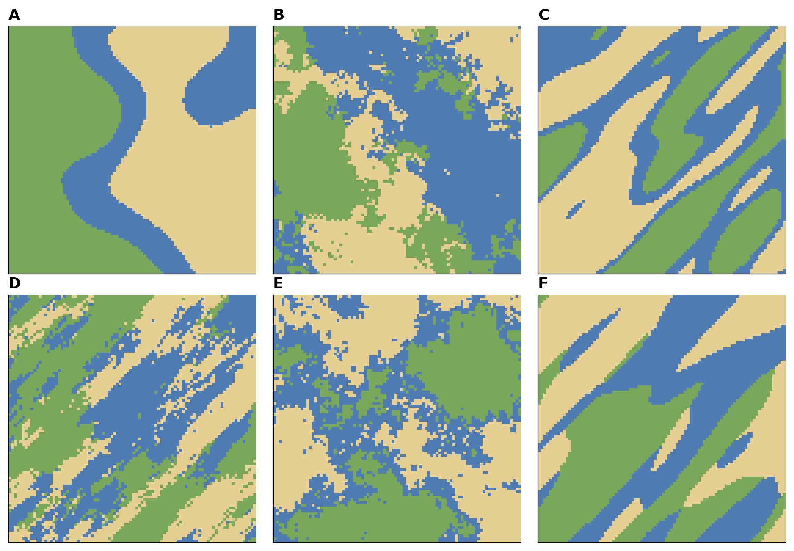
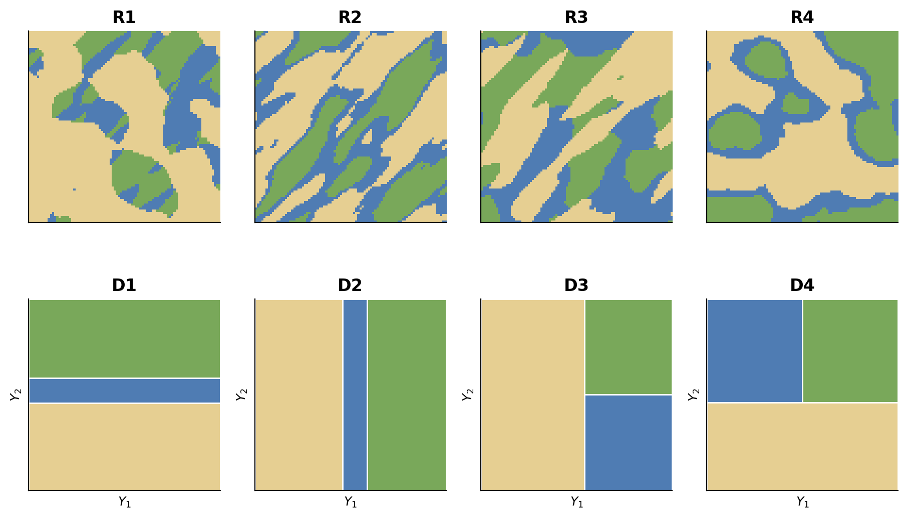

## Simulations géostatistiques de variable catégorielle {#sec-ex-ch13 .recueil}
### Exercice 1 — Proportions de faciès dans un modèle gaussien tronqué

Dans un modèle de simulation gaussienne tronquée (TGS), un champ latent $Z(\mathbf{x})$ de loi $\mathcal{N}(0,1)$ est découpé en trois faciès ordonnés $s_1$, $s_2$ et $s_3$ à l'aide de deux seuils de troncature. On adopte les seuils $s_1 = -0.2$ et $s_2 = 1.1$.

Quelles proportions de faciès $s_1$, $s_2$ et $s_3$ seront simulées théoriquement ? Utilisez la table de la loi $\mathcal{N}(0,1)$.

::: {.callout-note collapse="true"}
## Solution

Les trois faciès correspondent aux intervalles successifs du champ latent : $s_1$ occupe $(-\infty, s_1]$, $s_2$ occupe $(s_1, s_2]$ et $s_3$ occupe $(s_2, +\infty)$. Les proportions s'obtiennent par lecture de la fonction de répartition $\Phi$ de la loi $\mathcal{N}(0,1)$.

Par lecture de la table : $\Phi(0.2) = 0.5793$ et $\Phi(1.1) = 0.8643$. Par symétrie, $\Phi(-0.2) = 1 - 0.5793 = 0.3085$.

Les proportions des faciès sont alors :
$$
\mathbb{P}(s_1) = \mathbb{P}\big(Z(\mathbf{x}) \le -0.2\big) = \Phi(-0.2) = 0.3085 \;\; (30.85\,\%),
$$
$$
\mathbb{P}(s_2) = \mathbb{P}\big(-0.2 < Z(\mathbf{x}) \le 1.1\big) = \Phi(1.1) - \Phi(-0.2) = 0.8643 - 0.3085 = 0.5558 \;\; (55.58\,\%),
$$
$$
\mathbb{P}(s_3) = \mathbb{P}\big(Z(\mathbf{x}) > 1.1\big) = 1 - \Phi(1.1) = 1 - 0.8643 = 0.1357 \;\; (13.57\,\%).
$$
La somme des trois proportions vaut bien $1$.
:::

### Exercice 2 — Proportions de faciès avec d'autres seuils

On reprend le modèle gaussien tronqué de l'exercice précédent, avec un champ latent $Z(\mathbf{x})$ de loi $\mathcal{N}(0,1)$ et trois faciès ordonnés $s_1$, $s_2$, $s_3$. Cette fois, on adopte les seuils $s_1 = -0.85$ et $s_2 = 0.78$.

Quelles proportions de faciès $s_1$, $s_2$ et $s_3$ seront simulées théoriquement ?

::: {.callout-note collapse="true"}
## Solution

Par lecture de la table de la loi $\mathcal{N}(0,1)$ :

Pour le seuil $s_1 = -0.85$, on lit $\Phi(0.85) = 0.8023$, puis on prend le complément : $\Phi(-0.85) = 1 - 0.8023 = 0.1977$.

Pour le seuil $s_2 = 0.78$, on lit $\Phi(0.78) = 0.7823$.

Les proportions des faciès sont alors :
$$
\mathbb{P}(s_1) = \Phi(-0.85) = 0.1977 \;\; (19.76\,\%),
$$
$$
\mathbb{P}(s_2) = \Phi(0.78) - \Phi(-0.85) = 0.7823 - 0.1977 = 0.5847 \;\; (58.47\,\%),
$$
$$
\mathbb{P}(s_3) = 1 - \Phi(0.78) = 1 - 0.7823 = 0.2177 \;\; (21.77\,\%).
$$
:::

### Exercice 3 — Reconnaissance des méthodes SIS et TGS

On présente six images de simulation catégorielle, identifiées de A à F, obtenues soit par simulation séquentielle d'indicatrices (SIS), soit par simulation gaussienne tronquée (TGS), avec différents modèles de variogramme (gaussien ou sphérique, isotrope ou anisotrope).

{#fig-ex13-sis_tgs_planche fig-align="center" width="85%"}

a) Pour chaque image identifiée de A à F, indiquez par un $\times$ les énoncés qui s'appliquent dans le tableau ci-dessous. *(Aide : chaque colonne doit comporter deux $\times$ au total — un au-dessus de la double barre et un en dessous.)*

| Énoncé | A | B | C | D | E | F |
|:---|:---:|:---:|:---:|:---:|:---:|:---:|
| L'image est obtenue par la simulation séquentielle d'indicatrices (SIS) | | | | | | |
| L'image est obtenue par la simulation gaussienne tronquée (TGS) | | | | | | |
| Le variogramme utilisé est gaussien isotrope | | | | | | |
| Le variogramme utilisé est sphérique isotrope | | | | | | |
| Le variogramme utilisé est gaussien anisotrope | | | | | | |
| Le variogramme utilisé est sphérique anisotrope | | | | | | |

b) Sur quels critères visuels peut-on distinguer une réalisation SIS d'une réalisation TGS, et un variogramme gaussien d'un variogramme sphérique ?

::: {.callout-note collapse="true"}
## Solution

a) L'association exacte dépend des images régénérées par le générateur MATLAB ; le tableau se remplit en croisant deux familles de critères (méthode et type de variogramme), chaque colonne recevant un $\times$ pour la méthode et un $\times$ pour le variogramme.

b) Critères de lecture :

- **SIS vs TGS** : la TGS, issue de la troncature d'un champ gaussien ordonné, n'autorise que les transitions entre faciès successifs (les contacts $s_1$–$s_3$ sont interdits) et produit des frontières plus régulières et organisées. La SIS autorise toutes les transitions entre faciès et donne des contacts plus erratiques, des faciès géologiquement incompatibles pouvant apparaître côte à côte.
- **Variogramme gaussien vs sphérique** : un variogramme gaussien, parabolique à l'origine, engendre des structures très continues et lisses à courte distance ; un variogramme sphérique, linéaire à l'origine, produit une texture plus granuleuse et moins régulière.
- **Isotrope vs anisotrope** : un modèle isotrope donne des formes sans direction privilégiée, tandis qu'un modèle anisotrope étire les structures dans la direction de plus grande portée.
:::

### Exercice 4 — Échantillonneur de Gibbs en simulation tronquée

Dans le conditionnement d'une simulation gaussienne tronquée (TGS) ou plurigaussienne (PGS) aux données observées, on utilise l'échantillonneur de Gibbs.

a) À quoi sert l'échantillonneur de Gibbs dans ce contexte ? Décrivez succinctement l'idée de l'algorithme.

b) L'échantillonneur de Gibbs a tendance à converger très lentement lorsqu'il y a beaucoup de données à simuler. Quelle méthodologie peut-on utiliser pour pallier cette faiblesse ? Décrivez brièvement l'idée de cette méthode.

::: {.callout-note collapse="true"}
## Solution

a) Dans une simulation tronquée, seules les catégories — c'est-à-dire le faciès observé $W(\mathbf{x})$ — sont connues aux points de données, tandis que les valeurs du champ latent $Z(\mathbf{x})$ ne sont pas directement observables. L'échantillonneur de Gibbs sert à reconstituer, à chaque point de donnée, une valeur latente $Z(\mathbf{x}_\alpha)$ compatible à la fois avec l'intervalle de troncature imposé par le faciès observé — si $\mathbf{x}_\alpha$ appartient au faciès $i$, alors $Z(\mathbf{x}_\alpha) \in (s_{i-1}, s_i]$ — et avec la structure spatiale dictée par la covariance $C(\mathbf{h})$. L'algorithme procède point par point : à chaque itération, on met à jour une valeur latente en effectuant un krigeage simple à partir de toutes les autres valeurs déjà fixées, ce qui donne la loi gaussienne conditionnelle, puis on tire une valeur dans cette loi tronquée à l'intervalle du faciès. Le balayage est répété jusqu'à convergence : on obtient alors un champ latent corrélé selon $C(\mathbf{h})$ et respectant les seuils.

b) Lorsque le nombre de données est élevé, la convergence du Gibbs devient lente, car chaque mise à jour ne tient compte que d'un voisinage et l'information se propage lentement de proche en proche. Une méthode pour pallier ce problème est l'approche **multigrille** (ou multi-échelle) : on commence le balayage sur une grille grossière (peu de nœuds, espacés), ce qui permet d'établir rapidement les grandes structures de continuité spatiale, puis on raffine progressivement la grille en ajoutant des nœuds intermédiaires. Les valeurs déjà stabilisées aux échelles grossières servent de conditionnement, ce qui accélère considérablement la convergence aux échelles fines.
:::

### Exercice 5 — Simulations plurigaussiennes et drapeaux

On présente plusieurs réalisations issues de simulations plurigaussiennes (PGS), chacune obtenue en combinant deux champs gaussiens latents et un plan de codage (le « drapeau ») qui associe à chaque couple de valeurs latentes un faciès. On dispose par ailleurs des drapeaux candidats.

{#fig-ex13-pgs_drapeaux fig-align="center" width="90%"}

a) Associez chaque réalisation au drapeau correspondant.

b) Le variogramme utilisé est cubique pour les deux variables. Sachant qu'un des deux champs latents est isotrope et que l'autre est anisotrope avec une grande continuité dans la direction SO–NE (azimut de grande continuité $\approx 45^\circ$), comment cette structure spatiale se manifeste-t-elle dans les réalisations, et comment s'en sert-on pour confirmer l'association drapeau–réalisation ?

::: {.callout-note collapse="true"}
## Solution

a) L'association exacte réalisation–drapeau dépend des figures régénérées par le générateur MATLAB. La démarche consiste, pour chaque réalisation, à repérer quels faciès sont en contact direct et lesquels ne le sont jamais : le plan de codage (drapeau) impose les transitions permises et interdites entre faciès, et seul le drapeau dont les règles de contact correspondent aux contacts observés peut être associé à la réalisation. On utilise aussi les proportions relatives des faciès, fixées par les surfaces respectives des zones du drapeau.

b) Le variogramme cubique, parabolique à l'origine, produit des structures très continues et lisses. Le champ latent **isotrope** engendre des formes sans direction privilégiée, tandis que le champ latent **anisotrope** étire ses structures dans la direction de plus grande portée, ici SO–NE (azimut $\approx 45^\circ$). Pour confirmer une association, on identifie d'abord, dans le drapeau, quel faciès est gouverné par le champ anisotrope : ce faciès apparaîtra dans la réalisation sous forme de bandes ou de plages allongées le long de l'axe SO–NE, alors que les faciès contrôlés par le champ isotrope auront une texture sans orientation. La cohérence entre la direction d'allongement observée et l'axe du champ anisotrope assigné par le drapeau lève l'ambiguïté entre drapeaux candidats de structure semblable.
:::
