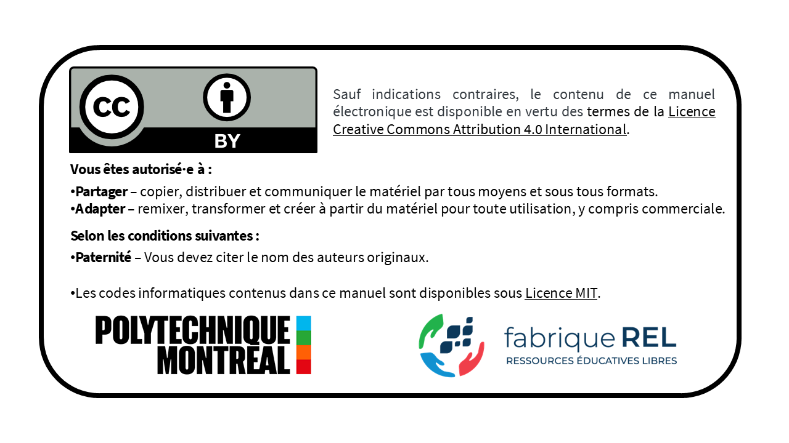

```{=latex}
\renewcommand{\partname}{} % Réinitialiser partie
```

**Résumé :** Ce livre présente les concepts fondamentaux et les applications pratiques de la géostatistique en géologie minière. Il a été rédigé intégralement avec Quarto et intègre des exemples pratiques ainsi qu’une bibliothèque de code en Python. Le contenu est conçu pour être accessible aux étudiants en génie géologique et en génie des mines. Ceux et celles qui souhaitent approfondir leur compréhension de l'estimation des ressources minérales trouveront dans cet ouvrage les éléments théoriques et pratiques nécessaires. La philosophie de ce livre est de fournir toutes les clés pour comprendre et mettre en œuvre les méthodes géostatistiques. La présentation des méthodes repose sur une approche à la fois compréhensive et intuitive plutôt que sur une approche purement mathématique.

**Remerciements :** Ce manuel a été réalisé avec le soutien de la fabriqueREL. Fondée en 2019, la fabriqueREL est portée par divers établissements d'enseignement supérieur du Québec et agit en collaboration avec les services de soutien pédagogique et les bibliothèques. Son but est de faire des ressources éducatives libres (REL) le matériel privilégié dans l’enseignement supérieur au Québec.

**Mise en page :** Dany Lauzon.

**Révision linguistique :** XXXXXXXXXXXXXXXXX

© Dany Lauzon.

**Pour citer cet ouvrage :** Lauzon, D. (2026). *Géostatistique et géologie minière*. Polytechnique Montréal, Département des génies civil, géologique et des mines. fabriqueREL. License CC BY. Licence MIT.


{width="80%" fig-align="left"}


# Préface {.unnumbered}

La géostatistique est la branche des statistiques appliquées consacrée à l'étude des variables régionalisées, c'est-à-dire des variables dont la valeur dépend de la position dans l'espace (et, le cas échéant, dans le temps). Contrairement au cadre statistique classique, qui suppose le plus souvent des observations indépendantes et identiquement distribuées, la géostatistique reconnaît que les valeurs mesurées en des points voisins ne sont généralement pas indépendantes : elles présentent une corrélation spatiale. Formellement, la variable régionalisée est interprétée comme une réalisation d'une fonction aléatoire, ce qui permet de conjuguer une composante structurée (la continuité spatiale du phénomène) et une composante aléatoire (l'irrégularité locale et l'incertitude).

Cette dépendance spatiale se traduit fréquemment par le fait que des points rapprochés se ressemblent davantage que des points éloignés. Quantifier et modéliser cette structure constituent l'objet premier de la géostatistique. L'outil central est le variogramme (ou semi-variogramme), qui décrit la variabilité en fonction de la distance et de la direction de séparation entre les points. À partir de ce modèle, des méthodes d'estimation telles que le krigeage fournissent, sous certaines hypothèses de stationnarité, un estimateur linéaire sans biais et de variance minimale, assorti d'une mesure explicite de l'incertitude d'estimation.

Ainsi, à partir d'un nombre souvent limité de données, la géostatistique permet d'estimer la valeur de la variable régionalisée aux sites non échantillonnés, de simuler le champs spatiale de la variable régionalisée et, surtout, de caractériser l'incertitude associée à ces estimations et simulations.

Développée dans les années 1950 et 1960, la géostatistique était initialement destinée à l'estimation des ressources minières. Elle s'est depuis imposée comme un ensemble d'outils fondamentaux dans de nombreux domaines : hydrogéologie, sciences de l'environnement, géotechnique, géologie, gestion des ressources naturelles, cartographie des sols, modélisation climatique, et jusqu'aux sciences de la santé. En pratique, la géostatistique permet de faire le lien entre la modélisation (c.-à-d. l'estimation ou la simulation de la variable régionalisée) et la prise de décision fondée sur cette variable.

Ce livre est issu de plusieurs années d'enseignement des cours GLQ3401 et GLQ3651 à Polytechnique Montréal, au Département des génies civil, géologique et des mines. Il s'adresse d'abord aux étudiantes et étudiants qui découvrent la discipline, ainsi qu'à toute personne souhaitant en approfondir les fondements théoriques, les méthodes et les applications.

L'objectif de cet ouvrage ne se limite pas à exposer des formules ou des algorithmes. Il vise à développer une véritable intuition spatiale. Les chapitres progressent de manière graduelle. Chaque notion impotante est appuyé par un atelier interractif visuel, puis approfondie au moyen d'exemples, d'exercices et d'applications numériques. 

J'espère que cet ouvrage aidera les étudiantes et étudiants en science de la Terra à mieux saisir la logique de la géostatistique et à en apprécier la portée. Au-delà des techniques, la géostatistique propose une manière rigoureuse d'appréhender l'incertitude et d'éclairer la prise de décision à partir de données spatiales nécessairement incomplètes.

## Structure du livre

Le livre est divisé en trois parties principales :

**Partie I : Géologie minière**  
Fondements de la géologie minière, normes et lois, teneur de coupure, théorie de l’échantillonnage des matières morcelées et introduction aux méthodes conventionnelles d’estimation des ressources.

**Partie II : Géostatistique linéaire**  
Méthodes classiques de géostatistique linéaire : effet de support, effet d'information, analyse variographique, variance de dispersion, krigeage et estimation locale d’une variable régionalisée.

**Partie III : Géostatistique non linéaire**  
Méthodes avancées de géostatistique non linéaire : indicatrices, simulations de variables continues et catégorielles, et approches conditionnelles.


## Pourquoi la géostatistique est-elle essentielle en géologie minière? {.unnumbered}

En géologie minière, on n'a jamais accès au gisement dans son intégralité : on ne le connaît que par des échantillons soit des informations ponctuelles et spatialement dispersées. L'essentiel de cette information provient de forages, en particulier des analyses géochimiques réalisées sur des intervalles (les composites), auxquelles s'ajoute l'interprétation géologique proprement dite : observations de terrain, structures, contacts recoupés en forage et levés géophysiques, pour ne nommer que quelques sources de données auxilliaires.

La difficulté fondamentale tient à la disproportion entre le volume échantillonné et le volume à estimer. Un forage de diamètre standard qui recoupe plusieurs centaines de mètres de roche ne prélève, en réalité, que quelques dizaines de kilogrammes de roche. Rapporté au volume total d'une enveloppe minéralisée, le matériel effectivement analysé représente une fraction infime, voir inférieure à 0,01 % du gisement. Autrement dit, plus de 99,99 % du volume dont on doit estimer la teneur n'a jamais été observé directement, ne sera jamais observé avant son exploitation, et doit être inféré à partir des données disponibles et d'hypothèses géologiques explicites.

C'est là que la vraie difficulté commence. Entre deux forages subsiste un volume important que l'on n'observe pas, mais qui doit néanmoins être pris en compte, car il conditionne directement toute grande décision d'une société minière : les campagnes d'exploration, l'estimation des ressources, la planification minière, l'évaluation du risque économique. On ne peut donc pas se contenter d'interpoler les points de manière arbitraire. Il faut une méthode qui respecte la structure spatiale des teneurs et la continuité géologique du gisement.

La géostatistique répond précisément à ce besoin. Plutôt que de traiter les données comme des valeurs isolées, elle les considère comme les réalisations d'une variable régionalisée et cherche à en caractériser le comportement statistique. Concrètement, on quantifie la continuité des teneurs : à quelle vitesse se décorrèlent-elles avec la distance? Existe-t-il des directions d'anisotropie privilégiées, dictées par la géologie? Deux zones voisines sont-elles réellement semblables, ou la variabilité à courte distance est-elle trop forte pour l'affirmer? Le variogramme formalise ces questions, et le krigeage permet ensuite d'estimer les portions non échantillonnées du gisement, en fournissant, pour chaque estimation, une mesure de l'incertitude associée.

Il faut aussi insister sur une notion propre à la géostatistique minière : l'estimation ne porte pas sur des points, mais sur des volumes, à savoir les blocs d'un modèle de ressources ou les unités d'exploitation. Or la distribution des teneurs dépend du volume sur lequel on les mesure (c'est l'effet de support) : la variabilité d'échantillons de quelques kilogrammes n'est pas celle de blocs de plusieurs milliers de tonnes. En ignorer les conséquences conduit à des erreurs systématiques dans l'évaluation des tonnages et des teneurs récupérables.

Apprendre la géostatistique minière, ce n'est donc pas seulement apprendre des formules. C'est avant tout apprendre à raisonner avec des données incomplètes : construire un modèle, mais rester critique à son égard. Où sont réellement les données? Que montrent-elles, et à quelle échelle? Jusqu’où l’extrapolation reste-t-elle défendable, et à partir de quel niveau d’incertitude l’estimation perd-elle son sens?
C’est ce dialogue constant entre les données, la géologie, l’interprétation et l’incertitude qui se trouve au cœur de la géostatistique minière.


## Remerciements {.unnumbered}

De nombreuses personnes ont contribué à l'élaboration de ce manuel. Ce projet a bénéficié du soutien pédagogique et financier de la **fabriqueREL**. Les différentes rencontres avec le comité de suivi nous ont permis de comprendre l'univers des REL et, notamment, leurs fameux 5R (Retenir — Réutiliser — Réviser — Remixer — Redistribuer), de mieux définir le besoin pédagogique visé par ce manuel, et d'identifier des outils et des ressources pédagogiques pertinents pour son élaboration. Ainsi, nous remercions chaleureusement les membres du comité de suivi de la fabriqueREL pour leur support inconditionnel :

* XXXX, bibliothécaire à l'XXXX.
* XXXX, conseillère pédagogique à l'XXXX et coordonnatrice de la fabriqueREL.
* XXXX, bibliothécaire à l'XXXX.
* XXXX, conseiller en formation à l'XXXX.
* XXXX, vice-recteur adjoint aux études de l'XXXX.

Nous tenons également à remercier sincèrement les étudiantes et étudiants des cours **Géostatistique et géologie minière** (GLQ3401) et **Géologie minière** (GLQ3651) de Polytechnique Montréal. Leurs questions pertinentes, leurs commentaires constructifs et leurs suggestions nous ont permis d'améliorer considérablement les versions préliminaires de ce manuel utilisées dans le cadre de ces cours.

Un remerciement particulier est adressé au **Professeur retraité Denis Marcotte** de Polytechnique Montréal pour son mentorat, sa générosité et sa contribution inestimable à la révision de ce livre. Ses enseignements et ses travaux de recherche ont profondément influencé l'approche pédagogique adoptée dans cet ouvrage.

Nous remercions également nos collègues du **Département des génies civil, géologique et des mines** de Polytechnique Montréal pour leurs encouragements constants et leur soutien tout au long de ce projet.

Nous remercions les membres du comité de révision pour leurs commentaires et suggestions très constructifs. Ce comité est composé de trois étudiants et deux professeurs de Polytechnique Montréal :

* Olivier Brisebois, étudiant à la maîtrise à Polytechnique Montréal.
* Kassahun Aweke Arega, doctorant à Polytechnique Montréal.
* Innocent Boris Tagne Nkounga, doctorant à Polytechnique Montréal.
* XXXX, professeur enseignant XXXX.
* XXXX, professeur enseignant XXXX.

Finalement, nous remercions XXXXX, réviseure linguistique, pour la révision du manuel.

## Évolution du livre 

Ce livre est un document vivant qui continuera d’évoluer. Les mises à jour, corrections et améliorations sont publiées régulièrement sur le dépôt GitHub du projet. Si vous repérez une erreur, souhaitez proposer une amélioration ou simplement formuler un commentaire, vous pouvez le faire via le dépôt GitHub ou me contacter directement par courriel à [dany.lauzon@polymtl.ca](mailto:dany.lauzon@polymtl.ca).

---

**Dany Lauzon, Ph.D.**  
Professeur adjoint  
Département des génies civil, géologique et des mines  
Polytechnique Montréal

Montréal, Août 2026


